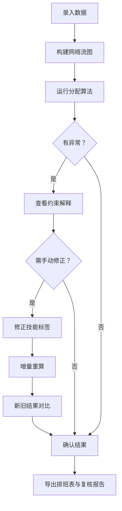

## 1. 产品概述

网络流志愿者分派工具，面向活动统筹人员，解决岗位缺人、技能错配、班次冲突等排班场景中口径不一致的问题。通过最大流/最小费用最大流算法自动分配志愿者，筛选条件变动时图表与明细同步更新，所有数据可一路追溯来源，并支持手动修正后新旧结果并排对比。

- 目标用户：活动统筹、志愿者管理者
- 核心价值：一次录入志愿者名单、技能标签、请假记录后，自动生成最优排班方案，异常可解释、可追溯、可修正

## 2. 核心功能

### 2.1 用户角色

| 角色 | 进入方式 | 核心权限 |
|------|----------|----------|
| 活动统筹 | 直接使用 | 录入数据、运行分配、手动修正、导出排班 |
| 复核人员 | 直接使用 | 查看分配结果、查看异常提示、导出排班 |

### 2.2 功能模块

1. **数据总览页**：志愿者名单、岗位需求、技能标签、请假记录的统一入口，筛选条件联动图表与明细
2. **网络流分配页**：运行分配算法、查看分配结果、约束解释、异常高亮
3. **手动修正与对比页**：修正技能标签、重新运行、新旧结果并排对比
4. **导出页**：导出排班表，含志愿者-岗位-班次映射及异常备注

### 2.3 页面详情

| 页面名称 | 模块名称 | 功能描述 |
|----------|----------|----------|
| 数据总览页 | 志愿者名单面板 | 展示志愿者列表，支持按技能、可用性筛选，点击可追溯来源 |
| 数据总览页 | 岗位需求面板 | 展示岗位列表与所需人数/技能，缺人岗位标红 |
| 数据总览页 | 技能标签面板 | 技能矩阵视图，支持标签增删改，变更即时同步 |
| 数据总览页 | 请假记录面板 | 请假/不可用时段记录，冲突自动标黄 |
| 数据总览页 | 统计图表 | 按筛选条件实时更新的柱状图/饼图：技能覆盖、岗位填充率、异常分布 |
| 网络流分配页 | 分配控制台 | 一键运行网络流算法，选择算法模式（最大流/最小费用最大流） |
| 网络流分配页 | 分配结果表格 | 志愿者→岗位→班次的映射表，可点击查看约束解释 |
| 网络流分配页 | 约束解释面板 | 点击任意分配行，展示为什么分配/未分配的原因链 |
| 网络流分配页 | 异常提示区 | 岗位缺人、技能错配、班次冲突的汇总，点击跳转明细 |
| 手动修正与对比页 | 技能修正入口 | 修改志愿者技能标签，触发增量重算 |
| 手动修正与对比页 | 新旧对比视图 | 左侧旧分配、右侧新分配，差异高亮 |
| 手动修正与对比页 | 修正历史 | 记录每次修正的时间、内容、影响范围 |
| 导出页 | 排班表导出 | 导出 CSV/JSON，含完整映射及异常备注 |
| 导出页 | 来源追溯报告 | 导出志愿者-技能-异常对应关系的复核报告 |

## 3. 核心流程

活动统筹录入志愿者名单、岗位需求、技能标签、请假记录后，系统构建网络流图并运行分配算法。分配结果以表格和图表展示，异常（缺人、错配、冲突）高亮提示。统筹可点击任意分配行查看约束解释，也可手动修正技能标签后对比新旧结果。最终导出排班表和复核报告。

## 4. 用户界面设计

### 4.1 设计风格

- 主色调：深靛蓝（#1e293b）为底，翠绿（#10b981）为强调色，警示用琥珀（#f59e0b）、错误用玫红（#f43f5e）
- 按钮风格：圆角 8px，主按钮实色填充，次按钮描边
- 字体：JetBrains Mono 用于数据表格，Noto Sans SC 用于中文界面
- 布局风格：左侧导航栏 + 右侧内容区，卡片式面板
- 图标：lucide-react 图标库，简洁线性风格

### 4.2 页面设计概览

| 页面名称 | 模块名称 | UI 元素 |
|----------|----------|---------|
| 数据总览页 | 志愿者名单面板 | 卡片列表，头像+姓名+技能标签chip，筛选栏，点击展开详情 |
| 数据总览页 | 岗位需求面板 | 表格，进度条显示填充率，缺人行红色边框 |
| 数据总览页 | 技能标签面板 | 矩阵热力图，行=志愿者 列=技能，绿色=具备 灰色=不具备 |
| 数据总览页 | 请假记录面板 | 时间轴视图，冲突时段黄色标记 |
| 数据总览页 | 统计图表 | Recharts 柱状图+饼图，筛选联动动画过渡 |
| 网络流分配页 | 分配控制台 | 顶部操作栏：算法选择下拉+运行按钮+进度指示 |
| 网络流分配页 | 分配结果表格 | 可排序可筛选表格，每行可展开约束解释 |
| 网络流分配页 | 约束解释面板 | 侧边抽屉，原因链用树形结构展示 |
| 网络流分配页 | 异常提示区 | 右侧固定面板，分类计数+点击跳转 |
| 手动修正与对比页 | 技能修正入口 | 内联编辑，技能标签chip可增删 |
| 手动修正与对比页 | 新旧对比视图 | 双栏布局，差异行用背景色标记 |
| 手动修正与对比页 | 修正历史 | 时间线列表，展示修正内容摘要 |
| 导出页 | 排班表导出 | 预览表格+格式选择+下载按钮 |
| 导出页 | 来源追溯报告 | 预览面板，展示志愿者-技能-异常对应关系 |

### 4.3 响应式设计

- 桌面优先，最小宽度 1280px
- 面板支持折叠/展开
- 表格支持横向滚动

### 4.4 3D 场景

不适用
