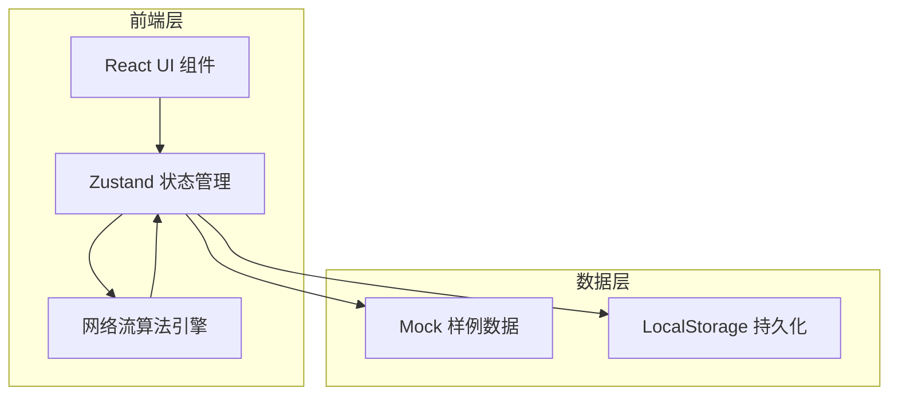
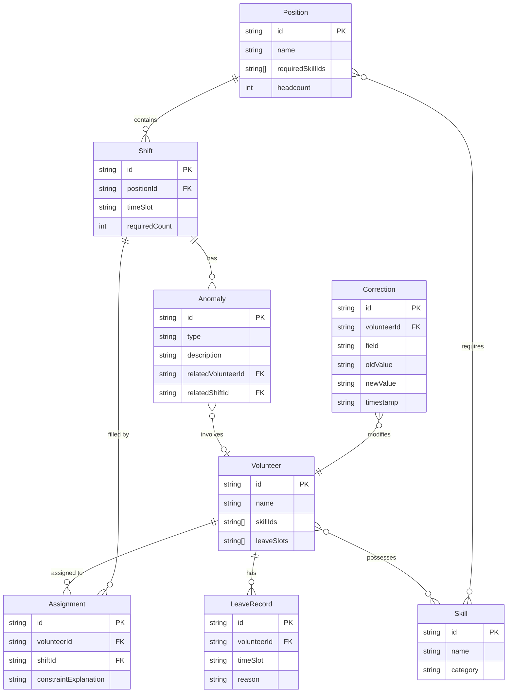

## 1. 架构设计

纯前端应用，所有算法和数据处理在浏览器端完成。使用 Zustand 管理全局状态，网络流算法用 TypeScript 实现。

## 2. 技术说明

- 前端：React@18 + TypeScript + Tailwind CSS@3 + Vite
- 初始化工具：vite-init
- 后端：无
- 数据库：无，使用 Mock 数据 + LocalStorage 持久化
- 图表库：Recharts
- 图标库：lucide-react
- 导出：原生 JS 生成 CSV/JSON

## 3. 路由定义

| 路由 | 用途 |
|------|------|
| / | 数据总览页：志愿者名单、岗位需求、技能标签、请假记录、统计图表 |
| /assign | 网络流分配页：运行分配、查看结果、约束解释、异常提示 |
| /compare | 手动修正与对比页：修正技能、新旧对比、修正历史 |
| /export | 导出页：排班表导出、来源追溯报告 |

## 4. API 定义

无后端 API，所有数据通过 Zustand Store 管理。

## 5. 服务器架构图

不适用

## 6. 数据模型

### 6.1 数据模型定义

### 6.2 样例数据设计

样例数据故意包含以下困难场景：

1. **岗位缺人**：安保岗需要 5 人，全场只有 3 人持有安保技能
2. **班次冲突**：志愿者张伟同时被分到周六上午的签到岗和周六上午的引导岗
3. **技能错配**：志愿者李娜只持有"翻译"技能，但被分配到"医疗急救"岗位
4. **请假冲突**：志愿者王芳周六请了假，但系统仍尝试将其分到周六班次
5. **正常分配**：部分志愿者技能匹配、时间可用，顺利分配

这些场景确保工具不只能处理最顺的材料。
