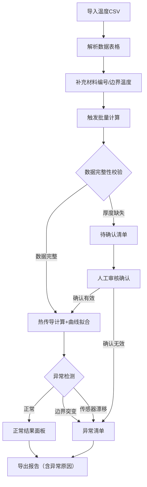

## 1. 产品概述

热传导材料比对工具是面向材料实验室教学与科研的专业数据分析平台，解决多组温升曲线数据批量比对问题，实现导热率计算、异常检测与结果溯源的全流程自动化。

- **核心价值**：将数据来源、计算判断、结果结论串联呈现，替代零散的输入框操作模式
- **目标用户**：材料实验室助教、学生、科研人员
- **解决痛点**：增量数据补录覆盖问题、异常数据混同正常结果、计算过程不可追溯

## 2. 核心功能

### 2.1 用户角色

| 角色 | 注册方式 | 核心权限 |
|------|----------|----------|
| 实验室助教 | 无需注册 | 完整数据导入、批量计算、异常审核、结果导出 |
| 学生用户 | 无需注册 | 数据上传、查看比对结果、导出个人实验数据 |

### 2.2 功能模块

1. **数据工作台**：CSV导入、数据预览、增量补录
2. **批量计算中心**：热传导计算、曲线拟合、导热率比对
3. **异常管理**：待确认清单、异常清单、异常说明
4. **结果导出**：正常结果报告、异常原因报告

### 2.3 页面详情

| 页面名称 | 模块名称 | 功能描述 |
|-----------|-------------|---------------------|
| 主工作台 | 数据导入区 | 支持CSV拖拽上传，解析温升曲线、材料编号、边界温度 |
| 主工作台 | 数据表格区 | 展示原始数据，支持增量补录，已判断数据高亮锁定 |
| 主工作台 | 批量操作区 | 一键计算全部、按批次计算、重算指定条目 |
| 计算结果区 | 正常结果面板 | 展示导热率、拟合曲线、来源溯源链 |
| 计算结果区 | 待确认清单 | 厚度缺失、数据不全等需人工确认的条目，醒目标红 |
| 计算结果区 | 异常清单 | 边界突变、传感器漂移等异常条目，醒目警示样式 |
| 导出面板 | 格式选择 | Excel/CSV导出，可选择包含/排除异常数据 |

## 3. 核心流程

用户上传温度序列CSV → 系统解析并展示原始数据 → 用户补充材料编号和边界温度 → 触发批量计算 → 系统自动分类（正常/待确认/异常） → 用户审核待确认数据 → 导出完整报告（含正常结果和异常原因）

## 4. 用户界面设计

### 4.1 设计风格

- **主色调**：深海蓝 `#1e3a5f`（专业、严谨），辅色：警示橙 `#e67e22`、危险红 `#e74c3c`、成功绿 `#27ae60`
- **按钮风格**：直角矩形，细微边框，点击反馈清晰，学术工具风格
- **字体**：标题使用 `JetBrains Mono`（等宽字体体现数据严谨性），正文使用 `Noto Sans SC`
- **布局风格**：三栏式布局，左：数据区，中：结果区，右：异常区，信息密度适中
- **图标风格**：线性图标，避免花哨装饰，异常状态使用醒目的背景色块而非仅图标

### 4.2 页面设计概述

| 页面名称 | 模块名称 | UI元素 |
|-----------|-------------|-------------|
| 主工作台 | 数据导入区 | 拖拽上传框、文件列表、解析进度条、增量更新提示 |
| 主工作台 | 数据表格区 | 冻结表头、行分组（按实验批次）、已锁定行灰化+锁图标、可编辑单元格高亮 |
| 计算结果区 | 正常结果面板 | 卡片式布局，每组材料一张卡片，含小型拟合曲线图、来源追溯链（来源→判断→结果） |
| 计算结果区 | 待确认清单 | 橙色背景条、黄色警示三角图标、缺失字段标红、确认/驳回按钮 |
| 计算结果区 | 异常清单 | 红色边框、闪烁警示条（首次加载）、异常原因详细说明、传感器漂移曲线图 |
| 导出面板 | 导出选项 | 复选框组（正常结果/待确认/异常）、格式选择、预览按钮、下载按钮 |

### 4.3 响应性

- Desktop-first设计，优先保障1280px+大屏数据展示效率
- 平板端自适应折叠为上下布局，移动端保留核心数据查看功能
- 表格支持水平滚动，异常信息始终固定在视口右侧

### 4.4 动效设计

- 数据导入进度条平滑动画
- 计算完成时结果卡片渐入展示（staggered动画）
- 异常条目首次出现时轻微抖动提醒
- 表格行锁定/解锁状态切换过渡动画
- 导出按钮点击后的进度反馈
