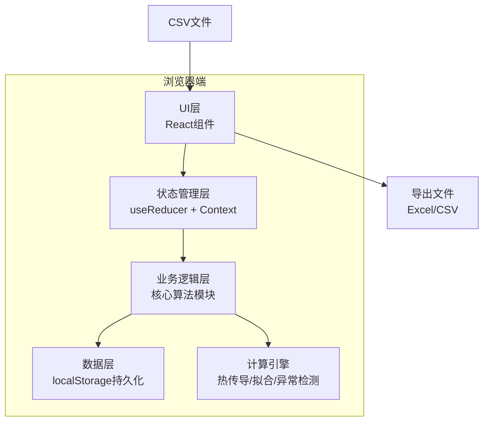
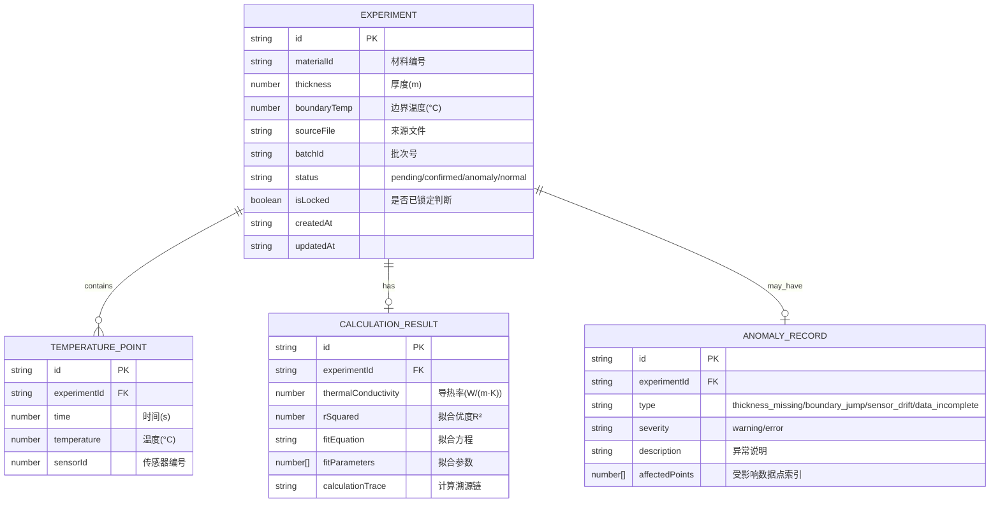

## 1. 架构设计

纯前端单页应用，所有计算和数据存储在浏览器端完成，无需后端服务。



## 2. 技术描述

- **Frontend**: React@18 + TypeScript + tailwindcss@3 + vite@5
- **图表库**: recharts@2（温升曲线拟合展示）
- **Excel导出**: xlsx@0.18
- **状态管理**: React Context + useReducer（轻量级，避免过度设计）
- **数据持久化**: localStorage（浏览器本地存储）
- **Initialization Tool**: vite-init
- **Backend**: None（纯前端应用）
- **Database**: localStorage（无需数据库）

## 3. 核心模块结构

```
src/
├── types/              # 类型定义
│   └── index.ts        # 数据结构、枚举类型
├── core/               # 核心算法
│   ├── heatConduction.ts  # 热传导计算
│   ├── curveFitting.ts    # 曲线拟合
│   └── anomalyDetection.ts # 异常检测
├── store/              # 状态管理
│   ├── AppContext.tsx
│   └── reducer.ts
├── components/         # UI组件
│   ├── DataImport.tsx
│   ├── DataTable.tsx
│   ├── ResultPanel.tsx
│   ├── PendingList.tsx
│   ├── AnomalyList.tsx
│   ├── ExportPanel.tsx
│   └── TraceChain.tsx
├── utils/              # 工具函数
│   ├── csvParser.ts
│   ├── exporter.ts
│   └── storage.ts
└── App.tsx
```

## 4. 路由定义

| Route | Purpose |
|-------|---------|
| / | 主工作台（数据导入+表格+结果+异常+导出） |

单页应用，无需多路由。

## 5. 数据模型

### 5.1 数据模型定义



### 5.2 TypeScript 类型定义

```typescript
type ExperimentStatus = 'pending' | 'confirmed' | 'anomaly' | 'normal';

type AnomalyType = 
  | 'thickness_missing'
  | 'boundary_jump'
  | 'sensor_drift'
  | 'data_incomplete'
  | 'boundary_temp_missing'
  | 'material_id_missing';

interface TemperaturePoint {
  time: number;
  temperature: number;
  sensorId?: number;
}

interface Experiment {
  id: string;
  materialId: string | null;
  thickness: number | null;
  boundaryTemp: number | null;
  temperaturePoints: TemperaturePoint[];
  sourceFile: string;
  batchId: string;
  status: ExperimentStatus;
  isLocked: boolean;
  createdAt: string;
  updatedAt: string;
}

interface CalculationResult {
  id: string;
  experimentId: string;
  thermalConductivity: number;
  rSquared: number;
  fitEquation: string;
  fitParameters: number[];
  calculationTrace: string;
  calculatedAt: string;
}

interface AnomalyRecord {
  id: string;
  experimentId: string;
  type: AnomalyType;
  severity: 'warning' | 'error';
  description: string;
  affectedPoints?: number[];
  detectedAt: string;
}

interface AppState {
  experiments: Experiment[];
  results: CalculationResult[];
  anomalies: AnomalyRecord[];
  selectedBatchId: string | null;
}
```

## 6. 核心算法说明

### 6.1 热传导计算

基于傅里叶定律的稳态热传导：
```
λ = (Q × d) / (A × ΔT)
其中：λ-导热率, Q-传热量, d-厚度, A-面积, ΔT-温差
```

采用非稳态温升曲线拟合法，通过比对标准曲线反算导热率。

### 6.2 曲线拟合

使用最小二乘法进行指数/多项式拟合：
- 支持一阶、二阶指数拟合：T(t) = T0 + A·(1 - e^(-t/τ))
- 计算拟合优度 R²，低于阈值（如0.95）标记异常

### 6.3 异常检测

1. **厚度缺失**：直接检测字段是否为空 → 待确认清单
2. **边界突变**：检测相邻时间点温度差 > 阈值（如5°C/s）→ 异常清单
3. **传感器漂移**：检测温度序列后期是否出现反向下降/波动增大 → 异常清单
4. **边界温度缺失**：检测边界温度字段 → 待确认清单

### 6.4 增量更新机制

```
核心规则：
1. 每条记录有 isLocked 字段，已完成判断的记录锁定
2. 补录材料编号/边界温度时，仅更新 isLocked=false 的记录
3. 锁定记录的计算结果永久保留，不可被覆盖
4. 数据溯源链记录每次计算的输入参数和时间戳
```

## 7. 核心状态管理 Action

```typescript
type Action =
  | { type: 'IMPORT_DATA'; payload: Experiment[] }
  | { type: 'UPDATE_EXPERIMENT'; payload: { id: string; updates: Partial<Experiment> } }
  | { type: 'LOCK_EXPERIMENT'; payload: string }
  | { type: 'UNLOCK_EXPERIMENT'; payload: string }
  | { type: 'CALCULATE_ALL' }
  | { type: 'CALCULATE_BATCH'; payload: string }
  | { type: 'CALCULATE_SINGLE'; payload: string }
  | { type: 'CONFIRM_PENDING'; payload: string }
  | { type: 'REJECT_PENDING'; payload: string }
  | { type: 'CLEAR_ALL' };
```
