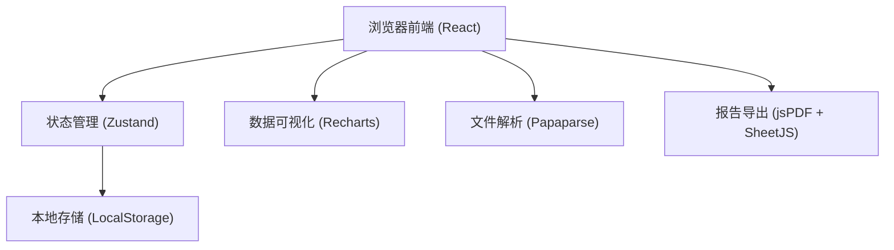
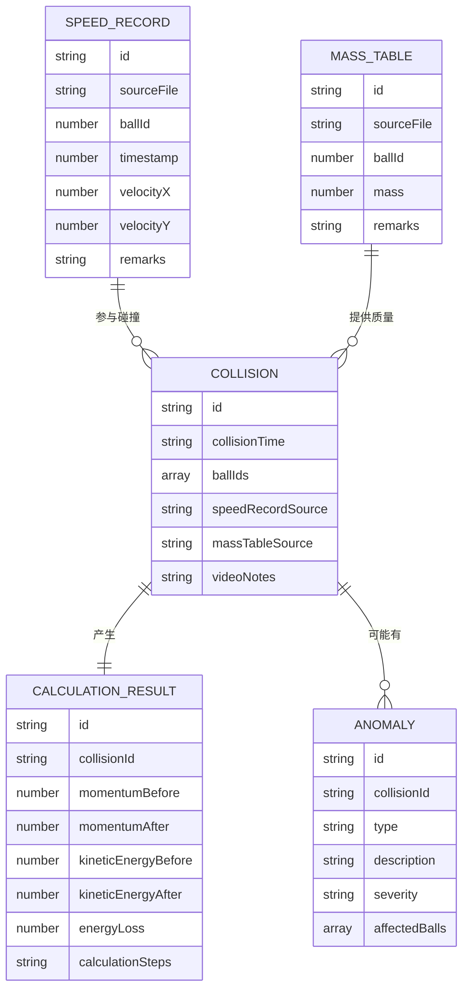

## 1. 架构设计



## 2. 技术选型

- 前端框架：React@18 + TypeScript
- 构建工具：Vite@5
- 样式方案：TailwindCSS@3
- 状态管理：Zustand
- 图表库：Recharts
- 文件解析：Papaparse (CSV) + SheetJS (Excel)
- 报告导出：jsPDF (PDF)
- 图标：Lucide React

## 3. 路由定义

| 路由 | 页面名称 | 用途 |
|------|----------|------|
| / | 数据导入页 | 导入速度记录和质量表 |
| /analysis | 分析概览页 | 碰撞列表与图表展示 |
| /detail/:id | 详情追溯页 | 单条碰撞记录的完整计算链路 |
| /export | 报告导出页 | 生成并导出实验报告 |

## 4. 数据模型

### 4.1 核心数据结构



### 4.2 异常类型定义

| 异常类型 | 说明 | 检测条件 |
|---------|------|----------|
| MASS_MISSING | 质量缺失 | 参与碰撞的小球在质量表中无记录 |
| DIRECTION_REVERSED | 方向反号 | 碰撞后速度方向与物理预期不符 |
| ENERGY_LOSS_EXCESSIVE | 能量损失过大 | 能量损失超过设定阈值（默认10%） |

## 5. 状态管理设计

```typescript
interface AppState {
  speedRecords: SpeedRecord[]
  massTable: MassTable[]
  collisions: Collision[]
  selectedCollisionId: string | null
  
  // Actions
  importSpeedRecords: (file: File) => Promise<void>
  importMassTable: (file: File) => Promise<void>
  calculateCollisions: () => void
  selectCollision: (id: string) => void
  exportReport: (format: 'pdf' | 'excel') => Blob
}
```

## 6. 计算引擎设计

### 6.1 动量计算公式
```
总动量 = Σ(质量 × 速度)
动量守恒验证：|碰撞前总动量 - 碰撞后总动量| < 允许误差
```

### 6.2 能量计算公式
```
动能 = 0.5 × 质量 × 速度²
总动能 = Σ(各小球动能)
能量损失率 = (碰撞前总动能 - 碰撞后总动能) / 碰撞前总动能 × 100%
```

### 6.3 碰撞匹配算法
- 基于时间窗口匹配速度突变点
- 识别速度方向或大小发生显著变化的时刻
- 匹配同一时间窗口内的多个小球作为一次碰撞事件
