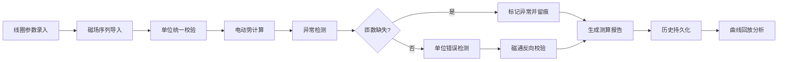

# 电磁感应线圈测算系统 PRD

## 1. 产品概述
电磁感应线圈测算系统是为物理竞赛教练设计的专业数据管理与分析工具，解决匝数缺失混入正常结果、单位换算不一致、数据无法持久化等核心痛点。系统提供统一的计算引擎、完整的数据留痕机制和可视化分析能力。

- 核心用途：物理竞赛电磁感应实验数据管理与精准测算
- 目标用户：物理竞赛教练、实验研究员
- 核心价值：防止数据异常（匝数缺失、单位错误、磁通反向），确保实验数据的准确性和可追溯性

## 2. 核心功能

### 2.1 用户角色
| 角色 | 注册方式 | 核心权限 |
|------|----------|----------|
| 教练用户 | 系统预置账号 | 数据录入、参数配置、报告生成、历史追溯 |

### 2.2 功能模块
1. **线圈参数管理**：线圈基础信息录入、编辑、单位统一管理
2. **磁场序列管理**：磁场数据录入、时序管理、异常检测
3. **测算报告生成**：电动势计算、单位换算、异常标记、曲线可视化
4. **历史数据追溯**：数据变更记录、补录影响分析、异常留痕
5. **曲线回放**：实验数据可视化、边界校验、趋势分析

### 2.3 页面详情
| 页面名称 | 模块名称 | 功能描述 |
|----------|----------|----------|
| 仪表盘 | 数据概览 | 今日实验统计、异常数据提醒、最近记录列表 |
| 线圈参数 | 参数管理 | 线圈匝数、截面积、电阻等参数录入与校验 |
| 磁场序列 | 数据录入 | 时间序列磁场数据导入、手动录入、批量管理 |
| 测算报告 | 计算分析 | 电动势自动计算、单位换算、异常标记、影响分析 |
| 历史追溯 | 变更记录 | 数据版本对比、补录影响明细、操作日志 |
| 曲线回放 | 可视化 | 磁场-电动势曲线、边界校验、趋势分析 |

## 3. 核心流程

### 3.1 数据录入与测算流程
1. 教练录入线圈基础参数（匝数、截面积等）
2. 导入或录入磁场时间序列数据
3. 系统自动进行单位统一校验
4. 执行电动势计算与异常检测
5. 标记匝数缺失、单位错误、磁通反向等异常
6. 生成测算报告与可视化曲线
7. 数据持久化存储并留痕

### 3.2 数据补录流程
1. 教练补录缺失的磁场数据或修正参数
2. 系统自动标记补录记录
3. 分析补录对相关测算明细的影响
4. 更新报告并保留历史版本
5. 生成补录影响分析报告

## 4. 用户界面设计

### 4.1 设计风格
- **主色调**：深蓝色系（#1e3a5f），体现专业科技感
- **辅助色**：橙色告警（#e67e22）、红色错误（#e74c3c）、绿色正常（#27ae60）
- **按钮风格**：圆角矩形（8px）、悬停微动画、状态色区分明显
- **字体**：标题使用 Roboto Mono（等宽字体适合数据展示），正文使用 Inter
- **布局风格**：卡片式布局、左侧导航、顶部状态栏、数据表格密集但清晰
- **图标风格**：简约线性图标，配合科技感小装饰

### 4.2 页面设计概述
| 页面名称 | 模块名称 | UI元素 |
|----------|----------|--------|
| 仪表盘 | 概览卡片 | 渐变背景、数据大屏风格、数字动效、异常告警浮层 |
| 线圈参数 | 表单区域 | 分组表单、实时校验提示、单位下拉选择 |
| 磁场序列 | 数据表格 | 可编辑表格、行高亮、批量操作、异常行标记 |
| 测算报告 | 详情页 | 左右分栏、左侧数据列表、右侧曲线图表 |
| 历史追溯 | 时间线 | 垂直时间线、版本对比、变更内容高亮 |
| 曲线回放 | 图表区 | 交互式折线图、缩放拖拽、数据点悬浮提示 |

### 4.3 响应式
- 桌面端优先（教练主要在实验室电脑使用）
- 平板适配（数据浏览模式）
- 触控优化：按钮最小48px，表格可横向滚动

### 4.4 视觉细节
- 数据表格使用斑马纹，异常行背景色高亮
- 数值变化使用微动画过渡
- 曲线图表使用渐变填充
- 告警提示使用脉冲动画吸引注意
- 卡片阴影分层，营造深度感
