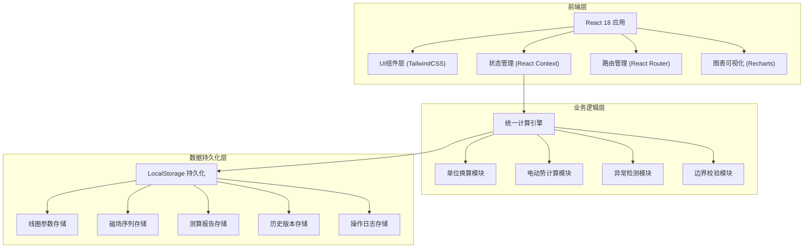
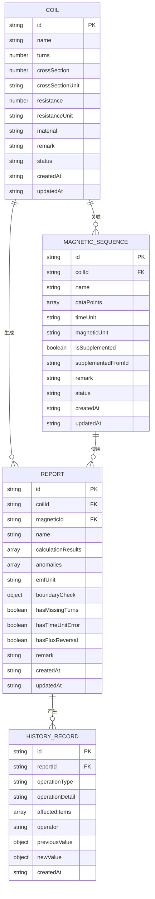

# 电磁感应线圈测算系统 技术架构文档

## 1. 架构设计



## 2. 技术描述

- **前端框架**：React@18 + TypeScript
- **构建工具**：Vite@5
- **样式方案**：TailwindCSS@3
- **路由管理**：React Router@6
- **图表可视化**：Recharts@2
- **图标库**：Lucide React
- **数据持久化**：LocalStorage（带版本管理）
- **状态管理**：React Context + useReducer

## 3. 路由定义

| 路由 | 页面名称 | 用途 |
|------|----------|------|
| / | 仪表盘 | 数据概览、异常提醒、最近记录 |
| /coils | 线圈参数 | 线圈参数管理、新建、编辑 |
| /coils/:id | 线圈详情 | 单个线圈的详细参数和关联数据 |
| /magnetic | 磁场序列 | 磁场数据列表、导入、管理 |
| /magnetic/:id | 磁场详情 | 磁场数据编辑、序列可视化 |
| /reports | 测算报告 | 报告列表、新建测算、导出 |
| /reports/:id | 报告详情 | 测算结果、异常标记、影响分析 |
| /history | 历史追溯 | 操作日志、版本对比、补录影响 |
| /replay | 曲线回放 | 数据可视化、边界校验、趋势分析 |

## 4. 核心数据模型

### 4.1 数据模型定义



### 4.2 数据结构定义

```typescript
// 线圈参数
interface Coil {
  id: string;
  name: string;
  turns: number;
  crossSection: number;
  crossSectionUnit: 'm²' | 'cm²' | 'mm²';
  resistance: number;
  resistanceUnit: 'Ω' | 'kΩ' | 'mΩ';
  material: string;
  remark: string;
  status: 'normal' | 'invalid' | 'deprecated';
  createdAt: string;
  updatedAt: string;
}

// 磁场数据点
interface MagneticDataPoint {
  time: number;
  magneticFlux: number;
  isSupplemented?: boolean;
  remark?: string;
}

// 磁场序列
interface MagneticSequence {
  id: string;
  coilId: string;
  name: string;
  dataPoints: MagneticDataPoint[];
  timeUnit: 's' | 'ms' | 'μs';
  magneticUnit: 'T' | 'mT' | 'μT';
  isSupplemented: boolean;
  supplementedFromId?: string;
  remark: string;
  status: 'complete' | 'partial' | 'invalid';
  createdAt: string;
  updatedAt: string;
}

// 计算结果
interface CalculationResult {
  time: number;
  magneticFlux: number;
  emf: number;
  dPhiDt: number;
}

// 异常记录
interface Anomaly {
  type: 'missing_turns' | 'time_unit_error' | 'flux_reversal' | 'other';
  severity: 'critical' | 'warning' | 'info';
  timestamp: number;
  description: string;
  dataPointIndex?: number;
  isResolved: boolean;
}

// 测算报告
interface Report {
  id: string;
  coilId: string;
  magneticId: string;
  name: string;
  calculationResults: CalculationResult[];
  anomalies: Anomaly[];
  emfUnit: 'V' | 'mV' | 'μV';
  boundaryCheck: {
    minEmf: number;
    maxEmf: number;
    avgEmf: number;
    isWithinBounds: boolean;
  };
  hasMissingTurns: boolean;
  hasTimeUnitError: boolean;
  hasFluxReversal: boolean;
  remark: string;
  createdAt: string;
  updatedAt: string;
}

// 历史记录
interface HistoryRecord {
  id: string;
  reportId?: string;
  operationType: 'create' | 'update' | 'supplement' | 'delete' | 'recalculate';
  operationDetail: string;
  affectedItems: string[];
  operator: string;
  previousValue?: any;
  newValue?: any;
  createdAt: string;
}
```

## 5. 核心计算引擎

### 5.1 单位换算模块
- 面积单位换算：m² ↔ cm² ↔ mm²
- 时间单位换算：s ↔ ms ↔ μs
- 磁场单位换算：T ↔ mT ↔ μT
- 电动势单位换算：V ↔ mV ↔ μV
- 统一单位标准化接口

### 5.2 电动势计算模块
- 法拉第电磁感应定律：ε = -N * dΦ/dt
- 支持数值微分（前向差分、中心差分）
- 匝数缺失检测算法
- 磁通反向检测

### 5.3 异常检测模块
- 匝数缺失：磁场突变点检测、电动势异常模式识别
- 时间单位错误：时序连续性校验、时间间隔异常检测
- 磁通反向：磁场符号突变检测、物理合理性校验
- 边界校验：理论值范围比对、统计异常值检测

### 5.4 补录影响分析
- 补录数据点标记
- 影响范围计算（时间窗口内的重算）
- 差异对比分析
- 影响明细列表生成

## 6. 持久化策略

### 6.1 LocalStorage 结构
```
emc_calculator/
├── coils/              # 线圈参数集合
├── magnetic/           # 磁场序列集合
├── reports/            # 测算报告集合
├── history/            # 历史记录集合
└── settings/           # 系统设置
```

### 6.2 版本管理
- 每次数据变更创建版本快照
- 保留最近10个版本
- 支持版本对比和回滚
- 变更自动记录操作日志

### 6.3 数据导出/导入
- JSON格式导出
- 支持单条记录和批量导出
- 导入时冲突检测与合并策略
