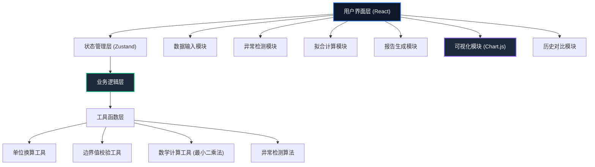

## 1. 架构设计



## 2. 技术栈说明

- **前端框架**：React@18 + TypeScript
- **构建工具**：Vite@5
- **样式方案**：TailwindCSS@3
- **状态管理**：Zustand（轻量级状态管理）
- **图表库**：Chart.js + react-chartjs-2
- **图标库**：Lucide React
- **后端服务**：无（纯前端应用，所有计算在浏览器端完成）
- **数据持久化**：localStorage（保存历史拟合记录）

## 3. 路由定义

| 路由 | 页面/组件 | 功能说明 |
|------|-----------|----------|
| / | 主工作台 | 完整的衰变拟合工作台，包含所有功能模块 |

**单页应用设计**：所有功能集成在一个页面，通过组件分区实现不同功能模块。

## 4. 核心数据结构

### 4.1 数据类型定义

```typescript
// 计数数据点
interface DataPoint {
  id: string;
  time: number;
  count: number;
  correctedCount?: number;
  isAbnormal?: boolean;
  abnormalType?: 'background' | 'interval' | 'peak';
}

// 背景噪声
interface BackgroundNoise {
  value: number;
  measuredTime?: number;
  isDeducted: boolean;
}

// 材料信息
interface MaterialInfo {
  name: string;
  halfLifeKnown?: number;
  unit: TimeUnit;
}

// 时间单位
type TimeUnit = 's' | 'min' | 'h' | 'd';

// 拟合结果
interface FitResult {
  id: string;
  timestamp: number;
  halfLife: number;
  halfLifeUnit: TimeUnit;
  decayConstant: number;
  initialActivity: number;
  rSquared: number;
  dataPoints: DataPoint[];
  background: BackgroundNoise;
  material: MaterialInfo;
  anomalies: Anomaly[];
  report: string;
}

// 异常信息
interface Anomaly {
  type: 'background_not_deducted' | 'interval_error' | 'abnormal_peak' | 'boundary_error';
  severity: 'warning' | 'error';
  message: string;
  location: {
    dataPointId?: string;
    time?: number;
    row?: number;
  };
  suggestion: string;
}

// 应用状态
interface AppState {
  material: MaterialInfo;
  dataPoints: DataPoint[];
  background: BackgroundNoise;
  currentTimeUnit: TimeUnit;
  fitResults: FitResult[];
  activeResultId: string | null;
  compareMode: boolean;
  compareResultIds: [string, string] | null;
  anomalies: Anomaly[];
  isFitting: boolean;
}
```

## 5. 核心算法

### 5.1 单位换算系数

| 单位 | 换算为秒 |
|------|-----------|
| 秒 (s) | 1 |
| 分钟 (min) | 60 |
| 小时 (h) | 3600 |
| 天 (d) | 86400 |

### 5.2 指数拟合算法

放射性衰变公式：N(t) = N₀ · e^(-λt)

其中：
- N(t)：t时刻的计数
- N₀：初始计数
- λ：衰变常数
- t：时间
- 半衰期 t₁/₂ = ln(2) / λ

**最小二乘法拟合**：
对衰变公式取对数线性化：ln(N) = ln(N₀) - λt
使用线性回归求解斜率和截距。

### 5.3 拟合优度 R²

R² = 1 - (残差平方和 / 总平方和)

### 5.4 异常检测算法

1. **背景未扣检测**：
   - 计算连续3个点的相对变化率
   - 若 |(N₂ - N₁)/N₁ < 0.02 且 |(N₃ - N₂)/N₂ < 0.02，判定为背景未扣

2. **采样间隔错误检测**：
   - 计算标称间隔 = 总时间 / (n-1)
   - 若 |实际间隔 - 标称间隔| / 标称间隔 > 10%，标记异常

3. **异常峰值检测**：
   - 使用3σ原则：|N_i - mean(N_{i-1}, N_{i+1})| > 3·σ

## 6. 模块划分

```
src/
├── components/
│   ├── DataInputSection.tsx      # 数据输入模块
│   ├── AnomalyPanel.tsx        # 异常检测面板
│   ├── FitResultSection.tsx     # 拟合结果展示
│   ├── ChartSection.tsx         # 图表可视化
│   ├── ReportSection.tsx        # 报告生成
│   ├── HistoryPanel.tsx        # 历史记录对比
│   └── UnitSelector.tsx        # 单位选择器
├── store/
│   └── useAppStore.ts           # Zustand状态管理
├── utils/
│   ├── unitConversion.ts        # 单位换算
│   ├── boundaryCheck.ts         # 边界值校验
│   ├── exponentialFit.ts            # 指数拟合
│   ├── anomalyDetection.ts      # 异常检测
│   └── reportGenerator.ts     # 报告生成
├── types/
│   └── index.ts               # 类型定义
├── hooks/
│   └── useFitting.ts            # 拟合计算hook
├── App.tsx
├── main.tsx
└── index.css
```

## 7. 关键实现要点

1. **单位一致性保证**：
   - 所有内部计算统一使用秒为基准单位
   - 仅在显示层进行单位转换
   - 使用React Context统一管理当前显示单位

2. **边界值校验时机**：
   - 输入时实时校验
   - 拟合前集中校验
   - 报告生成前最终校验

3. **历史记录对比**：
   - 每次拟合结果完整保存
   - 对比时逐项diff，差异项高亮显示
   - 支持最多两个历史记录并排对比

4. **异常提示策略**：
   - 不自动修改数据
   - 每条异常可定位到具体数据行
   - 提供修正建议但不强制执行
