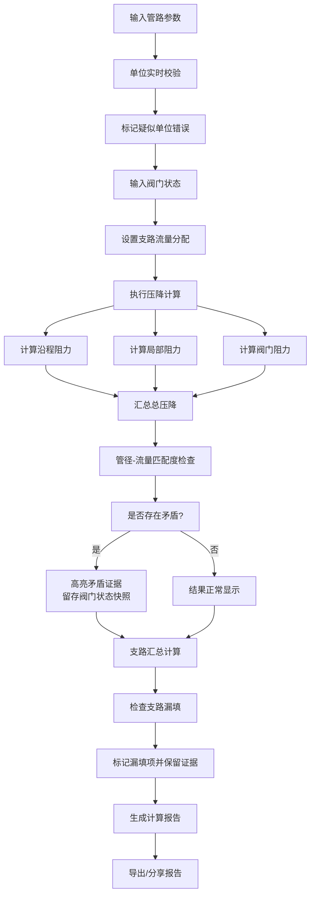

## 1. 产品概述

流体管路压降计算工具，面向暖通工程师的专业工程计算应用。解决管路改造时管径、流量、弯头损失等数据分散、人工核算易出错、阀门半开状态凭印象估算、支路漏填等问题。

- 核心目标：提供透明、可追溯、留证据的压降计算服务
- 目标用户：暖通工程师、管路设计人员、现场施工技术人员
- 产品价值：减少计算错误，保留决策证据链，便于跨角色沟通确认

## 2. 核心特性

### 2.1 用户角色

| 角色 | 注册方式 | 核心权限 |
|------|----------|----------|
| 暖通工程师 | 无需注册，直接使用 | 输入管路数据、执行压降计算、查看追溯详情、导出计算报告 |
| 现场技术人员 | 无需注册，直接使用 | 快速估算压降、查看计算结果 |
| 审核人员 | 无需注册，直接使用 | 查看计算过程、核验数据证据链 |

### 2.2 功能模块

1. **数据输入页**：管路参数输入、支路管理、阀门状态设置
2. **计算结果页**：压降计算结果展示、中间量追溯、单位校验、矛盾预警
3. **报告导出页**：完整计算报告生成、PDF/图片导出、分享链接

### 2.3 页面详情

| 页面名称 | 模块名称 | 功能描述 |
|-----------|-------------|---------------------|
| 数据输入页 | 基础参数模块 | 流体类型选择、温度设置、流量输入（带单位选择） |
| 数据输入页 | 管路段管理 | 多段管路添加、管径/管长/粗糙度输入、弯头数量配置 |
| 数据输入页 | 支路管理 | 支路添加/删除、支路流量分配、支路参数独立设置 |
| 数据输入页 | 阀门状态设置 | 阀门类型选择、开度滑块（0-100%）、全开/半开快捷按钮 |
| 数据输入页 | 单位校验面板 | 实时显示各参数单位、标记疑似单位错误、提供修正建议 |
| 计算结果页 | 压降总览卡片 | 总压降值、各段压降占比、流量-管径匹配度评估 |
| 计算结果页 | 中间量追溯面板 | 雷诺数计算、摩擦系数计算、沿程阻力计算、局部阻力计算 |
| 计算结果页 | 矛盾证据区 | 管路段与管径结论不一致时高亮、阀门状态证据留存、支路漏填标记 |
| 计算结果页 | 支路汇总表 | 各支路流量、压降、管径匹配度、漏填项醒目提示 |
| 报告导出页 | 报告预览 | 完整报告内容预览、含所有中间量和证据链 |
| 报告导出页 | 导出操作 | 一键生成报告、支持PDF/PNG导出、生成分享链接 |

## 3. 核心流程

### 3.1 用户主流程

1. 用户进入应用，选择流体类型并输入基础参数
2. 添加管路段，依次输入管径、管长、弯头数量等参数
3. 如有支路，添加支路并设置流量分配比例
4. 设置阀门状态（类型、开度）
5. 点击计算，系统执行压降计算并进行单位校验
6. 查看计算结果，追溯中间计算过程，检查矛盾预警
7. 如需调整，返回修改参数重新计算
8. 生成完整计算报告，导出或分享给相关同事

### 3.2 计算与追溯流程图

## 4. 用户界面设计

### 4.1 设计风格

**设计方向：工业工程风格（Industrial/Technical）**

- **主色调**：深蓝 `#0F2744` - 代表专业、严谨、可信赖
- **辅助色**：青蓝 `#1E88E5` - 用于交互元素、高亮
- **警示色**：琥珀橙 `#FF8F00` - 用于单位错误、矛盾预警
- **危险色**：深红 `#C62828` - 用于严重错误、漏填标记
- **成功色**：深绿 `#2E7D32` - 用于校验通过、匹配度高
- **背景色**：深灰蓝 `#1A2942` 配合渐变和工业风纹理
- **字体**：
  - 标题/数据：`JetBrains Mono` - 等宽字体，数字对齐，工程感强
  - 正文：`Noto Sans SC` - 清晰易读的中文无衬线
- **布局风格**：模块化卡片布局，清晰的功能分区，网格对齐
- **按钮风格**：方角硬朗风格，微立体边框，hover 时有技术感的光效
- **图标风格**：线性技术图标，类似 CAD 软件的简洁线条

### 4.2 页面设计概述

| 页面名称 | 模块名称 | UI 元素 |
|-----------|-------------|-------------|
| 数据输入页 | 顶部导航 | 应用 Logo、步骤指示器（输入→计算→报告）、主题切换 |
| 数据输入页 | 基础参数卡片 | 流体选择下拉、温度输入、流量输入带单位切换 |
| 数据输入页 | 管路段列表 | 可折叠卡片组，每段独立输入，添加/删除按钮 |
| 数据输入页 | 阀门控制面板 | 阀门类型图标、开度滑动条、开度百分比显示、全开/半开预设 |
| 数据输入页 | 支路管理面板 | 支路卡片、流量分配环形图、漏填项高亮标记 |
| 数据输入页 | 单位校验侧边栏 | 单位列表、错误标记、修正建议按钮 |
| 计算结果页 | 结果总览 | 大字号压降值、单位显示、匹配度仪表盘 |
| 计算结果页 | 追溯详情区 | 可展开的计算步骤树、公式展示、中间量数值 |
| 计算结果页 | 矛盾证据区 | 带时间戳的证据卡片、阀门状态快照、前后版本对比 |
| 计算结果页 | 支路汇总表 | 数据表格、漏填项红框标记、各支路压降柱状图 |
| 报告导出页 | 报告预览 | 类 A4 纸张布局、完整内容展示、分页预览 |
| 报告导出页 | 导出工具栏 | 导出格式选择按钮、生成分享链接、下载进度指示器 |

### 4.3 响应式设计

- **设计原则**：桌面优先（Desktop-first），兼顾平板和移动设备
- **桌面端（>1200px）**：三栏布局 - 左侧参数输入、中间结果展示、右侧追溯详情
- **平板端（768-1200px）**：两栏布局 - 上下分区，上半部分输入，下半部分结果
- **移动端（<768px）**：单栏流式布局，标签页切换输入/结果/报告
- **触摸优化**：按钮最小高度 48px，滑动条增大触控区域，关键数据双击放大查看

### 4.4 交互动效

- **页面加载**：模块依次淡入，数据区域先出现骨架屏再填充内容
- **参数输入**：输入框 focus 时边框发光，单位切换时数字过渡动画
- **计算执行**：进度条显示计算步骤，各中间量依次点亮
- **矛盾预警**：错误卡片震动效果后稳定显示，边框脉冲发光
- **追溯展开**：点击展开时平滑滚动到目标位置，高亮当前查看的计算步骤
- **报告生成**：纸张卷起的动效，生成完成后飘落效果
