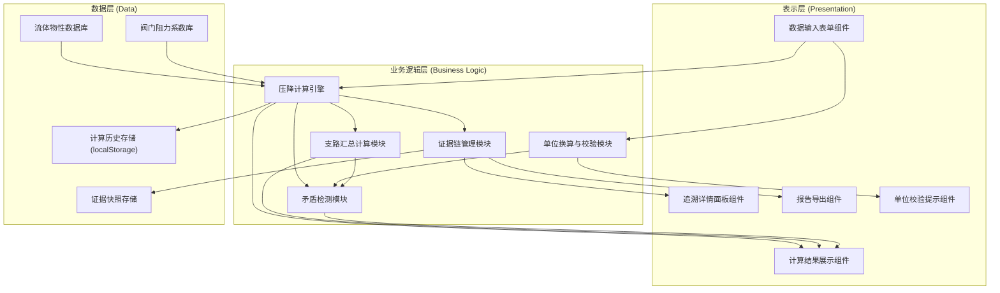
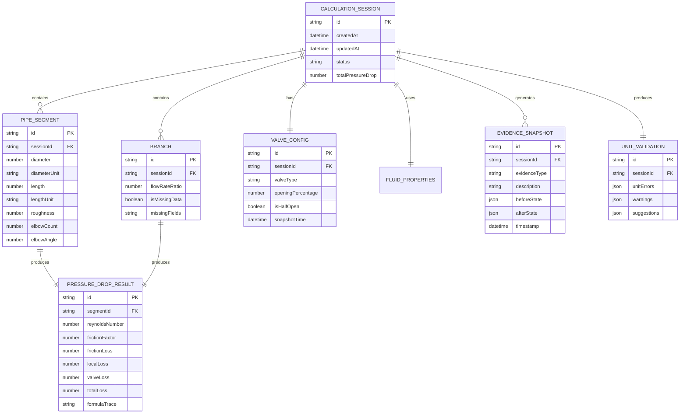

## 1. 架构设计

本项目为纯前端工程计算应用，所有计算逻辑在浏览器端执行，无需后端服务。采用三层架构确保计算透明性和数据可追溯性。



## 2. 技术栈描述

- **前端框架**：React@18 + TypeScript@5 - 类型安全，组件化开发
- **构建工具**：Vite@5 - 快速开发，按需编译
- **样式方案**：TailwindCSS@3 - 原子化 CSS，配合自定义主题
- **状态管理**：Zustand@4 - 轻量状态管理，支持时间旅行调试
- **图表库**：Recharts@2 - 专业数据可视化，压降分布图表
- **导出库**：html2canvas@1 + jspdf@2 - 报告截图和 PDF 生成
- **图标库**：Lucide React@0.344 - 线性技术风格图标
- **动画库**：Framer Motion@11 - 流畅的交互动效
- **数据存储**：localStorage + IndexedDB - 计算历史和证据快照持久化

## 3. 路由定义

| 路由路径 | 页面名称 | 核心功能 |
|---------|----------|----------|
| `/` | 数据输入页 | 管路参数输入、支路管理、阀门状态设置、单位实时校验 |
| `/result` | 计算结果页 | 压降结果展示、中间量追溯、矛盾预警、支路汇总 |
| `/report` | 报告导出页 | 完整报告预览、PDF/PNG 导出、生成分享链接（参数编码） |

## 4. 数据模型

### 4.1 数据实体关系



### 4.2 核心计算数据结构定义

```typescript
// 流体类型
type FluidType = 'water' | 'steam' | 'air' | 'refrigerant';

// 单位系统
type UnitSystem = 'metric' | 'imperial';

// 管径单位
type DiameterUnit = 'mm' | 'cm' | 'm' | 'inch';

// 管长单位
type LengthUnit = 'm' | 'km' | 'ft';

// 流量单位
type FlowUnit = 'm³/h' | 'L/s' | 'm³/s' | 'gpm';

// 压降单位
type PressureUnit = 'Pa' | 'kPa' | 'bar' | 'psi' | 'mH2O';

// 阀门类型
type ValveType = 'gate' | 'globe' | 'ball' | 'butterfly' | 'check';

// 弯头角度
type ElbowAngle = 45 | 90 | 180;

// 管路段
interface PipeSegment {
  id: string;
  name: string;
  diameter: number;
  diameterUnit: DiameterUnit;
  length: number;
  lengthUnit: LengthUnit;
  roughness: number; // 绝对粗糙度，单位：mm
  elbowCount: number;
  elbowAngle: ElbowAngle;
  notes?: string;
}

// 支路
interface Branch {
  id: string;
  name: string;
  flowRateRatio: number; // 0-1
  segments: PipeSegment[];
  valveConfig: ValveConfig;
  isMissingData: boolean;
  missingFields: string[];
}

// 阀门配置
interface ValveConfig {
  id: string;
  valveType: ValveType;
  openingPercentage: number; // 0-100
  isHalfOpen: boolean;
  snapshotTimestamp: number;
}

// 流体属性
interface FluidProperties {
  type: FluidType;
  temperature: number; // °C
  density: number; // kg/m³
  viscosity: number; // Pa·s
}

// 单位校验结果
interface UnitValidationResult {
  field: string;
  value: number;
  currentUnit: string;
  suggestedUnit?: string;
  errorType: 'none' | 'suspicious' | 'invalid' | 'inconsistent';
  message: string;
  confidence: number; // 0-1
}

// 中间计算量 - 用于追溯
interface IntermediateResult {
  id: string;
  name: string;
  value: number;
  unit: string;
  formula: string;
  inputs: Record<string, { value: number; unit: string }>;
  timestamp: number;
}

// 压降计算结果
interface PressureDropResult {
  segmentId: string;
  reynoldsNumber: IntermediateResult;
  frictionFactor: IntermediateResult;
  frictionLoss: IntermediateResult; // 沿程阻力
  localLoss: IntermediateResult; // 局部阻力
  valveLoss: IntermediateResult; // 阀门阻力
  totalLoss: IntermediateResult;
  flowVelocity: IntermediateResult;
}

// 矛盾检测结果
interface ContradictionResult {
  type: 'diameter_flow_mismatch' | 'segment_inconsistent' | 'unit_error' | 'branch_missing';
  severity: 'warning' | 'error';
  message: string;
  evidence: {
    fieldA: { name: string; value: number; unit: string };
    fieldB?: { name: string; value: number; unit: string };
    valveSnapshot?: ValveConfig;
    suggestion: string;
  };
}

// 证据快照
interface EvidenceSnapshot {
  id: string;
  type: 'valve_state' | 'unit_correction' | 'branch_addition' | 'parameter_change';
  description: string;
  beforeState: Record<string, unknown>;
  afterState: Record<string, unknown>;
  timestamp: number;
  userNote?: string;
}

// 完整计算会话
interface CalculationSession {
  id: string;
  createdAt: number;
  updatedAt: number;
  title: string;
  unitSystem: UnitSystem;
  fluid: FluidProperties;
  totalFlowRate: number;
  flowRateUnit: FlowUnit;
  mainSegments: PipeSegment[];
  branches: Branch[];
  mainValve: ValveConfig;
  results: {
    segmentResults: Record<string, PressureDropResult>;
    branchResults: Record<string, PressureDropResult>;
    totalPressureDrop: number;
    pressureDropUnit: PressureUnit;
    contradictions: ContradictionResult[];
    unitValidations: UnitValidationResult[];
    evidenceChain: EvidenceSnapshot[];
  } | null;
  status: 'draft' | 'calculating' | 'completed' | 'error';
}

// 导出报告
interface ExportReport {
  sessionId: string;
  generatedAt: number;
  summary: {
    totalPressureDrop: number;
    unit: PressureUnit;
    totalFlowRate: number;
    flowUnit: FlowUnit;
    contradictionCount: number;
    warningCount: number;
  };
  fullResults: CalculationSession['results'];
  inputParameters: {
    fluid: FluidProperties;
    segments: PipeSegment[];
    branches: Branch[];
    valve: ValveConfig;
  };
}
```

### 4.3 核心计算公式

1. **雷诺数 (Reynolds Number)**  
   `Re = (v × d) / ν`  
   其中 v = 流速，d = 管径，ν = 运动粘度

2. **流速 (Flow Velocity)**  
   `v = Q / A`  
   其中 Q = 流量，A = 管道横截面积

3. **沿程阻力 (Friction Loss) - 达西-魏斯巴赫公式**  
   `hf = f × (L/d) × (v²/2g)`  
   其中 f = 摩擦系数，L = 管长，g = 重力加速度

4. **摩擦系数 (Friction Factor) - 科尔布鲁克公式**  
   `1/√f = -2 × log10(ε/(3.7d) + 2.51/(Re√f))`  
   其中 ε = 绝对粗糙度

5. **局部阻力 (Local Loss)**  
   `hl = ΣK × (v²/2g)`  
   其中 K = 局部阻力系数（弯头、三通等）

6. **阀门阻力 (Valve Loss)**  
   `hv = Kv × (v²/2g)`  
   其中 Kv = 阀门阻力系数（与开度相关）

7. **总压降**  
   `ΔP = ρ × g × (hf + hl + hv)`  
   其中 ρ = 流体密度
