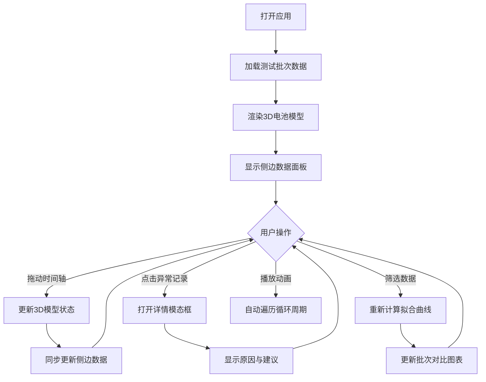

## 1. 产品概述

电池循环衰减分析3D可视化平台，专为新能源实验员设计，用于直观展示电池循环测试中的容量衰减、充放电倍率变化、温度漂移等关键指标。通过交互式3D场景与详细数据面板的联动，解决传统数据复核中信息压缩、风险笼统等问题，提高实验数据复核效率与准确性。

## 2. 核心功能

### 2.1 用户角色
| 角色 | 注册方式 | 核心权限 |
|------|----------|----------|
| 实验员 | 本地访问 | 查看3D可视化、筛选数据、导出报告 |

### 2.2 功能模块
1. **主面板**: 3D电池模型可视化、实时参数显示
2. **侧边数据面板**: 循环记录列表、容量数据详情、异常备注
3. **时间轴控制**: 拖动、筛选、播放/暂停动画
4. **分析模块**: 衰减拟合曲线、批次对比、图表导出
5. **详情模态框**: 中断重启原因与处理建议、倍率切换记录、温度漂移分析

### 2.3 页面详情
| 页面名称 | 模块名称 | 功能描述 |
|----------|----------|----------|
| 主页面 | 3D可视化场景 | 电池模型根据循环次数和衰减率动态变色，支持旋转缩放 |
| 主页面 | 时间轴控制器 | 拖动滑块跳转、播放动画、倍率筛选、温度筛选 |
| 主页面 | 侧边数据面板 | 循环记录表格、容量趋势图、异常事件列表 |
| 主页面 | 详情模态框 | 点击异常事件查看完整原因、处理建议、数据来源追溯 |
| 主页面 | 分析工具栏 | 衰减拟合计算、批次对比、导出CSV/PNG报告 |

## 3. 核心流程

用户打开应用后，默认显示最新批次的3D电池模型和数据概览。可以通过时间轴拖动或播放按钮查看电池在不同循环周期的状态变化。点击侧边栏的异常记录（中断重启、倍率切换、温度漂移）可查看详细原因和处理建议，同时3D场景会定位到对应时间点高亮显示。使用筛选功能可按倍率范围、温度区间过滤数据，衰减拟合曲线和批次对比图表会实时更新。

## 4. 用户界面设计

### 4.1 设计风格
- **主色调**: 深蓝色 (#0F172A) 背景，科技感十足
- **强调色**: 青色 (#06B6D4) 用于正常状态，橙色 (#F59E0B) 用于警告，红色 (#EF4444) 用于异常
- **按钮风格**: 圆角矩形，轻微悬浮效果，点击有按压反馈
- **字体**: 使用 JetBrains Mono 等宽字体显示数据，Inter 显示标题
- **布局风格**: 左侧固定侧边栏（320px），右侧3D场景区域，底部时间轴控制条
- **图标风格**: 使用 Lucide 线性图标，简洁专业

### 4.2 页面设计概述
| 页面名称 | 模块名称 | UI元素 |
|----------|----------|--------|
| 主页面 | 3D场景区域 | 深灰背景、电池模型、环境光、轨道控制、渐变发光效果 |
| 主页面 | 侧边数据面板 | 卡片式布局、阴影效果、滚动区域、高亮异常行 |
| 主页面 | 时间轴控制条 | 自定义滑块、播放按钮、筛选下拉框、进度指示 |
| 主页面 | 详情模态框 | 半透明遮罩、圆角卡片、分栏布局、来源追溯标签 |

### 4.3 响应式
- 桌面端优先设计（1920x1080）
- 平板端自适应布局，侧边栏可折叠
- 移动端简化视图，保留核心数据展示

### 4.4 3D场景指导
- **环境**: 深色空间环境，轻微雾气效果增强纵深感
- **光照**: 主光源（白色）+ 补光（青色），电池表面有高光反射
- **相机**: 初始45度俯视角，支持轨道控制（旋转、缩放、平移）
- **交互**: 悬停高亮、点击显示信息、动画过渡平滑
- **特效**: 电池衰减时表面颜色渐变（绿→黄→红），异常时脉冲发光
- **性能**: 单批次模型面数控制在5万以内，确保60fps流畅运行
