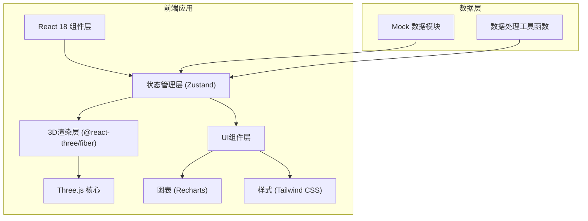

## 1. 架构设计



## 2. 技术描述

- **前端框架**: React@18 + TypeScript
- **构建工具**: Vite@5
- **3D渲染**: three@0.160 + @react-three/fiber@8 + @react-three/drei@9
- **状态管理**: zustand@4
- **图表库**: recharts@2
- **样式方案**: tailwindcss@3
- **图标库**: lucide-react@0.294
- **后端**: 无（纯前端应用，使用Mock数据）
- **数据库**: 无（本地模拟数据）

## 3. 目录结构

```
src/
├── components/
│   ├── Scene3D/          # 3D场景组件
│   ├── Sidebar/          # 侧边数据面板
│   ├── Timeline/         # 时间轴控制器
│   ├── DetailModal/      # 详情模态框
│   └── Analysis/         # 分析工具栏
├── store/
│   └── useBatteryStore.ts # 状态管理
├── data/
│   └── mockData.ts       # 模拟数据
├── utils/
│   ├── fitting.ts        # 衰减拟合算法
│   └── export.ts         # 导出工具
├── types/
│   └── index.ts          # TypeScript类型定义
├── App.tsx
├── main.tsx
└── index.css
```

## 4. 数据模型

### 4.1 核心数据类型

```typescript
// 循环记录
interface CycleRecord {
  id: string;
  cycleNumber: number;
  timestamp: Date;
  capacity: number;      // 容量 (mAh)
  capacityRetention: number; // 容量保持率 (%)
  chargeRate: number;    // 充电倍率 (C)
  dischargeRate: number; // 放电倍率 (C)
  avgTemperature: number; // 平均温度 (°C)
  maxTemperature: number; // 最高温度 (°C)
  energyEfficiency: number; // 能量效率 (%)
  anomalies: Anomaly[];  // 异常事件
}

// 异常事件
interface Anomaly {
  id: string;
  type: 'interruption' | 'rate_change' | 'temperature_drift';
  timestamp: Date;
  cycleNumber: number;
  description: string;
  cause: string;
  suggestion: string;
  severity: 'low' | 'medium' | 'high';
  dataSources: string[]; // 数据来源追溯
}

// 电池批次
interface BatteryBatch {
  id: string;
  name: string;
  chemistry: string;     // 化学体系
  nominalCapacity: number; // 标称容量
  testStartDate: Date;
  cycles: CycleRecord[];
}
```

### 4.2 状态管理

```typescript
interface BatteryState {
  // 当前状态
  currentBatch: BatteryBatch | null;
  currentCycleIndex: number;
  isPlaying: boolean;
  playbackSpeed: number;
  
  // 筛选条件
  filters: {
    chargeRateRange: [number, number];
    temperatureRange: [number, number];
    anomalyTypes: string[];
  };
  
  // 分析结果
  fittingCurve: number[];
  comparisonData: ComparisonPoint[];
  
  // UI状态
  selectedAnomaly: Anomaly | null;
  showDetailModal: boolean;
  
  // Actions
  setCycleIndex: (index: number) => void;
  togglePlayback: () => void;
  setFilters: (filters: Partial<Filters>) => void;
  selectAnomaly: (anomaly: Anomaly | null) => void;
  exportReport: (format: 'csv' | 'png') => void;
  calculateFitting: () => void;
}
```

## 5. 组件设计

| 组件名称 | 核心职责 | 依赖 |
|---------|----------|------|
| BatteryModel | 3D电池模型渲染，根据衰减率变色 | @react-three/fiber, three |
| Scene3D | 3D场景容器，相机、光照控制 | @react-three/drei (OrbitControls) |
| CycleList | 循环记录表格，支持排序筛选 | Zustand store |
| CapacityChart | 容量趋势图 + 拟合曲线 | Recharts |
| AnomalyList | 异常事件列表，点击查看详情 | Zustand store |
| TimelineControl | 时间轴滑块、播放控制 | React, Zustand |
| DetailModal | 异常详情、原因建议、来源追溯 | React Modal |
| AnalysisToolbar | 拟合计算、批次对比、导出按钮 | utils/fitting, utils/export |

## 6. 关键技术点

### 6.1 3D模型状态更新
- 使用 `useFrame` 钩子实现平滑动画过渡
- 根据 `capacityRetention` 计算颜色渐变（绿→黄→红）
- 异常事件触发脉冲发光效果（使用 `useSpring` 动画）

### 6.2 衰减拟合算法
- 采用指数衰减模型: `f(x) = a * exp(-b * x) + c`
- 使用最小二乘法进行参数拟合
- 拟合结果实时反映在图表和3D场景中

### 6.3 数据联动机制
- Zustand 单一数据源保证状态一致性
- 时间轴变化 → 触发 3D 模型更新 + 侧边数据高亮
- 筛选条件变化 → 重新过滤数据 + 重新计算拟合

### 6.4 导出功能
- CSV 导出: 使用 `json2csv` 或原生字符串拼接
- PNG 导出: 使用 `html2canvas` 捕获图表区域
- 报告包含: 循环记录、容量数据、异常备注、拟合参数
