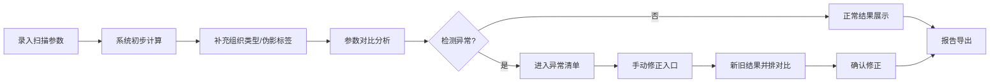

## 1. 产品概述

核磁信号参数调试工具是专为医学物理讲师设计，用于处理日常"脏材料"的参数调试工作。解决参数冲突、时间超限、伪影误判等反复出现的问题。

- 核心目标：提供统一的参数对比和持久化管理，确保多接口计算结果一致性
- 目标用户：医学物理讲师、MRI技术人员
- 市场价值：提升MRI参数调试效率，减少重复工作，降低误判率

## 2. 核心功能

### 2.1 用户角色

| 角色 | 注册方式 | 核心权限 |
|------|----------|----------|
| 医学物理讲师 | 系统登录 | 参数录入、对比分析、手动修正、报告导出 |
| 管理员 | 系统登录 | 系统配置、用户管理 |

### 2.2 功能模块

1. **参数录入页**：扫描参数录入、组织类型标注、伪影标签补充
2. **参数对比面板**：多接口参数对比、冲突检测、历史版本对比
3. **异常清单页**：参数冲突清单、时间超限清单、伪影误判清单
4. **手动修正页**：组织类型修正、新旧结果并排对比、修改记录追踪
5. **报告导出页**：参数变更影响分析、伪影解释、PDF导出

### 2.3 页面详情

| 页面名称 | 模块名称 | 功能描述 |
|----------|----------|----------|
| 参数录入页 | 扫描参数表单 | 支持分步录入，先录入扫描参数，后续补充组织类型和伪影标签 |
| 参数录入页 | 参数持久化存储 | 增量更新，不覆盖已有判断结果 |
| 参数对比面板 | 多接口对比视图 | 并排展示多接口计算结果，高亮差异 |
| 参数对比面板 | 冲突检测 | 自动检测参数冲突和时间超限 |
| 异常清单页 | 待确认清单 | 参数冲突、时间超限、伪影误判分类展示 |
| 异常清单页 | 异常处理 | 标记处理状态、添加备注、批量操作 |
| 手动修正页 | 组织类型编辑器 | 下拉选择组织类型，实时预览影响 |
| 手动修正页 | 新旧对比视图 | 左右并排展示修正前后结果 |
| 报告导出页 | 变更影响分析 | 展示人工修改对伪影解释的影响 |
| 报告导出页 | 报告生成 | 支持PDF导出，包含完整参数和修改记录 |

## 3. 核心流程

用户录入扫描参数→系统计算初步结果→用户补充组织类型和伪影标签→系统进行参数对比→检测异常进入异常清单→用户手动修正→查看新旧对比→导出报告

## 4. 用户界面设计

### 4.1 设计风格

- 主色调：专业医疗蓝 (#165DFF)
- 辅助色：警示橙 (#FF7D00)、错误红 (#F53F3F)、成功绿 (#00B42A)
- 中性色：深灰 (#1D2129)、中灰 (#4E5969)、浅灰 (#C9CDD4)
- 按钮风格：圆角8px，悬停有微动画
- 字体：思源黑体 (Source Han Sans)
- 布局风格：卡片式布局，左侧导航+右侧内容
- 图标风格：线性图标，统一24px

### 4.2 页面设计概述

| 页面名称 | 模块名称 | UI元素 |
|----------|----------|--------|
| 参数录入页 | 扫描参数表单 | 分步表单、卡片分组、必填标记、保存提示 |
| 参数对比面板 | 多接口对比视图 | 表格对比、颜色标记差异、悬停提示 |
| 异常清单页 | 待确认清单 | 标签分类、状态徽章、操作按钮组 |
| 手动修正页 | 新旧对比视图 | 左右分栏、同步滚动、差异高亮 |
| 报告导出页 | 报告预览 | 分页预览、导出按钮、下载进度 |

### 4.3 响应式

- 桌面端优先设计，支持1280px以上最佳体验
- 平板端适配，左右布局转为上下布局
- 移动端基础功能可用，复杂操作建议桌面端完成

### 4.4 动效设计

- 页面加载：骨架屏过渡
- 表单提交：按钮加载动画
- 异常检测：进度条动画
- 对比视图：差异高亮渐显
- 报告导出：环形进度条
