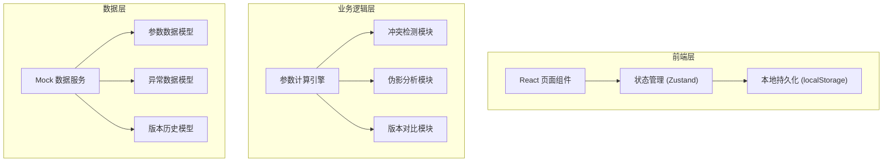
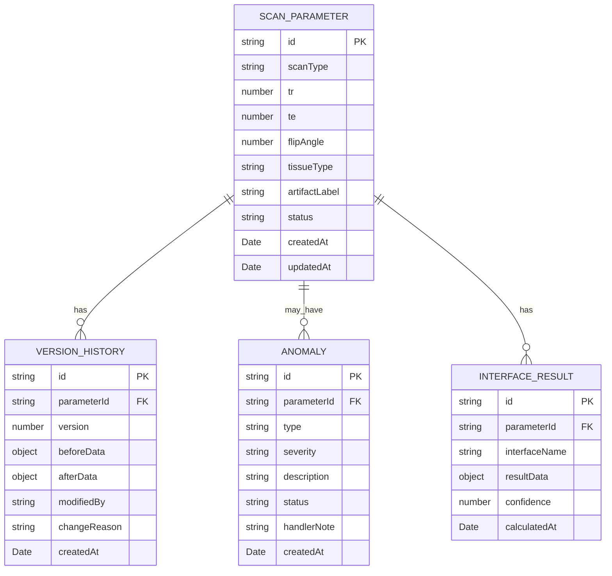

## 1. 架构设计



## 2. 技术描述

- 前端框架: React@18 + TypeScript
- 构建工具: Vite@5
- 样式方案: TailwindCSS@3
- 状态管理: Zustand
- UI组件库: Ant Design
- 路由管理: React Router@6
- 图表库: ECharts (用于参数对比可视化)
- PDF导出: html2pdf.js
- 后端: 无后端，使用 localStorage 实现本地持久化
- 数据: Mock 数据模拟服务端响应

## 3. 路由定义

| 路由 | 页面名称 | 说明 |
|------|----------|------|
| / | 首页/仪表盘 | 展示统计概览和快捷入口 |
| /parameter-input | 参数录入页 | 扫描参数录入和补充 |
| /comparison | 参数对比面板 | 多接口参数对比分析 |
| /anomalies | 异常清单页 | 待确认和异常列表 |
| /manual-correction | 手动修正页 | 组织类型修正和新旧对比 |
| /report | 报告导出页 | 报告预览和导出 |

## 4. 数据模型

### 4.1 数据模型定义



### 4.2 数据类型定义

```typescript
// 扫描参数
interface ScanParameter {
  id: string;
  scanType: string;
  tr: number; // 重复时间
  te: number; // 回波时间
  flipAngle: number; // 翻转角
  sliceThickness?: number;
  fov?: string;
  matrix?: string;
  tissueType?: string; // 组织类型（后补）
  artifactLabel?: string; // 伪影标签（后补）
  status: 'draft' | 'pending' | 'confirmed' | 'anomaly';
  createdAt: Date;
  updatedAt: Date;
}

// 接口计算结果
interface InterfaceResult {
  id: string;
  parameterId: string;
  interfaceName: string;
  resultData: Record<string, any>;
  confidence: number;
  calculatedAt: Date;
}

// 异常记录
interface Anomaly {
  id: string;
  parameterId: string;
  type: 'conflict' | 'timeout' | 'artifact_misjudgment';
  severity: 'low' | 'medium' | 'high';
  description: string;
  status: 'pending' | 'confirmed' | 'resolved';
  handlerNote?: string;
  createdAt: Date;
}

// 版本历史
interface VersionHistory {
  id: string;
  parameterId: string;
  version: number;
  beforeData: Partial<ScanParameter>;
  afterData: Partial<ScanParameter>;
  modifiedBy: string;
  changeReason?: string;
  createdAt: Date;
}
```

## 5. 核心模块设计

### 5.1 参数计算引擎
- 统一调用多个模拟接口
- 计算结果归一化处理
- 结果缓存和版本管理

### 5.2 冲突检测模块
- 参数值范围校验
- 多接口结果一致性检查
- 时间超限检测
- 伪影误判分析

### 5.3 版本对比模块
- 新旧数据差异计算
- 差异可视化展示
- 修改影响分析

### 5.4 报告生成模块
- 伪影解释模板化
- 修改痕迹保留
- PDF导出

## 6. 状态管理设计

```typescript
// 参数状态
interface ParameterStore {
  parameters: ScanParameter[];
  currentParameter: ScanParameter | null;
  interfaceResults: InterfaceResult[];
  anomalies: Anomaly[];
  versionHistories: VersionHistory[];
  
  // Actions
  addParameter: (data: Partial<ScanParameter>) => void;
  updateParameter: (id: string, data: Partial<ScanParameter>) => void;
  calculateResults: (parameterId: string) => Promise<void>;
  detectAnomalies: (parameterId: string) => void;
  correctTissueType: (parameterId: string, newType: string, reason?: string) => void;
  exportReport: (parameterId: string) => Promise<void>;
}
```
