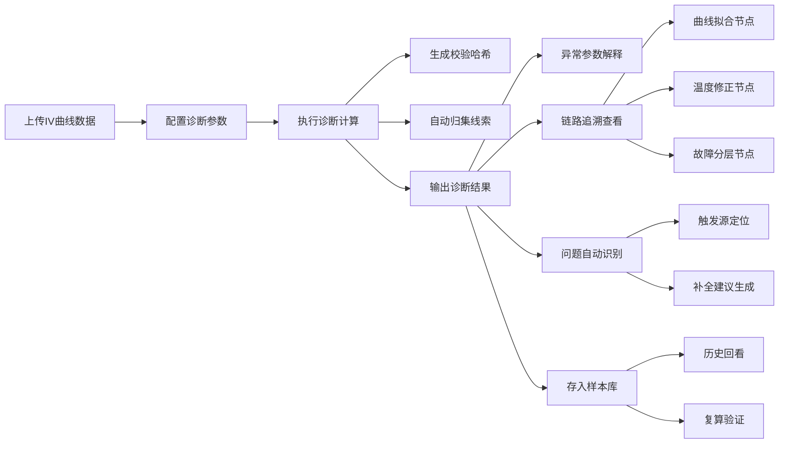

## 1. 产品概述

光伏组件IV曲线诊断系统，为光伏运维工程师提供可复算、可追溯的IV曲线分析工具。解决IV曲线小改动导致重复计算、异常参数缺乏解释、线索分散难以关联等痛点，实现从诊断结果到原始数据的全链路追溯。

## 2. 核心功能

### 2.1 用户角色
| 角色 | 注册方式 | 核心权限 |
|------|----------|----------|
| 光伏运维工程师 | 账号登录 | IV曲线诊断、线索归集、链路追溯、样本回看 |
| 系统管理员 | 后台创建 | 用户管理、参数配置、系统监控 |

### 2.2 功能模块
1. **诊断工作台**：IV曲线上传、参数配置、诊断执行、结果展示
2. **线索归集中心**：IV曲线、温度记录、遮挡照片关联管理
3. **链路追溯面板**：诊断结果→曲线拟合→温度修正→故障分层全链路
4. **问题追踪系统**：异常定位、触发材料、卡点分析、下一步建议
5. **样本回看库**：历史诊断记录、参数对比、复算验证

### 2.3 页面详情
| 页面名称 | 模块名称 | 功能描述 |
|----------|----------|----------|
| 诊断工作台 | IV曲线上传 | 支持批量上传IV曲线数据文件，格式校验 |
| 诊断工作台 | 参数配置 | 温度修正系数、串号配置、故障阈值等参数设置 |
| 诊断工作台 | 诊断执行 | 一键诊断，实时进度，可复算哈希校验 |
| 诊断工作台 | 结果展示 | 异常参数高亮，参数解释悬浮提示 |
| 线索归集中心 | 事件管理 | 创建/编辑诊断事件，关联多条线索 |
| 线索归集中心 | 线索关联 | IV曲线、温度记录、照片上传与事件绑定 |
| 链路追溯面板 | 诊断链路 | 可视化展示诊断全流程节点 |
| 链路追溯面板 | 节点详情 | 点击节点查看该步骤的输入输出、算法参数 |
| 问题追踪系统 | 异常定位 | 自动识别温度未修正/遮挡误判/串号混淆等问题 |
| 问题追踪系统 | 触发溯源 | 显示哪份材料触发异常，卡点位置 |
| 问题追踪系统 | 补全建议 | 智能推荐下一步需要补充的数据或操作 |
| 样本回看库 | 历史记录 | 按时间/串号/事件筛选历史诊断 |
| 样本回看库 | 复算验证 | 相同输入一键重跑，结果一致性对比 |
| 样本回看库 | 参数对比 | 多次诊断参数差异高亮对比 |

## 3. 核心流程

用户上传IV曲线数据并配置诊断参数，系统执行诊断计算并生成唯一校验哈希。诊断过程中自动归集相关线索（温度记录、遮挡照片）到同一事件。用户可查看诊断结果，点击异常参数查看解释，通过链路追溯面板追踪每个计算节点的详情。系统自动识别常见问题并定位触发源，提供补全建议。所有诊断记录存储在样本库中，支持随时回看和复算验证。

## 4. 用户界面设计

### 4.1 设计风格
- **主色调**：科技蓝 #165DFF，代表专业、可靠
- **辅助色**：警示橙 #FF7D00（异常）、成功绿 #00B42A（正常）、信息灰 #86909C
- **按钮样式**：圆角8px，微阴影，hover时有轻微上浮效果
- **字体**：标题使用 PingFang SC Semibold，正文使用 PingFang SC Regular
- **布局风格**：左侧导航 + 右侧内容区，卡片式模块布局
- **图标风格**：线性图标，统一24px尺寸，与文字对齐

### 4.2 页面设计概述
| 页面名称 | 模块名称 | UI元素 |
|----------|----------|--------|
| 诊断工作台 | IV曲线上传 | 拖拽上传区，文件列表，进度条 |
| 诊断工作台 | 诊断结果 | 卡片式参数展示，异常高亮，悬浮解释框 |
| 链路追溯面板 | 诊断链路 | 时间轴式流程图，可点击节点，连接线动画 |
| 线索归集中心 | 事件卡片 | 事件概要，线索数量徽标，状态标签 |
| 样本回看库 | 历史列表 | 表格布局，筛选栏，操作列按钮 |

### 4.3 响应式
- 桌面端优先（1440px及以上）
- 平板端（768px-1440px）：侧边栏可折叠，卡片自适应换行
- 移动端（768px以下）：顶部导航，纵向堆叠布局

### 4.4 数据可视化
- IV曲线图：使用折线图展示电流-电压关系
- 链路追溯：使用流程图展示计算节点
- 参数对比：使用柱状图/差异表展示多次诊断对比
