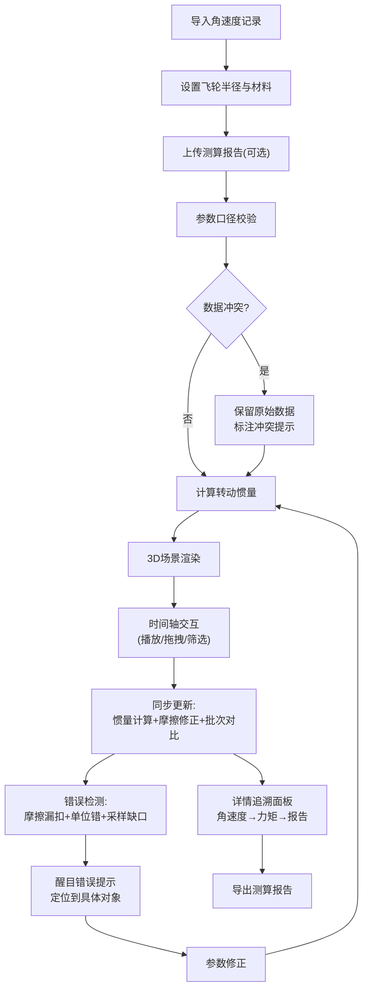

## 1. 产品概述
飞轮转动惯量测算可视化系统，用于工业场景下飞轮转动惯量的精准测算与数据复核。核心解决惯量计算后采样缺口追溯不清、摩擦修正遗漏、单位换算错误等业务痛点，为工程技术人员提供"所见即所得"的参数调校与数据溯源平台。

## 2. 核心功能

### 2.1 用户角色
| 角色 | 注册方式 | 核心权限 |
|------|----------|----------|
| 测试工程师 | 企业账号登录 | 参数输入、3D交互、数据导出、报告生成 |
| 质量复核员 | 企业账号登录 | 数据追溯、批次对比、报告审核 |

### 2.2 功能模块
1. **主工作台**：3D飞轮场景、实时数据侧边栏、时间轴控制器
2. **参数输入面板**：角速度记录导入、飞轮半径设置、测算报告上传
3. **计算与修正模块**：转动惯量计算、摩擦阻力修正、批次对比分析
4. **错误预警模块**：摩擦漏扣检测、半径单位校验、采样缺口定位
5. **详情追溯面板**：角速度-力矩-报告对应关系、数据溯源链路
6. **报告导出模块**：测算报告生成、数据快照导出

### 2.3 页面详情
| 页面名称 | 模块名称 | 功能描述 |
|----------|----------|----------|
| 主工作台 | 3D飞轮场景 | Three.js 渲染可交互飞轮模型，支持旋转、缩放、剖切视角 |
| 主工作台 | 侧边数据面板 | 实时显示计算参数、惯量结果、修正值，参数修改即时联动3D场景 |
| 主工作台 | 时间轴控制器 | 播放/暂停/拖拽/筛选，驱动惯量计算、摩擦修正、批次对比同步更新 |
| 参数输入 | 角速度记录 | 支持 CSV/JSON 导入或手动输入，数据校验与格式提示 |
| 参数输入 | 飞轮半径 | 支持多单位输入（mm/cm/m），自动换算与单位错误检测 |
| 参数输入 | 测算报告 | 上传历史报告进行对比，数据口径冲突时保留原始数据不篡改 |
| 错误预警 | 提示系统 | 具体到材料/对象的错误提示，摩擦漏扣和单位错误高亮醒目显示 |
| 详情追溯 | 数据链路 | 展示角速度记录→力矩计算→报告导出的完整对应关系，支持逐条复核 |
| 详情追溯 | 批次对比 | 多批次数据叠加对比，差异点自动标注 |

## 3. 核心流程

测试工程师导入角速度记录与飞轮参数→系统实时计算转动惯量并渲染3D场景→通过时间轴筛选数据区间→自动检测摩擦漏扣、单位错误、采样缺口→修正参数后重新计算→生成可追溯的测算报告→质量复核员通过详情面板追溯数据链路

## 4. 用户界面设计

### 4.1 设计风格
- **主色调**：工业深灰 #1A1D21 为底，科技蓝 #3B82F6 为强调色，警示橙 #F97316 用于错误高亮
- **警示色**：摩擦漏扣/单位错误使用高饱和警示红 #EF4444 配合脉冲动画，确保醒目
- **按钮风格**：硬朗直角边框，轻微悬停浮起效果，按压下沉反馈
- **字体**：标题使用 JetBrains Mono 等宽字体体现工业精密感，正文使用 Inter 保证可读性
- **布局风格**：左侧固定侧边数据面板，中央3D场景，底部时间轴控制器，右上角详情追溯抽屉
- **图标风格**：线性工业图标，避免过度装饰，数据密度优先

### 4.2 页面设计概述
| 页面名称 | 模块名称 | UI 元素 |
|----------|----------|----------|
| 主工作台 | 3D场景 | 金属质感飞轮模型，轴心坐标系，采样缺口处红色标记点闪烁，摩擦系数可视化热力环 |
| 主工作台 | 侧边面板 | 参数输入区（带单位切换），实时计算结果区，错误预警区（醒目警示条） |
| 主工作台 | 时间轴 | 波形图显示角速度曲线，可拖拽选择区间，缺口处用橙色断点标记 |
| 详情抽屉 | 追溯链路 | 三列对齐展示：角速度记录列表 → 力矩计算过程 → 对应报告条目，点击高亮联动3D场景 |
| 详情抽屉 | 批次对比 | 多曲线叠加图表，差异数值用红色背景标注 |

### 4.3 响应式
- Desktop-first 设计，最小支持 1440px 宽度
- 侧边面板可折叠，为3D场景让出空间
- 时间轴在小屏时可垂直滚动
- 触摸设备支持双指缩放3D场景

### 4.4 3D 场景指引
- **环境**：深色工业环境，使用方向光模拟实验室顶灯，环境光反射金属质感
- **光照**：主光源 45° 侧上方，补光突出飞轮边缘轮廓，底部柔光消除硬阴影
- **相机**：默认透视相机，初始距离为飞轮直径3倍，支持轨道控制，预设4个视角（正视/侧视/俯视/剖切）
- **交互**：鼠标滚轮缩放，左键拖动旋转，右键平移；点击飞轮扇区高亮对应采样区间
- **动画**：飞轮根据角速度参数真实转动，采样缺口处暂停并闪烁红色标记，摩擦系数变化时热力环颜色渐变
- **后处理**：轻微泛光效果突出警示标记，FXAA 抗锯齿保证边缘锐利
- **性能**：单帧绘制调用控制在 50 以内，保持 60fps，低性能设备自动降级后处理

### 4.5 错误提示规范
- **摩擦漏扣**：红色脉冲边框包裹整个侧边面板，提示内容：`【摩擦修正遗漏】第3批次铸铁飞轮摩擦系数未配置，当前计算值偏差约12.7%`
- **半径单位错误**：输入框红色高亮，右侧悬浮错误卡片：`【半径单位错误】当前输入 500mm 与报告中 0.5m 口径不一致，请确认材料"45号钢飞轮A-03"的实际尺寸`
- **采样缺口**：时间轴对应位置橙色断点标记，点击弹出：`【采样缺口】时间点 12.3s-14.7s 无角速度记录，涉及材料"铝合金飞轮B-01"，惯量计算已自动插值，建议复核`
