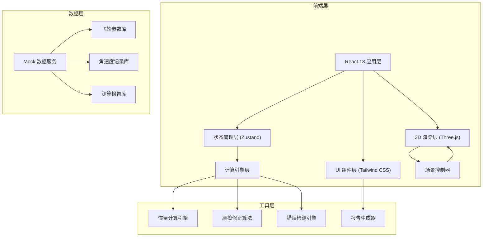
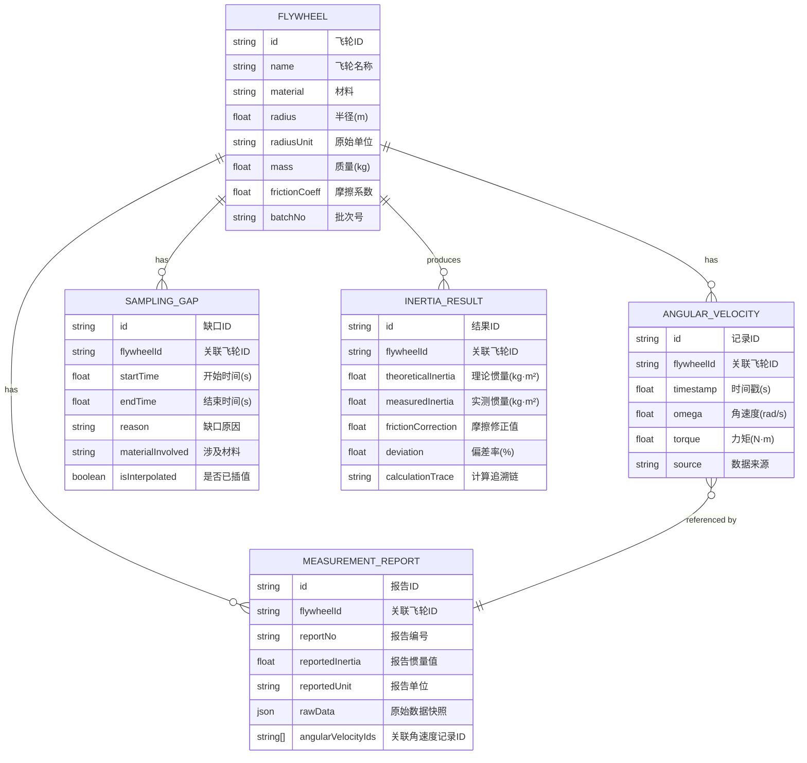

## 1. 架构设计



## 2. 技术描述
- **前端框架**：React@18.2.0 + TypeScript@5.3.3
- **构建工具**：Vite@5.0.10
- **样式方案**：TailwindCSS@3.4.1 + PostCSS
- **3D 渲染**：three@0.160.0 + @react-three/fiber@8.15.12 + @react-three/drei@9.92.7 + @react-three/postprocessing@2.15.11
- **状态管理**：Zustand@4.4.7
- **图表库**：recharts@2.10.3（时间轴波形图、批次对比图）
- **数据处理**：date-fns@3.0.6 + papaparse@5.4.1（CSV解析）
- **Mock 数据**：内置 JSON 模拟数据，覆盖 3 个批次飞轮测试数据
- **字体**：JetBrains Mono + Inter（通过 Google Fonts 引入）

## 3. 路由定义
| 路由 | 用途 |
|------|------|
| / | 主工作台（默认路由，包含3D场景、侧边面板、时间轴） |

## 4. 核心数据模型

### 4.1 数据模型定义



### 4.2 TypeScript 类型定义

```typescript
// 飞轮基础信息
interface Flywheel {
  id: string;
  name: string;
  material: string;
  radius: number; // 标准单位：米
  radiusUnit: 'mm' | 'cm' | 'm';
  rawRadiusInput: string; // 原始输入，用于单位错误检测
  mass: number;
  frictionCoeff: number | null; // null 表示未配置（摩擦漏扣）
  batchNo: string;
  createTime: number;
}

// 角速度记录
interface AngularVelocityRecord {
  id: string;
  flywheelId: string;
  timestamp: number;
  omega: number; // 角速度 rad/s
  alpha: number; // 角加速度 rad/s²
  torque: number; // 力矩 N·m
  source: 'sensor' | 'manual' | 'import';
  isValid: boolean;
}

// 采样缺口
interface SamplingGap {
  id: string;
  flywheelId: string;
  startTime: number;
  endTime: number;
  duration: number;
  materialInvolved: string;
  reason: 'data_loss' | 'sensor_error' | 'manual_skip';
  isInterpolated: boolean;
  interpolationMethod?: string;
}

// 单位错误
interface UnitError {
  id: string;
  flywheelId: string;
  field: 'radius' | 'mass' | 'inertia';
  inputValue: string;
  inputUnit: string;
  expectedUnit: string;
  expectedValue: number;
  materialName: string;
  severity: 'warning' | 'error';
}

// 摩擦漏扣
interface FrictionOmission {
  id: string;
  flywheelId: string;
  materialName: string;
  batchNo: string;
  estimatedDeviation: number; // 预估偏差 %
  isConfigured: boolean;
}

// 惯量计算结果
interface InertiaResult {
  id: string;
  flywheelId: string;
  timeRange: [number, number];
  theoreticalInertia: number; // I = 0.5 * m * r²
  measuredInertia: number; // I = τ / α
  frictionCorrection: number;
  finalInertia: number;
  deviation: number;
  calculationTrace: {
    angularVelocityIds: string[];
    formula: string;
    steps: Array<{ param: string; value: number; source: string }>;
  };
  gapsInvolved: string[];
  errorsInvolved: string[];
}

// 测算报告
interface MeasurementReport {
  id: string;
  flywheelId: string;
  reportNo: string;
  reportDate: string;
  reportedInertia: number;
  reportedUnit: string;
  rawDataSnapshot: {
    flywheel: Flywheel;
    angularVelocities: AngularVelocityRecord[];
    results: InertiaResult[];
  };
  angularVelocityIds: string[];
  status: 'draft' | 'final' | 'conflicting';
}

// 批次对比
interface BatchComparison {
  batchNo: string;
  flywheelIds: string[];
  averageInertia: number;
  stdDeviation: number;
  outliers: string[];
  comparisonChartData: Array<{ batch: string; inertia: number; deviation: number }>;
}

// 应用状态
interface AppState {
  flywheels: Flywheel[];
  selectedFlywheelId: string | null;
  angularVelocities: AngularVelocityRecord[];
  samplingGaps: SamplingGap[];
  unitErrors: UnitError[];
  frictionOmissions: FrictionOmission[];
  inertiaResults: InertiaResult[];
  reports: MeasurementReport[];
  selectedTimeRange: [number, number] | null;
  isPlaying: boolean;
  playbackSpeed: number;
  currentTime: number;
  showDetailPanel: boolean;
  selectedResultId: string | null;
}
```

## 5. 目录结构

```
src/
├── components/
│   ├── layout/
│   │   ├── AppLayout.tsx        # 主布局
│   │   └── Sidebar.tsx          # 侧边面板容器
│   ├── three/
│   │   ├── FlywheelScene.tsx    # 3D飞轮场景
│   │   ├── FlywheelMesh.tsx     # 飞轮网格组件
│   │   ├── FrictionHeatRing.tsx # 摩擦热力环
│   │   └── SceneControls.tsx    # 场景控制器
│   ├── sidebar/
│   │   ├── ParameterInput.tsx   # 参数输入面板
│   │   ├── InertiaDisplay.tsx   # 惯量结果显示
│   │   └── ErrorAlert.tsx       # 错误预警组件
│   ├── timeline/
│   │   ├── TimelineController.tsx  # 时间轴控制
│   │   └── VelocityChart.tsx       # 角速度波形图
│   └── detail/
│       ├── DetailDrawer.tsx     # 详情抽屉
│       ├── TraceabilityPanel.tsx # 追溯链路面板
│       └── BatchComparison.tsx  # 批次对比
├── store/
│   └── useAppStore.ts           # Zustand 状态管理
├── engine/
│   ├── inertiaCalculator.ts     # 惯量计算引擎
│   ├── frictionCorrector.ts     # 摩擦修正算法
│   ├── errorDetector.ts         # 错误检测引擎
│   └── reportGenerator.ts       # 报告生成器
├── data/
│   ├── mockFlywheels.ts         # 飞轮模拟数据
│   ├── mockVelocities.ts        # 角速度模拟数据
│   └── mockReports.ts           # 报告模拟数据
├── types/
│   └── index.ts                 # 类型定义
├── utils/
│   ├── unitConverter.ts         # 单位转换工具
│   └── formatters.ts            # 格式化工具
├── hooks/
│   └── usePlayback.ts           # 播放控制 Hook
├── App.tsx
├── main.tsx
└── index.css
```

## 6. 核心算法

### 6.1 转动惯量计算
- **理论惯量**：I_theory = 0.5 × m × r² （圆盘飞轮）
- **实测惯量**：I_measured = τ / α （力矩除以角加速度）
- **摩擦修正**：I_final = I_measured + I_friction_correction
- **偏差率**：deviation = |I_final - I_theory| / I_theory × 100%

### 6.2 错误检测规则
1. **摩擦漏扣**：检测 frictionCoeff 是否为 null 或 0，根据材料库标准值预估偏差
2. **半径单位错误**：比较原始输入值与报告值，检测 mm/cm/m 单位混淆
3. **采样缺口**：检测角速度记录时间戳间隔 > 阈值（默认 0.5s），标记缺口区间

### 6.3 追溯链路生成
每条计算结果记录完整的计算过程：
- 参与计算的角速度记录 ID 列表
- 使用的计算公式
- 每一步参数的来源（输入/导入/插值）
- 涉及的采样缺口和错误标记
