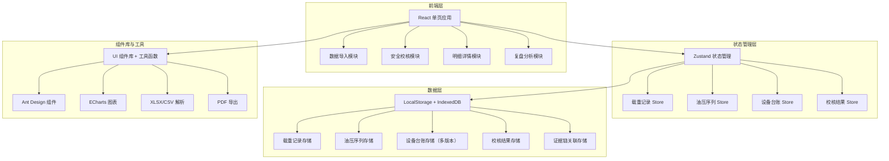
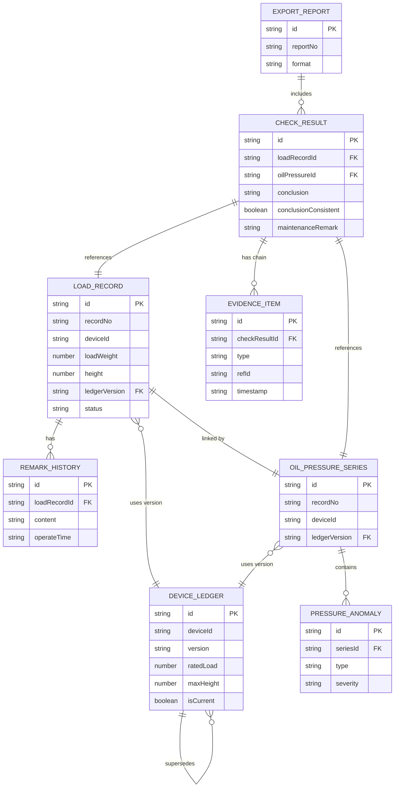

## 1. 架构设计



## 2. 技术说明

- **前端框架**：React@18 + TypeScript + Vite
- **构建工具**：Vite@5
- **状态管理**：Zustand（轻量级，适合本地数据管理）
- **UI 组件库**：Ant Design@5
- **图表库**：ECharts@5（油压曲线、趋势图、统计图）
- **数据解析**：xlsx（Excel解析）、papaparse（CSV解析）
- **导出功能**：jspdf（PDF导出）、xlsx（Excel导出）、html2canvas（图表导出）
- **数据存储**：LocalStorage（配置+小数据）、IndexedDB（大量时序数据）
- **路由**：React Router@6
- **样式方案**：TailwindCSS@3 + CSS Modules
- **后端**：无（纯前端应用，数据本地存储）
- **数据库**：无（使用浏览器存储 + Mock 数据）

## 3. 路由定义

| 路由 | 页面 | 功能说明 |
|------|------|----------|
| `/` | 首页/安全校核页 | 校核结果总览、问题列表、快捷操作 |
| `/import` | 数据导入页 | 载重记录、油压序列、设备台账导入，样例数据导入 |
| `/check` | 安全校核页 | 超载核对、油压分析、高度越界检测 |
| `/detail/:id` | 明细详情页 | 单条记录详情、证据链展示、图表展示 |
| `/analysis` | 复盘分析页 | 趋势图表、版本对比、报告导出 |

## 4. 数据类型定义

```typescript
// 载重记录
interface LoadRecord {
  id: string;
  recordNo: string;
  deviceId: string;
  deviceName: string;
  loadTime: string;
  loadWeight: number;
  ratedLoad: number;
  isOverload: boolean;
  height: number;
  maxHeight: number;
  isHeightOver: boolean;
  remark: string;
  remarkHistory: RemarkHistory[];
  ledgerVersion: string;
  createTime: string;
  updateTime: string;
  status: 'pending' | 'confirmed' | 'disputed';
}

interface RemarkHistory {
  id: string;
  content: string;
  operator: string;
  operateTime: string;
}

// 油压序列
interface OilPressureSeries {
  id: string;
  deviceId: string;
  recordNo: string;
  startTime: string;
  endTime: string;
  sampleInterval: number;
  dataPoints: OilPressurePoint[];
  anomalies: PressureAnomaly[];
  ledgerVersion: string;
  importTime: string;
}

interface OilPressurePoint {
  timestamp: string;
  pressure: number;
  temperature?: number;
}

interface PressureAnomaly {
  id: string;
  startTime: string;
  endTime: string;
  maxPressure: number;
  minPressure: number;
  fluctuation: number;
  type: 'spike' | 'drop' | 'fluctuation' | 'over_limit';
  severity: 'low' | 'medium' | 'high';
}

// 设备台账
interface DeviceLedger {
  id: string;
  deviceId: string;
  deviceName: string;
  version: string;
  versionName: string;
  ratedLoad: number;
  maxHeight: number;
  ratedPressure: number;
  pressureWarning: number;
  pressureAlarm: number;
  effectiveDate: string;
  isCurrent: boolean;
  createTime: string;
  remark: string;
}

// 校核结果
interface CheckResult {
  id: string;
  recordNo: string;
  loadRecordId: string;
  oilPressureId: string;
  ledgerVersion: string;
  checkTime: string;
  overloadCheck: CheckItem;
  pressureCheck: CheckItem;
  heightCheck: CheckItem;
  conclusion: 'normal' | 'warning' | 'danger';
  conclusionConsistent: boolean;
  maintenanceRemark: string;
  evidenceChain: EvidenceItem[];
  operator: string;
  status: 'draft' | 'confirmed' | 'archived';
}

interface CheckItem {
  passed: boolean;
  value: number;
  threshold: number;
  detail: string;
}

interface EvidenceItem {
  id: string;
  type: 'load_record' | 'oil_pressure' | 'maintenance_remark' | 'report';
  refId: string;
  description: string;
  timestamp: string;
  operator: string;
}

// 导出报告
interface ExportReport {
  id: string;
  reportNo: string;
  checkResultIds: string[];
  generateTime: string;
  format: 'pdf' | 'excel';
  operator: string;
  includeEvidence: boolean;
}
```

## 5. 数据模型

### 5.1 实体关系图



### 5.2 核心业务规则

1. **多版本管理**：设备台账支持多版本，新版本不覆盖旧版本，校核结果绑定具体版本号
2. **证据链关联**：每条校核结果必须关联对应的载重记录ID、油压序列ID和检修备注
3. **一致性判断**：当载重记录结论与油压序列结论不一致时，必须填写检修备注作为补充证据
4. **历史追溯**：载重记录的备注修改历史必须完整保留，不可删除或篡改
5. **高度越界保护**：高度越界记录与台账版本绑定，新版本不会覆盖旧版本的越界记录
6. **报告可追溯**：导出的报告需记录包含的校核结果ID列表，便于后续复核追溯
