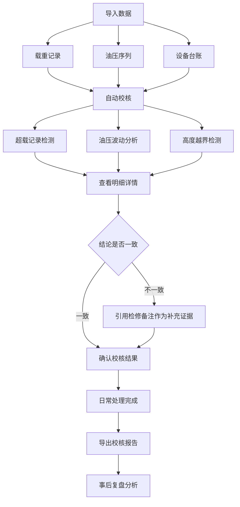

## 1. 产品概述

液压升降安全校核系统，用于解决设备安全员在处理载重记录、油压序列和设备台账多版本时的口径混乱问题。系统支持数据导入、可视化图表、明细追溯和报告导出，确保日常处理与事后复盘口径一致，保留完整证据链。

- **核心问题**：载重记录备注修改、设备台账版本更新、高度越界被覆盖等导致校核口径混乱
- **目标用户**：设备安全员、液压设备运维人员
- **产品价值**：统一校核口径，保留完整证据链，降低人工判断误差，提升安全校核可信度

## 2. 核心 Features

### 2.1 用户角色

| 角色 | 注册方式 | 核心权限 |
|------|----------|----------|
| 设备安全员 | 系统内置账号 | 导入数据、执行校核、查看明细、导出报告 |
| 运维人员 | 系统内置账号 | 查看校核结果、导出复盘报告 |

### 2.2 Feature 模块

1. **数据导入页**：载重记录导入、油压序列导入、设备台账版本管理、样例数据导入
2. **安全校核页**：校核结果总览、超载记录核对、油压波动分析、高度越界检测
3. **明细详情页**：载重记录详情、油压序列详情、检修备注证据、数据版本对应关系
4. **复盘分析页**：趋势图表展示、多版本对比、报告导出

### 2.3 页面详情

| 页面名称 | 模块名称 | Feature 描述 |
|----------|----------|--------------|
| 数据导入页 | 样例数据导入 | 一键导入内置样例数据，便于快速上手和演示 |
| 数据导入页 | 载重记录导入 | 支持Excel/CSV格式导入，保留备注修改历史 |
| 数据导入页 | 油压序列导入 | 支持时序数据导入，自动识别波动异常 |
| 数据导入页 | 台账版本管理 | 设备台账多版本存储，不覆盖历史数据 |
| 安全校核页 | 校核结果总览 | 展示超载、油压波动、高度越界三类问题统计 |
| 安全校核页 | 超载记录核对 | 人工核对超载记录，标记确认状态 |
| 安全校核页 | 油压波动分析 | 自动检测油压异常波动，高亮可疑区间 |
| 安全校核页 | 高度越界检测 | 检测高度越界记录，关联对应台账版本 |
| 明细详情页 | 载重记录详情 | 展示单条载重记录完整信息及备注修改历史 |
| 明细详情页 | 油压序列详情 | 展示油压曲线图及异常点标注 |
| 明细详情页 | 证据链展示 | 检修备注、超载记录、油压序列的对应关系 |
| 复盘分析页 | 趋势图表 | 多维度趋势展示（载重趋势、油压趋势、异常趋势） |
| 复盘分析页 | 版本对比 | 不同台账版本下的校核结果对比 |
| 复盘分析页 | 报告导出 | 导出PDF/Excel格式校核报告，包含完整证据链 |

## 3. 核心流程

用户导入载重记录、油压序列和设备台账数据，系统自动执行安全校核，检测超载记录、油压波动和高度越界。用户可查看每条校核结果的明细详情，核对证据链（载重记录+油压序列+检修备注）。当载重记录与油压序列结论不一致时，检修备注作为补充证据保留。日常校核完成后，可导出包含完整证据链的报告用于事后复盘。

## 4. 用户界面设计

### 4.1 设计风格

- **主色调**：工业蓝 (#165DFF)，代表专业、可靠、安全
- **辅助色**：警示橙 (#FF7D00) 用于异常提示，成功绿 (#00B42A) 用于正常状态，危险红 (#F53F3F) 用于严重异常
- **中性色**：深灰 (#1D2129) 用于正文，中灰 (#4E5969) 用于辅助文字，浅灰 (#C9CDD4) 用于边框
- **按钮风格**：直角矩形，2px圆角，简约硬朗，符合工业系统风格
- **字体**："Noto Sans SC" 作为中文主字体，等宽字体用于数据展示
- **布局风格**：顶部导航+左侧菜单+主内容区，卡片式模块划分，信息密度适中
- **图标风格**：线性图标，2px描边，保持工业系统的严谨感

### 4.2 页面设计概览

| 页面名称 | 模块名称 | UI 元素 |
|----------|----------|---------|
| 数据导入页 | 导入区域 | 拖拽上传区、文件格式提示、导入进度条、样例数据按钮 |
| 数据导入页 | 数据列表 | 表格展示已导入数据，版本标签，操作按钮 |
| 安全校核页 | 结果总览 | 统计卡片（异常数量/正常数量）、状态色标、快捷筛选 |
| 安全校核页 | 问题列表 | 数据表格、异常高亮、状态切换、查看详情入口 |
| 明细详情页 | 信息区 | 左右分栏布局，左侧基础信息，右侧图表展示 |
| 明细详情页 | 证据链 | 时间线布局，展示载重记录→油压序列→检修备注→报告导出的对应关系 |
| 明细详情页 | 图表区 | 油压曲线图，异常点红色标注，悬浮 tooltip |
| 复盘分析页 | 趋势图表 | 可切换多维度图表，支持时间范围筛选 |
| 复盘分析页 | 导出区域 | 报告预览、格式选择、导出按钮 |

### 4.3 响应式

- 采用桌面优先设计，主内容区最小宽度1200px
- 支持1440px及以上宽屏自适应，表格列宽可调整
- 移动端适配核心功能（查看列表、详情），复杂操作保留在桌面端
- 触控优化：按钮最小尺寸44px，表格支持横向滚动

### 4.4 数据可视化设计

- 油压曲线图：折线图，异常区间用红色半透明背景高亮
- 载重趋势图：柱状图，超载阈值线用红色虚线标注
- 异常统计图：饼图/环形图，展示各类异常占比
- 证据链时间线：垂直时间线，节点用不同图标区分数据类型
- 所有图表支持数据点悬浮查看详情，支持导出为图片
