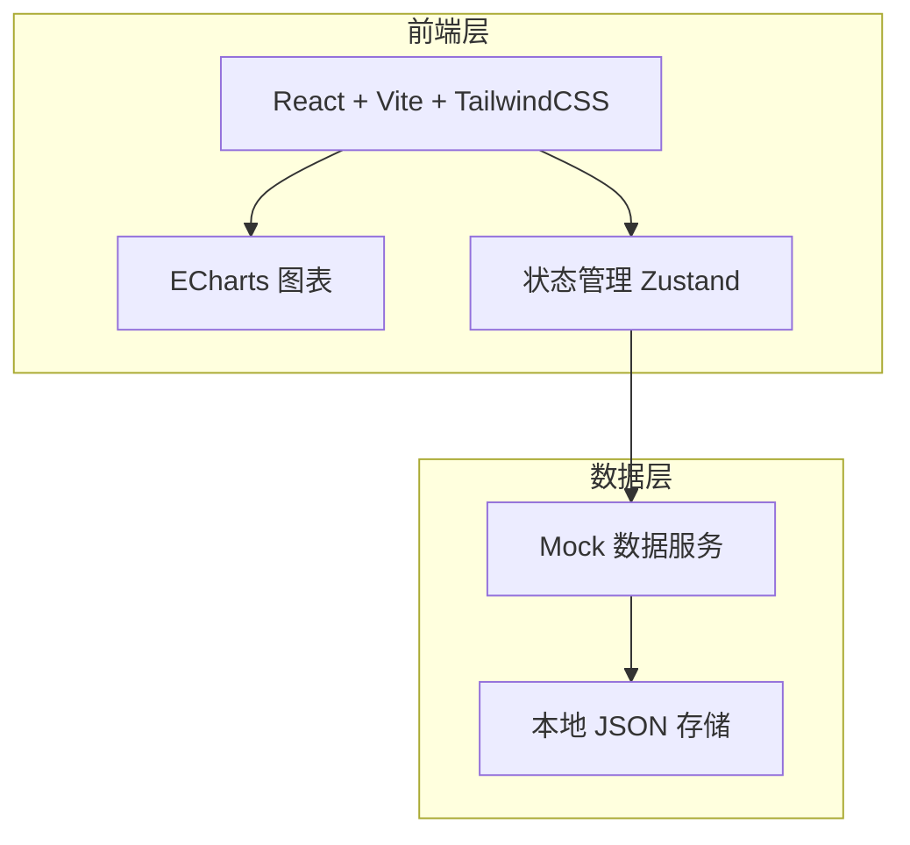
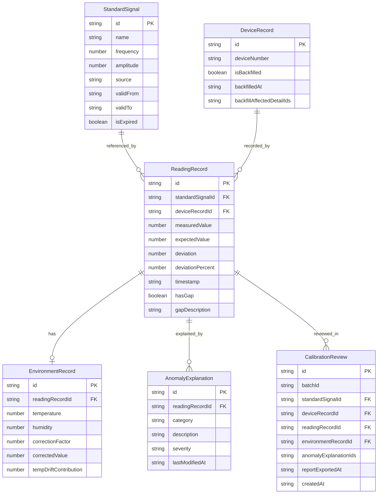

## 1. 架构设计



## 2. 技术说明

- 前端：React@18 + TailwindCSS@3 + Vite
- 初始化工具：Vite
- 图表库：ECharts@5（折线图、饼图、柱状图、仪表盘）
- 状态管理：Zustand（轻量级，筛选条件与明细数据全局共享）
- 后端：无（纯前端，Mock 数据）
- 数据库：无（本地 Mock JSON）

## 3. 路由定义

| 路由 | 用途 |
|------|------|
| / | 复盘总览页：筛选面板、异常分类汇总、统计图表、明细表格、快捷导出 |
| /detail/:id | 复盘详情页：校准偏差步骤、环境修正步骤、异常解释步骤、溯源关系、补录标注 |

## 4. API 定义

无后端 API，使用 Mock 数据服务。

### 数据类型定义

```typescript
interface StandardSignal {
  id: string
  name: string
  frequency: number
  amplitude: number
  source: string
  validFrom: string
  validTo: string
  isExpired: boolean
}

interface DeviceRecord {
  id: string
  deviceNumber: string
  isBackfilled: boolean
  backfilledAt: string | null
  backfillAffectedDetailIds: string[]
}

interface ReadingRecord {
  id: string
  standardSignalId: string
  deviceRecordId: string
  measuredValue: number
  expectedValue: number
  deviation: number
  deviationPercent: number
  timestamp: string
  hasGap: boolean
  gapDescription: string | null
}

interface EnvironmentRecord {
  id: string
  readingRecordId: string
  temperature: number
  humidity: number
  correctionFactor: number
  correctedValue: number
  tempDriftContribution: number
}

interface AnomalyExplanation {
  id: string
  readingRecordId: string
  category: "standard_expired" | "temp_drift" | "reading_gap"
  description: string
  severity: "low" | "medium" | "high"
  lastModifiedAt: string
}

interface CalibrationReview {
  id: string
  batchId: string
  standardSignalId: string
  deviceRecordId: string
  readingRecordId: string
  environmentRecordId: string
  anomalyExplanationIds: string[]
  reportExportedAt: string | null
  createdAt: string
}

interface TraceLink {
  standardSignalId: string
  readingRecordId: string
  reviewId: string
  exportTimestamp: string | null
}
```

## 5. 服务端架构图

不适用（纯前端项目）

## 6. 数据模型

### 6.1 数据模型定义



### 6.2 数据定义语言

使用 TypeScript 类型定义（见上方 API 定义），数据以 Mock JSON 文件提供。

### 核心筛选联动逻辑

- 筛选条件存储在 Zustand store 中，包含：时间范围、设备编号列表、标准信号类型、异常类别
- 任何筛选条件变更 → 触发 computed 数据重算 → 图表组件与明细表格组件同时接收新数据
- 补录设备编号后，受影响的 detailIds 通过 DeviceRecord.backfillAffectedDetailIds 追踪，明细表格对应行自动添加"补录"标注
