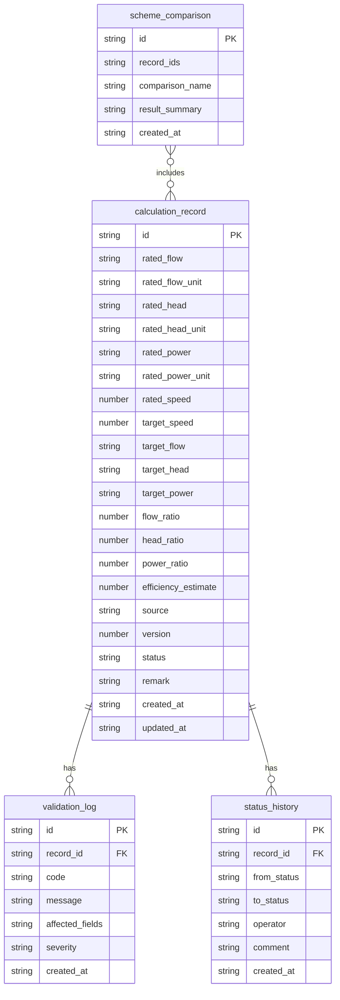

## 1. 架构设计

```mermaid
flowchart TD
    subgraph "前端层"
        "React + Vite + Tailwind"
        "计算工作台页面"
        "记录列表页面"
        "详情追溯页面"
        "导出面板"
    end
    subgraph "后端层"
        "Express + TypeScript"
        "计算引擎 API"
        "记录管理 API"
        "校验服务"
        "导出服务"
    end
    subgraph "数据层"
        "SQLite 数据库"
        "计算记录表"
        "方案对比表"
        "校验日志表"
        "状态流转表"
    end
    "React + Vite + Tailwind" --> "Express + TypeScript"
    "Express + TypeScript" --> "SQLite 数据库"
```

## 2. 技术说明
- 前端：React@18 + TailwindCSS@3 + Vite + Zustand
- 初始化工具：vite-init
- 后端：Express@4 + TypeScript（ESM）
- 数据库：SQLite（better-sqlite3），本地文件存储
- 图标：lucide-react

## 3. 路由定义
| 路由 | 用途 |
|------|------|
| / | 计算工作台，默认首页 |
| /records | 计算记录列表 |
| /records/:id | 计算详情与追溯链路 |
| /export | 报告导出面板 |

## 4. API 定义

### 4.1 计算引擎 API
```typescript
interface CalculateRequest {
  ratedFlow: number;
  ratedFlowUnit: "m3/h" | "L/s" | "gpm";
  ratedHead: number;
  ratedHeadUnit: "m" | "ft" | "kPa";
  ratedPower: number;
  ratedPowerUnit: "kW" | "hp";
  ratedSpeed: number;
  targetSpeed: number;
  speedUnit: "rpm";
  source: string;
  remark?: string;
}

interface CalculateResponse {
  id: string;
  results: {
    targetFlow: number;
    targetFlowUnit: string;
    targetHead: number;
    targetHeadUnit: string;
    targetPower: number;
    targetPowerUnit: string;
    flowRatio: number;
    headRatio: number;
    powerRatio: number;
    efficiencyEstimate: number;
  };
  warnings: Warning[];
  version: number;
  createdAt: string;
}

interface Warning {
  code: "UNIT_MIX" | "SPEED_OUT_OF_RANGE" | "MISSING_CONDITION";
  message: string;
  affectedFields: string[];
  severity: "error" | "warning" | "info";
}
```

### 4.2 记录管理 API
```typescript
interface CalculationRecord {
  id: string;
  input: CalculateRequest;
  output: CalculateResponse;
  status: "draft" | "reviewed" | "approved" | "archived";
  source: string;
  version: number;
  history: StatusChange[];
  comparisons: string[];
  createdAt: string;
  updatedAt: string;
}

interface StatusChange {
  from: string;
  to: string;
  operator: string;
  timestamp: string;
  comment?: string;
}

GET    /api/records          - 获取记录列表（支持筛选）
GET    /api/records/:id      - 获取记录详情（含追溯链路）
POST   /api/records          - 新建计算记录
PUT    /api/records/:id      - 更新记录
PATCH  /api/records/:id/status - 推进状态
DELETE /api/records/:id      - 删除记录

POST   /api/calculate        - 执行相似律计算
POST   /api/compare          - 方案对比
GET    /api/export/:id       - 导出单条报告
POST   /api/export           - 批量导出
```

## 5. 服务端架构图

```mermaid
flowchart TD
    "Controller 层" --> "Service 层"
    "Service 层" --> "Repository 层"
    "Repository 层" --> "SQLite 数据库"
    subgraph "Controller 层"
        "CalculationController"
        "RecordController"
        "ExportController"
    end
    subgraph "Service 层"
        "AffinityLawService"
        "ValidationService"
        "RecordService"
        "ExportService"
    end
    subgraph "Repository 层"
        "CalculationRepository"
        "StatusRepository"
    end
```

## 6. 数据模型

### 6.1 数据模型定义



### 6.2 数据定义语言

```sql
CREATE TABLE calculation_record (
  id TEXT PRIMARY KEY,
  rated_flow TEXT NOT NULL,
  rated_flow_unit TEXT NOT NULL DEFAULT 'm3/h',
  rated_head TEXT NOT NULL,
  rated_head_unit TEXT NOT NULL DEFAULT 'm',
  rated_power TEXT NOT NULL,
  rated_power_unit TEXT NOT NULL DEFAULT 'kW',
  rated_speed REAL NOT NULL,
  target_speed REAL NOT NULL,
  target_flow TEXT,
  target_head TEXT,
  target_power TEXT,
  flow_ratio REAL,
  head_ratio REAL,
  power_ratio REAL,
  efficiency_estimate REAL,
  source TEXT NOT NULL DEFAULT 'manual',
  version INTEGER NOT NULL DEFAULT 1,
  status TEXT NOT NULL DEFAULT 'draft',
  remark TEXT,
  created_at TEXT NOT NULL DEFAULT (datetime('now')),
  updated_at TEXT NOT NULL DEFAULT (datetime('now'))
);

CREATE TABLE validation_log (
  id TEXT PRIMARY KEY,
  record_id TEXT NOT NULL,
  code TEXT NOT NULL,
  message TEXT NOT NULL,
  affected_fields TEXT NOT NULL,
  severity TEXT NOT NULL DEFAULT 'warning',
  created_at TEXT NOT NULL DEFAULT (datetime('now')),
  FOREIGN KEY (record_id) REFERENCES calculation_record(id)
);

CREATE TABLE status_history (
  id TEXT PRIMARY KEY,
  record_id TEXT NOT NULL,
  from_status TEXT NOT NULL,
  to_status TEXT NOT NULL,
  operator TEXT NOT NULL DEFAULT 'system',
  comment TEXT,
  created_at TEXT NOT NULL DEFAULT (datetime('now')),
  FOREIGN KEY (record_id) REFERENCES calculation_record(id)
);

CREATE TABLE scheme_comparison (
  id TEXT PRIMARY KEY,
  record_ids TEXT NOT NULL,
  comparison_name TEXT NOT NULL,
  result_summary TEXT,
  created_at TEXT NOT NULL DEFAULT (datetime('now'))
);

CREATE INDEX idx_record_status ON calculation_record(status);
CREATE INDEX idx_record_created ON calculation_record(created_at);
CREATE INDEX idx_validation_record ON validation_log(record_id);
CREATE INDEX idx_status_history_record ON status_history(record_id);
```
