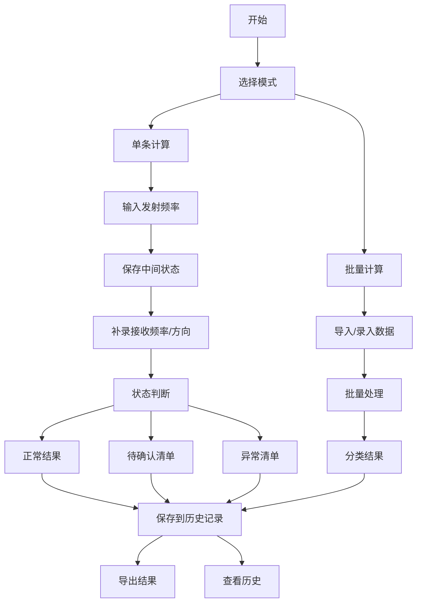

## 1. 产品概述

多普勒测速教具是面向物理教学和实验数据处理的专业工具，帮助学生和教师理解多普勒效应，实现频移与速度的双向换算，并支持批量数据处理。

- 核心目标：将抽象的多普勒公式转化为可视化的计算工具，连接数据来源、判断逻辑和计算结果
- 目标用户：物理学生、教师、科研实验人员
- 市场价值：填补物理教学中多普勒效应定量计算工具的空白，支持教学演示和实验数据批量处理

## 2. 核心功能

### 2.1 用户角色
| 角色 | 注册方式 | 核心权限 |
|------|----------|----------|
| 通用用户 | 无需注册 | 使用全部计算功能，导入导出数据，查看历史记录 |

### 2.2 功能模块
1. **单条计算页**：多普勒公式双向换算，实时演示频移与速度关系
2. **批量计算页**：多组数据批量处理，支持分步补录数据
3. **结果分析页**：正常结果、待确认、异常清单分类展示
4. **历史记录页**：持久化存储，防止重复，支持回溯

### 2.3 页面详情
| 页面名称 | 模块名称 | 功能描述 |
|-----------|-------------|---------------------|
| 单条计算 | 发射频率输入 | 支持先输入发射频率，可单独保存 |
| 单条计算 | 接收频率输入 | 支持后续补录，不覆盖已有判断 |
| 单条计算 | 运动方向选择 | 靠近/远离，支持双向切换和反判检测 |
| 单条计算 | 温度修正 | 声速温度修正，未修正标记提醒 |
| 单条计算 | 双向换算 | 频移→速度，速度→频移，单位实时校验 |
| 单条计算 | 示例回放 | 参数变化后自动回放演示 |
| 批量计算 | 数据导入 | 支持CSV/手动输入批量数据 |
| 批量计算 | 分步补录 | 支持补充缺失字段，保留历史状态 |
| 批量计算 | 状态分类 | 正常/待确认/异常三类状态标记 |
| 结果导出 | 完整导出 | 包含所有数据、状态、原因说明 |
| 历史记录 | 持久化存储 | localStorage保存，重启不丢失 |
| 历史记录 | 去重机制 | 基于数据指纹防止重复结论 |

## 3. 核心流程

用户进入应用后，可选择单条计算或批量计算模式。单条计算支持分步输入，每个字段填写后立即进行状态判断；批量计算支持导入或手动录入多组数据，系统自动分类正常、待确认和异常结果。所有计算记录自动保存到历史记录，支持导出和回溯。

## 4. 用户界面设计

### 4.1 设计风格
- **主色调**：深蓝 (#1e3a5f) - 代表科学与专业
- **辅助色**：青色 (#00d4aa) - 正常状态；橙色 (#ff9500) - 待确认；红色 (#ff3b30) - 异常
- **按钮样式**：圆角胶囊按钮，悬停有微妙缩放效果
- **字体**：标题使用 Orbitron（科技感），正文使用 Roboto Mono（等宽易读）
- **布局风格**：卡片式布局，信息分组清晰，状态色彩区分明确
- **图标风格**：线性科技风图标，emoji辅助增强状态感知

### 4.2 页面设计概述
| 页面名称 | 模块名称 | UI元素 |
|-----------|-------------|-------------|
| 单条计算 | 输入区域 | 分组卡片，分步指示，实时状态徽章 |
| 单条计算 | 换算面板 | 双向箭头切换，单位选择下拉框 |
| 单条计算 | 演示区域 | 波形动画，速度指示器，数值联动 |
| 批量计算 | 数据表格 | 可编辑单元格，行内状态标记 |
| 批量计算 | 分类标签 | 三色标签页，计数徽章 |
| 历史记录 | 时间线 | 按时间分组，折叠展开，去重标记 |
| 导出 | 预览模态框 | 导出格式选择，数据预览 |

### 4.3 响应性
- 桌面端优先（1280px+），三栏布局
- 平板端（768px-1279px）两栏布局，输入与结果并排
- 移动端（<768px）单栏堆叠，优化触控区域
- 所有表格支持横向滚动

### 4.4 交互动效
- 数值变化时数字滚动动画
- 状态切换时颜色渐变过渡
- 波形演示区域周期性平滑动画
- 卡片悬停时轻微上浮效果
- 分步输入进度条动画
