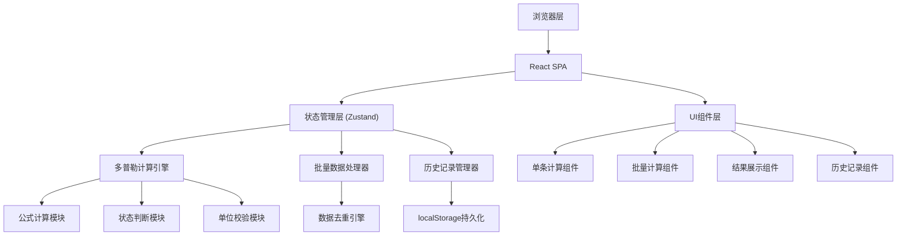

## 1. 架构设计



## 2. 技术描述
- **前端框架**: React@18 + TypeScript
- **构建工具**: Vite@5
- **样式方案**: TailwindCSS@3
- **状态管理**: Zustand@4
- **路由**: React Router@6
- **图标**: Lucide React
- **数据持久化**: localStorage (带版本管理)
- **导出功能**: CSV/JSON 原生导出

## 3. 路由定义
| 路由 | 页面名称 | 功能描述 |
|------|----------|----------|
| / | 首页 | 应用介绍，快速入口 |
| /single | 单条计算 | 多普勒公式双向换算 |
| /batch | 批量计算 | 多组数据批量处理 |
| /results | 结果分析 | 分类展示计算结果 |
| /history | 历史记录 | 查看和管理历史数据 |

## 4. 核心数据模型

### 4.1 多普勒计算记录
```typescript
interface DopplerRecord {
  id: string;
  fingerprint: string;
  createdAt: number;
  updatedAt: number;
  
  source: 'manual' | 'import' | 'demo';
  sourceNote?: string;
  
  emittedFrequency: number | null;
  receivedFrequency: number | null;
  velocity: number | null;
  direction: 'approaching' | 'receding' | null;
  temperature: number | null;
  
  speedOfSound: number;
  frequencyShift: number | null;
  
  status: 'incomplete' | 'normal' | 'pending' | 'error';
  statusReasons: string[];
  
  calculationLog: {
    timestamp: number;
    field: string;
    oldValue: any;
    newValue: any;
  }[];
}
```

### 4.2 计算状态
```typescript
type CalculationStatus = 'incomplete' | 'normal' | 'pending' | 'error';

interface StatusRule {
  field: keyof DopplerRecord;
  condition: (value: any, record: DopplerRecord) => boolean;
  status: CalculationStatus;
  reason: string;
}
```

## 5. 核心算法

### 5.1 多普勒公式
- **观察者静止，波源运动**: f' = f₀ × v / (v ∓ vₛ)
- **波源静止，观察者运动**: f' = f₀ × (v ± v₀) / v
- **本教具简化模型**: f' = f₀ × v / (v - vₛ × direction)
  - direction: +1 表示靠近, -1 表示远离
  - v: 声速 (m/s), 常温约 343 m/s

### 5.2 温度修正声速
v = 331.3 × √(1 + T/273.15)
- T: 摄氏温度

### 5.3 数据指纹算法
```
fingerprint = hash(emittedFrequency + receivedFrequency + velocity + direction + temperature)
```
用于检测重复记录，防止历史记录重复。

### 5.4 状态判断规则
| 条件 | 状态 | 原因 |
|------|------|------|
| 发射频率为空 | incomplete | 缺少发射频率 |
| 接收频率为空 | incomplete | 缺少接收频率 |
| 运动方向为空 | pending | 运动方向未确认 |
| 温度为空 | pending | 未进行温度修正 |
| 接收频率>发射频率且方向=远离 | pending | 方向可能反判 |
| 接收频率<发射频率且方向=靠近 | pending | 方向可能反判 |
| 速度超过声速 | error | 速度超过声速限制 |
| 频率为负 | error | 频率不能为负值 |

## 6. 状态管理设计

### 6.1 Store 结构
```typescript
interface DopplerStore {
  records: DopplerRecord[];
  currentRecord: DopplerRecord | null;
  filters: {
    status: CalculationStatus[];
    dateRange: [number, number];
  };
  
  actions: {
    createRecord: () => DopplerRecord;
    updateRecord: (id: string, updates: Partial<DopplerRecord>) => void;
    deleteRecord: (id: string) => void;
    batchImport: (data: Partial<DopplerRecord>[]) => void;
    exportRecords: (format: 'csv' | 'json') => string;
    recalculateAll: () => void;
    loadFromStorage: () => void;
    saveToStorage: () => void;
  };
}
```

## 7. 组件层次结构

```
App
├── Layout
│   ├── Header
│   ├── Navigation
│   └── Outlet
├── pages/
│   ├── HomePage
│   ├── SingleCalculationPage
│   │   ├── InputCard
│   │   ├── CalculationDisplay
│   │   └── WaveAnimation
│   ├── BatchCalculationPage
│   │   ├── DataTable
│   │   ├── ImportModal
│   │   └── StatusTabs
│   ├── ResultsPage
│   │   ├── StatusSummary
│   │   ├── RecordsList
│   │   └── ExportPanel
│   └── HistoryPage
│       ├── Timeline
│       ├── RecordDetail
│       └── DuplicateMarker
└── shared/
    ├── StatusBadge
    ├── NumberInput
    ├── UnitSelector
    └── ReasonTooltip
```

## 8. 持久化方案

### 8.1 localStorage 结构
```
doppler-teaching-aid:v1
├── records: DopplerRecord[]
├── settings: { temperature: number, unit: string }
└── migrations: { version: number, lastMigrated: number }
```

### 8.2 数据迁移策略
- 每次应用启动时检查版本号
- 旧版本数据自动迁移到新格式
- 迁移前后保留备份

## 9. 导出格式

### 9.1 CSV 导出字段
| 字段 | 说明 |
|------|------|
| ID | 记录唯一标识 |
| 发射频率(Hz) | |
| 接收频率(Hz) | |
| 频移(Hz) | |
| 速度(m/s) | |
| 运动方向 | 靠近/远离 |
| 温度(°C) | |
| 声速(m/s) | |
| 状态 | 正常/待确认/异常 |
| 原因说明 | 详细原因 |
| 数据来源 | |
| 创建时间 | |
| 更新时间 | |
