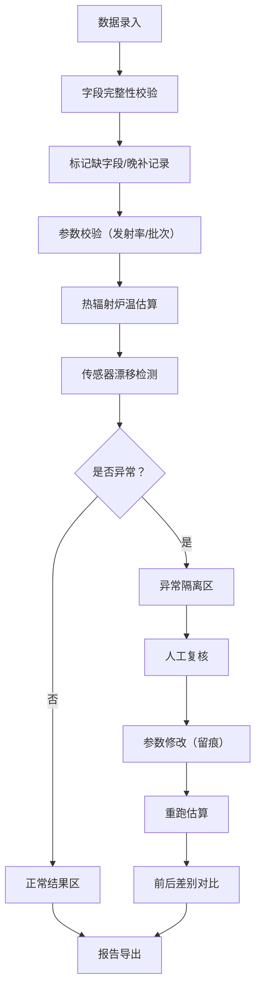
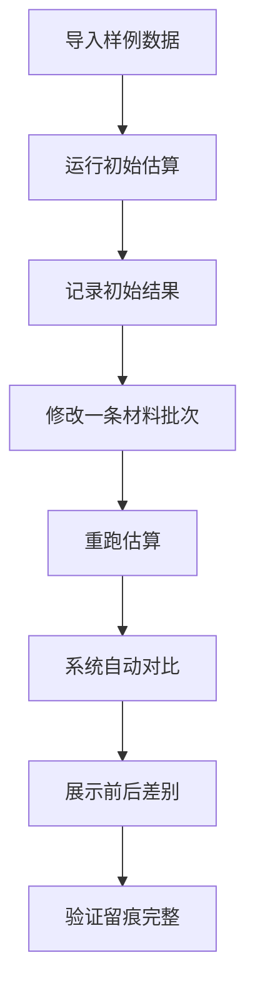

## 1. 产品概述

热辐射炉温估算系统是面向材料车间工程师的专业工业软件，解决月底核算和上课前数据校验时传感器漂移混入正常结果的痛点问题。系统通过统一口径、智能漂移检测、历史留痕和可视化联动，让热辐射炉温估算不再依赖临时表格硬凑。

- 核心价值：防止传感器漂移被发射率缺失或批次混入掩盖，所有人工修改均留痕可追溯
- 目标用户：材料车间工程师、质量检测人员、实验教学人员

## 2. 核心功能

### 2.1 用户角色

| 角色 | 登录方式 | 核心权限 |
|------|----------|----------|
| 工程师 | 系统账号登录 | 数据录入、参数配置、查看估算结果、导出报告 |
| 审核员 | 系统账号登录 | 异常隔离审核、参数修改审批、审计追踪查看 |

### 2.2 功能模块

1. **数据录入页**：辐射读数录入、材料批次管理、参数校验配置
2. **估算看板页**：温度趋势图表、筛选联动面板、明细数据表格
3. **异常检测页**：传感器漂移分析、发射率缺失告警、批次混入隔离
4. **审计追踪页**：变更历史对比、人工修改留痕、参数改动影响分析
5. **报告导出页**：估算报告生成、异常明细导出、前后差别对比

### 2.3 页面详情

| 页面名称 | 模块名称 | 功能描述 |
|----------|----------|----------|
| 数据录入页 | 辐射读数录入 | 支持批量导入、手动录入，实时校验字段完整性 |
| 数据录入页 | 材料批次管理 | 批次编号、材料类型、发射率参数统一维护 |
| 数据录入页 | 参数校验配置 | 阈值范围、漂移灵敏度、告警规则可人工调整，修改全程留痕 |
| 估算看板页 | 温度趋势图表 | 热辐射炉温估算曲线，支持多批次叠加对比 |
| 估算看板页 | 筛选联动面板 | 按时间、批次、传感器筛选，图表和明细实时同步 |
| 估算看板页 | 明细数据表格 | 展示原始读数、估算温度、异常标记、备注信息 |
| 异常检测页 | 漂移检测引擎 | 基于统计过程控制(SPC)检测传感器漂移，优先级高于数据缺失 |
| 异常检测页 | 异常隔离区 | 可疑记录单独隔离，支持人工复核和标记处理 |
| 审计追踪页 | 变更历史 | 所有字段修改记录：修改人、时间、前后值、修改原因 |
| 审计追踪页 | 重跑对比 | 修改批次后重跑估算，自动对比前后估算结果差异 |
| 报告导出页 | 估算报告 | 按标准模板生成PDF/Excel报告，包含异常明细和改动痕迹 |

## 3. 核心流程

### 3.1 数据录入与估算流程

工程师录入辐射读数和材料批次信息，系统自动校验字段完整性，标记缺字段记录。通过发射率参数和热辐射公式计算估算温度，同时运行漂移检测算法。检测到异常则自动隔离，人工修改参数后可重跑估算，所有操作留痕。最终生成包含完整审计轨迹的估算报告。

### 3.2 验收测试流程

## 4. 用户界面设计

### 4.1 设计风格

- **主色调**：工业蓝 (#165DFF)，代表专业可靠的工业系统
- **辅助色**：警示橙 (#FF7D00) 标记异常、成功绿 (#00B42A) 标记正常、危险红 (#F53F3F) 标记严重漂移
- **字体**：JetBrains Mono 用于数据展示，Inter 用于界面文本，体现工业数据的精确感
- **布局**：顶部导航 + 左侧筛选 + 右侧内容区的工业控制台风格
- **图标风格**：线性工业图标，强调功能性和可读性

### 4.2 页面设计概述

| 页面名称 | 模块名称 | UI元素 |
|----------|----------|--------|
| 估算看板页 | 顶部导航 | Logo、页面切换、用户信息、通知中心 |
| 估算看板页 | 左侧筛选 | 时间范围选择器、批次下拉、传感器多选、应用按钮 |
| 估算看板页 | 主内容区 | 大面积温度趋势折线图、下方数据明细表格、异常标记色块 |
| 估算看板页 | 悬浮操作 | 导出按钮、重跑按钮、时间轴缩放控件 |
| 异常检测页 | 异常列表 | 卡片式展示，按严重程度排序，漂移异常使用红色高亮边框 |
| 异常检测页 | 隔离区 | 灰底背景，标记"待复核"状态，支持批量操作 |
| 审计追踪页 | 变更对比 | 左右分栏对比，高亮显示差异字段，时间戳精确到毫秒 |

### 4.3 响应式设计

- **桌面端优先**：1280px 及以上为主要适配目标，支持大尺寸数据展示
- **平板适配**：1024px-1279px，筛选区可折叠，图表自适应宽度
- **交互优化**：表格支持水平滚动，下拉菜单支持触控选择，关键操作二次确认

### 4.4 数据可视化规范

- **温度曲线**：实线表示正常估算，虚线表示异常隔离数据，点标记表示传感器读数
- **异常标记**：传感器漂移使用红色菱形标记，发射率缺失使用橙色圆形标记，批次混入使用黄色方形标记
- **图例**：固定在图表右侧，支持点击隐藏/显示对应数据系列
- **动效**：数据加载时骨架屏渐入，筛选变更时图表平滑过渡动画（400ms ease-out）
