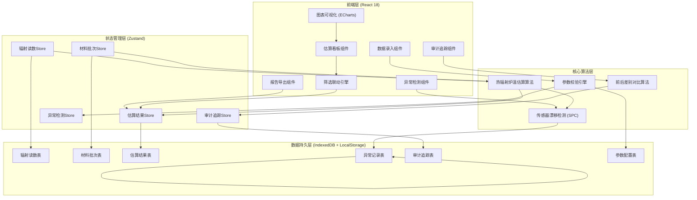
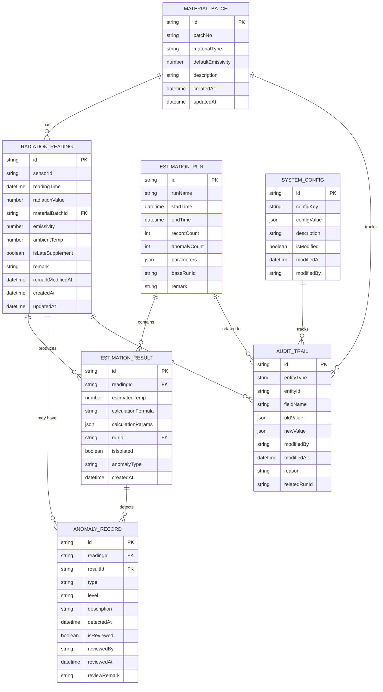

## 1. 架构设计



## 2. 技术选型说明

- **前端框架**：React@18.2.0 + TypeScript@5.3.0 + Vite@5.0.0
- **样式方案**：TailwindCSS@3.4.0
- **状态管理**：Zustand@4.4.0（轻量级，适合工业数据场景）
- **图表库**：ECharts@5.4.0（工业级图表，支持复杂折线图和标记）
- **UI组件**：Ant Design@5.12.0（企业级组件库，适合工业系统）
- **数据持久化**：IndexedDB（localForage封装）+ LocalStorage
- **导出功能**：xlsx@0.18.5 + jspdf@2.5.1
- **后端**：无后端架构，前端纯客户端实现，数据本地持久化

## 3. 路由定义

| 路由路径 | 页面名称 | 主要功能 |
|----------|----------|----------|
| / | 估算看板页 | 温度趋势图表、筛选联动、明细表格 |
| /data-entry | 数据录入页 | 辐射读数录入、材料批次管理、参数配置 |
| /anomaly | 异常检测页 | 漂移检测结果、异常隔离区、人工复核 |
| /audit | 审计追踪页 | 变更历史、重跑对比、改动影响分析 |
| /report | 报告导出页 | 估算报告生成、异常明细导出、对比报告 |

## 4. 核心数据类型定义

```typescript
// 辐射读数
interface RadiationReading {
  id: string;
  sensorId: string;
  readingTime: Date;
  radiationValue: number;  // 辐射强度读数 (W/m²)
  materialBatchId: string;
  emissivity: number | null;  // 发射率 (0-1)，可能缺失
  ambientTemp: number;  // 环境温度 (°C)
  isLateSupplement: boolean;  // 是否晚补
  remark: string;
  remarkModifiedAt: Date | null;
  createdAt: Date;
  updatedAt: Date;
}

// 材料批次
interface MaterialBatch {
  id: string;
  batchNo: string;
  materialType: string;
  defaultEmissivity: number;
  description: string;
  createdAt: Date;
  updatedAt: Date;
}

// 估算结果
interface EstimationResult {
  id: string;
  readingId: string;
  estimatedTemp: number;  // 估算温度 (°C)
  calculationFormula: string;
  calculationParams: Record<string, number>;
  runId: string;  // 每次估算运行的ID，用于对比
  isIsolated: boolean;
  anomalyType: AnomalyType | null;
  createdAt: Date;
}

// 异常类型
enum AnomalyType {
  SENSOR_DRIFT = 'SENSOR_DRIFT',        // 传感器漂移
  EMISSIVITY_MISSING = 'EMISSIVITY_MISSING',  // 发射率缺失
  BATCH_MISMATCH = 'BATCH_MISMATCH',    // 批次混入
  FIELD_MISSING = 'FIELD_MISSING',      // 缺字段
}

// 异常等级
enum AnomalyLevel {
  CRITICAL = 'CRITICAL',  // 严重（传感器漂移）
  WARNING = 'WARNING',    // 警告
  INFO = 'INFO',          // 提示
}

// 异常记录
interface AnomalyRecord {
  id: string;
  readingId: string;
  resultId: string;
  type: AnomalyType;
  level: AnomalyLevel;
  description: string;
  detectedAt: Date;
  isReviewed: boolean;
  reviewedBy: string | null;
  reviewedAt: Date | null;
  reviewRemark: string | null;
}

// 审计追踪
interface AuditTrail {
  id: string;
  entityType: 'reading' | 'batch' | 'config' | 'result';
  entityId: string;
  fieldName: string;
  oldValue: any;
  newValue: any;
  modifiedBy: string;
  modifiedAt: Date;
  reason: string;
  relatedRunId: string | null;
}

// 参数配置
interface SystemConfig {
  id: string;
  configKey: string;
  configValue: number | string | boolean;
  description: string;
  isModified: boolean;
  modifiedAt: Date | null;
  modifiedBy: string | null;
}

// 估算运行记录
interface EstimationRun {
  id: string;
  runName: string;
  startTime: Date;
  endTime: Date;
  recordCount: number;
  anomalyCount: number;
  parameters: Record<string, any>;
  baseRunId: string | null;  // 基于哪个运行重跑
  remark: string;
}
```

## 5. 数据模型ER图



## 6. 核心算法说明

### 6.1 热辐射炉温估算公式

基于斯蒂芬-玻尔兹曼定律，考虑环境温度和发射率修正：

```
T_estimated = [(R / (ε * σ) + T_ambient^4)]^(1/4) - 273.15

其中：
- R: 辐射强度读数 (W/m²)
- ε: 发射率 (0-1)，取材料批次默认值或手动输入值
- σ: 斯蒂芬-玻尔兹曼常数 = 5.670374419 × 10^-8 W/(m²·K^4)
- T_ambient: 环境温度 (K)
- T_estimated: 估算炉温 (°C)
```

### 6.2 传感器漂移检测算法（SPC控制图）

1. 计算同一传感器历史30个正常读数的均值(μ)和标准差(σ)
2. 设置控制限：UCL = μ + 3σ, LCL = μ - 3σ
3. 连续7个点超出控制限或呈现趋势性变化 → 判定为漂移
4. **优先级规则**：传感器漂移异常等级为CRITICAL，优先于发射率缺失(WARNING)和批次混入(WARNING)，确保漂移不被掩盖

### 6.3 前后差别对比算法

1. 记录每次估算运行的runId和所有参数
2. 重跑时设置baseRunId关联到原始运行
3. 逐记录对比两个run的估算结果，计算温度差值
4. 标记差异超过阈值（默认±5°C）的记录
5. 汇总：差异记录数、最大差异、平均差异、受影响的批次

## 7. 初始数据（样例）

系统预置15条样例数据，包含以下场景：
- 8条正常记录（不同批次、不同传感器）
- 2条发射率缺失记录
- 2条缺字段记录（辐射读数或批次为空）
- 1条晚补记录（isLateSupplement=true）
- 1条备注已修改记录（remarkModifiedAt有值）
- 1条传感器漂移记录（已标记异常）

预置3个材料批次：
- BAT-2024-001: 不锈钢304，发射率0.85
- BAT-2024-002: 铝合金6061，发射率0.12
- BAT-2024-003: 陶瓷氧化铝，发射率0.93

## 8. 验收测试标准

1. 修改一条材料批次的发射率参数后重跑
2. 系统应：
   - 自动关联原始runId
   - 展示前后估算结果对比
   - 温度差异超过5°C的记录高亮显示
   - 审计追踪表记录参数修改轨迹
   - 报告导出时包含改动影响分析
3. 传感器漂移记录即使存在发射率缺失，仍保持CRITICAL等级显示
