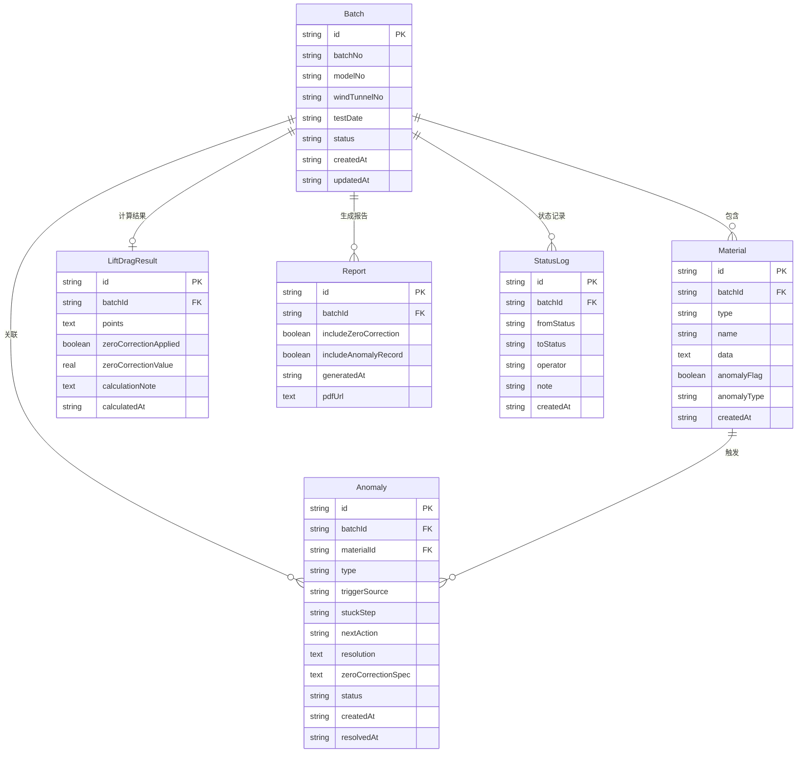

## 1. 架构设计

```mermaid
graph TB
    subgraph "前端层"
        "React 18 + Tailwind"
        "Zustand 状态管理"
        "React Router 路由"
    end
    subgraph "后端层"
        "Express 4 + TypeScript"
        "REST API"
        "业务逻辑层"
    end
    subgraph "数据层"
        "SQLite (better-sqlite3)"
        "迁移脚本"
    end
    "React 18 + Tailwind" --> "REST API"
    "REST API" --> "业务逻辑层"
    "业务逻辑层" --> "SQLite (better-sqlite3)"
```

## 2. 技术说明

- **前端**：React@18 + TailwindCSS@3 + Vite
- **初始化工具**：vite-init (react-express-ts 模板)
- **后端**：Express@4 + TypeScript (ESM)
- **数据库**：SQLite (better-sqlite3)
- **状态管理**：Zustand
- **路由**：react-router-dom
- **图表**：Recharts（升阻力曲线绘制）
- **PDF导出**：jsPDF + html2canvas

## 3. 路由定义

| 路由 | 用途 |
|------|------|
| `/` | 试验总览页，批次列表与筛选 |
| `/batch/:id` | 试验详情页，材料归集/计算/异常/状态推进 |
| `/anomalies` | 异常追踪页，跨批次异常汇总与待办 |
| `/report/:id` | 报告导出页，预览与导出PDF |

## 4. API定义

### 4.1 批次管理

```typescript
interface Batch {
  id: string;
  batchNo: string;
  modelNo: string;
  windTunnelNo: string;
  testDate: string;
  status: "pending_review" | "anomaly" | "completed";
  createdAt: string;
  updatedAt: string;
}

// GET    /api/batches          - 获取批次列表（支持筛选）
// POST   /api/batches          - 新增批次
// GET    /api/batches/:id      - 获取批次详情
// PATCH  /api/batches/:id      - 更新批次信息
// PATCH  /api/batches/:id/status - 推进批次状态
```

### 4.2 材料管理

```typescript
type MaterialType = "angle_of_attack" | "force_sensor" | "curve_report";

interface Material {
  id: string;
  batchId: string;
  type: MaterialType;
  name: string;
  data: AngleOfAttackData | ForceSensorData | CurveReportData;
  anomalyFlag: boolean;
  anomalyType?: "zero_drift" | "angle_exceed" | "speed_missing";
  createdAt: string;
}

interface AngleOfAttackData {
  angles: number[];
  unit: string;
  sampleRate: number;
}

interface ForceSensorData {
  liftForce: number[];
  dragForce: number[];
  unit: string;
  zeroOffset: number;
  sampleRate: number;
}

interface CurveReportData {
  reportNo: string;
  generatedAt: string;
  curvePoints: { alpha: number; cl: number; cd: number }[];
}

// POST   /api/batches/:id/materials      - 关联材料到批次
// GET    /api/batches/:id/materials      - 获取批次下所有材料
// DELETE /api/materials/:id              - 移除材料
// PATCH  /api/materials/:id              - 更新材料数据
```

### 4.3 异常管理

```typescript
interface Anomaly {
  id: string;
  batchId: string;
  materialId: string;
  type: "zero_drift" | "angle_exceed" | "speed_missing";
  triggerSource: string;
  stuckStep: string;
  nextAction: string;
  resolution?: string;
  zeroCorrectionSpec?: string;
  status: "open" | "in_progress" | "resolved";
  createdAt: string;
  resolvedAt?: string;
}

// GET    /api/anomalies                   - 获取异常列表（支持按类型/状态筛选）
// GET    /api/anomalies/:id               - 获取异常详情
// POST   /api/batches/:id/anomalies       - 创建异常记录
// PATCH  /api/anomalies/:id               - 更新异常（录入修正说明等）
// PATCH  /api/anomalies/:id/resolve       - 标记异常已解决
```

### 4.4 升阻力计算

```typescript
interface LiftDragResult {
  batchId: string;
  points: { alpha: number; cl: number; cd: number; cl_cd: number }[];
  zeroCorrectionApplied: boolean;
  zeroCorrectionValue: number;
  calculationNote: string;
  calculatedAt: string;
}

// POST   /api/batches/:id/calculate      - 执行升阻力计算
// GET    /api/batches/:id/calculate      - 获取计算结果
```

### 4.5 报告导出

```typescript
interface Report {
  id: string;
  batchId: string;
  includeZeroCorrection: boolean;
  includeAnomalyRecord: boolean;
  generatedAt: string;
  pdfUrl?: string;
}

// GET    /api/batches/:id/report         - 获取报告预览数据
// POST   /api/batches/:id/report/export  - 导出PDF
```

## 5. 服务端架构图

```mermaid
graph LR
    "Controller" --> "Service"
    "Service" --> "Repository"
    "Repository" --> "SQLite"
```

- **Controller**：路由处理、参数校验、响应格式化
- **Service**：业务逻辑（异常检测算法、升阻力计算、状态推进规则）
- **Repository**：数据访问层（SQL查询封装）

## 6. 数据模型

### 6.1 数据模型定义



### 6.2 数据定义语言

```sql
CREATE TABLE IF NOT EXISTS batch (
  id TEXT PRIMARY KEY,
  batch_no TEXT NOT NULL UNIQUE,
  model_no TEXT NOT NULL,
  wind_tunnel_no TEXT NOT NULL,
  test_date TEXT NOT NULL,
  status TEXT NOT NULL DEFAULT 'pending_review',
  created_at TEXT NOT NULL DEFAULT (datetime('now')),
  updated_at TEXT NOT NULL DEFAULT (datetime('now'))
);

CREATE TABLE IF NOT EXISTS material (
  id TEXT PRIMARY KEY,
  batch_id TEXT NOT NULL,
  type TEXT NOT NULL,
  name TEXT NOT NULL,
  data TEXT NOT NULL,
  anomaly_flag INTEGER NOT NULL DEFAULT 0,
  anomaly_type TEXT,
  created_at TEXT NOT NULL DEFAULT (datetime('now')),
  FOREIGN KEY (batch_id) REFERENCES batch(id) ON DELETE CASCADE
);

CREATE TABLE IF NOT EXISTS anomaly (
  id TEXT PRIMARY KEY,
  batch_id TEXT NOT NULL,
  material_id TEXT NOT NULL,
  type TEXT NOT NULL,
  trigger_source TEXT NOT NULL,
  stuck_step TEXT NOT NULL,
  next_action TEXT NOT NULL,
  resolution TEXT,
  zero_correction_spec TEXT,
  status TEXT NOT NULL DEFAULT 'open',
  created_at TEXT NOT NULL DEFAULT (datetime('now')),
  resolved_at TEXT,
  FOREIGN KEY (batch_id) REFERENCES batch(id) ON DELETE CASCADE,
  FOREIGN KEY (material_id) REFERENCES material(id) ON DELETE CASCADE
);

CREATE TABLE IF NOT EXISTS lift_drag_result (
  id TEXT PRIMARY KEY,
  batch_id TEXT NOT NULL UNIQUE,
  points TEXT NOT NULL,
  zero_correction_applied INTEGER NOT NULL DEFAULT 0,
  zero_correction_value REAL NOT NULL DEFAULT 0,
  calculation_note TEXT,
  calculated_at TEXT NOT NULL DEFAULT (datetime('now')),
  FOREIGN KEY (batch_id) REFERENCES batch(id) ON DELETE CASCADE
);

CREATE TABLE IF NOT EXISTS report (
  id TEXT PRIMARY KEY,
  batch_id TEXT NOT NULL,
  include_zero_correction INTEGER NOT NULL DEFAULT 1,
  include_anomaly_record INTEGER NOT NULL DEFAULT 1,
  generated_at TEXT NOT NULL DEFAULT (datetime('now')),
  pdf_url TEXT,
  FOREIGN KEY (batch_id) REFERENCES batch(id) ON DELETE CASCADE
);

CREATE TABLE IF NOT EXISTS status_log (
  id TEXT PRIMARY KEY,
  batch_id TEXT NOT NULL,
  from_status TEXT NOT NULL,
  to_status TEXT NOT NULL,
  operator TEXT NOT NULL DEFAULT 'system',
  note TEXT,
  created_at TEXT NOT NULL DEFAULT (datetime('now')),
  FOREIGN KEY (batch_id) REFERENCES batch(id) ON DELETE CASCADE
);

CREATE INDEX IF NOT EXISTS idx_material_batch ON material(batch_id);
CREATE INDEX IF NOT EXISTS idx_anomaly_batch ON anomaly(batch_id);
CREATE INDEX IF NOT EXISTS idx_anomaly_status ON anomaly(status);
CREATE INDEX IF NOT EXISTS idx_anomaly_type ON anomaly(type);
CREATE INDEX IF NOT EXISTS idx_batch_status ON batch(status);
CREATE INDEX IF NOT EXISTS idx_batch_model ON batch(model_no);
```
