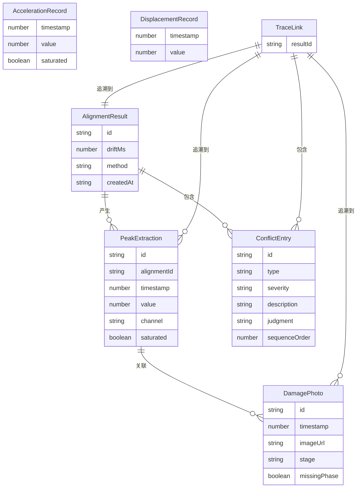

## 1. 架构设计

```mermaid
flowchart TB
    subgraph "前端层"
        "React App" --> "路由层(React Router)"
        "路由层" --> "回放工作台页"
        "路由层" --> "明细溯源页"
    end
    subgraph "状态层(Zustand)"
        "数据导入Store" --> "时序对齐Store"
        "时序对齐Store" --> "峰值提取Store"
        "峰值提取Store" --> "损伤关联Store"
        "损伤关联Store" --> "冲突留痕Store"
    end
    subgraph "数据处理层(纯前端)"
        "CSV解析器" --> "时间戳归一化"
        "时间戳归一化" --> "对齐算法"
        "对齐算法" --> "峰值检测"
        "照片元数据提取" --> "对齐算法"
    end
    subgraph "导出层"
        "报告生成器" --> "一致性校验"
        "一致性校验" --> "JSON/CSV下载"
    end
    "回放工作台页" --> "数据导入Store"
    "回放工作台页" --> "时序对齐Store"
    "明细溯源页" --> "冲突留痕Store"
    "明细溯源页" --> "报告生成器"
```

## 2. 技术说明

- 前端：React@18 + TypeScript + Tailwind CSS@3 + Vite
- 初始化工具：vite-init
- 后端：无（纯前端，所有数据处理在浏览器端完成）
- 数据库：无（使用浏览器内存 + Zustand 持久化中间件）
- 图表库：recharts（波形绘制）
- 文件解析：PapaParse（CSV解析）、JSZip（照片ZIP解压）
- 时间处理：date-fns

## 3. 路由定义

| 路由 | 用途 |
|------|------|
| `/` | 回放工作台：数据导入、时序对齐、波形回放、冲突留痕 |
| `/trace/:resultId` | 明细溯源页：单条结果的溯源链路与导出 |

## 4. API定义

无后端API，所有数据在浏览器端处理。

### 4.1 核心数据类型

```typescript
interface AccelerationRecord {
  timestamp: number
  value: number
  saturated: boolean
}

interface DisplacementRecord {
  timestamp: number
  value: number
}

interface DamagePhoto {
  id: string
  timestamp: number | null
  imageUrl: string
  stage: string
  missingPhase: boolean
}

interface AlignmentResult {
  id: string
  driftMs: number
  method: 'auto' | 'manual'
  createdAt: string
}

interface PeakExtraction {
  id: string
  alignmentId: string
  timestamp: number
  value: number
  channel: 'acceleration' | 'displacement'
  saturated: boolean
}

interface ConflictEntry {
  id: string
  type: 'timestamp_drift' | 'photo_missing' | 'sensor_saturated_late'
  severity: 'high' | 'medium' | 'low'
  description: string
  relatedSourceIds: string[]
  judgment: string
  judgmentAt: string
  sequenceOrder: number
}

interface TraceLink {
  resultId: string
  alignment: AlignmentResult
  peakExtraction: PeakExtraction
  damageAssociation: DamagePhoto[]
  conflicts: ConflictEntry[]
}

interface ExportReport {
  displacementConclusion: string
  generatedAt: string
  traceLinks: TraceLink[]
}
```

## 5. 服务端架构图

不适用（纯前端项目）

## 6. 数据模型

### 6.1 数据模型定义



### 6.2 数据定义语言

不适用（无数据库，使用前端内存状态管理）
