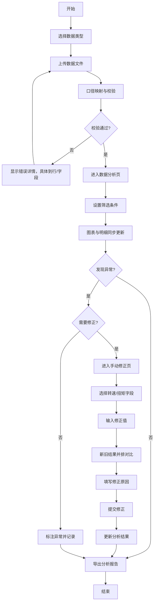
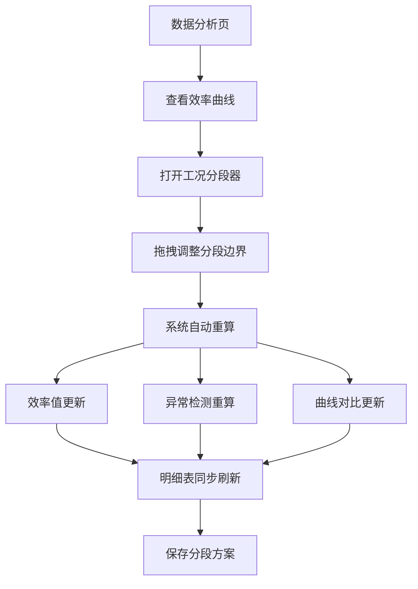

## 1. 产品概述

电机效率测试台数据分析系统，面向电气实验员设计，解决测试数据口径不一致、异常检测定位模糊、工况分段计算复杂等核心痛点。系统支持电压电流、温度序列、效率报告三类数据接入，提供精确到材料/对象的异常提示，实现筛选条件与图表明细的实时联动，并保留手动修正入口支持新旧结果并排对比。

- 目标用户：电气实验员、测试工程师、质量分析人员
- 核心价值：统一数据口径、精确定位异常、灵活分段计算、可追溯手动修正

## 2. 核心功能

### 2.1 用户角色

| 角色 | 登录方式 | 核心权限 |
|------|----------|----------|
| 电气实验员 | 工号登录 | 数据导入、异常查看、手动修正、报告导出 |
| 质量工程师 | 工号登录 | 数据查询、口径配置、分段规则配置 |
| 管理员 | 工号登录 | 用户管理、系统配置、操作日志 |

### 2.2 功能模块

1. **数据概览页**：测试台状态、今日异常统计、快捷入口
2. **数据分析页**：多口径筛选、图表联动、明细同步、工况分段、异常标注
3. **数据导入页**：电压电流/温度序列/效率报告三类数据上传、口径映射
4. **手动修正页**：转速扭矩修正、新旧结果并排对比、修正日志
5. **配置管理页**：口径规则、异常阈值、分段策略配置

### 2.3 页面详情

| 页面名称 | 模块名称 | 功能描述 |
|----------|----------|----------|
| 数据概览 | 状态仪表盘 | 实时显示各测试台运行状态、在线/离线数量 |
| 数据概览 | 异常统计卡 | 转速缺采、温升超限、功率反号三类异常按日/周/月统计 |
| 数据概览 | 最近修正记录 | 显示最近10条手动修正记录，包含修正人、修正时间、修正对象 |
| 数据分析 | 多口径筛选器 | 支持测试台编号、材料类型、工况等级、时间范围多条件组合筛选 |
| 数据分析 | 联动图表区 | 效率曲线、温度曲线、功率曲线三图联动，筛选条件变化实时更新 |
| 数据分析 | 数据明细表 | 与图表同步更新，异常数据高亮显示，点击定位到图表对应位置 |
| 数据分析 | 工况分段器 | 可视化拖拽调整分段边界，分段后异常提示和曲线对比自动重新计算 |
| 数据分析 | 异常标注层 | 在图表上标注异常点，悬浮显示异常详情（具体材料/对象、异常类型、数值） |
| 数据导入 | 文件上传区 | 支持CSV/Excel格式，拖拽上传，实时显示上传进度 |
| 数据导入 | 口径映射器 | 字段自动匹配，支持手动调整，保存映射模板 |
| 数据导入 | 数据校验 | 上传后自动校验，列出格式错误、缺失字段、数值异常 |
| 手动修正 | 数据选择器 | 按测试台/时间/材料筛选待修正数据 |
| 手动修正 | 并排对比区 | 左侧原始数据，右侧修正后数据，转速扭矩可编辑 |
| 手动修正 | 修正预览 | 实时计算修正后的效率值、异常变化，确认后提交 |
| 手动修正 | 修正日志 | 记录所有修正操作，包含修正前后数值、修正原因、审批状态 |
| 配置管理 | 口径规则配置 | 定义电压电流、温度、效率的计算口径，禁止系统自动改口径 |
| 配置管理 | 异常阈值配置 | 按材料类型设置温升上限、功率正常范围、转速采样间隔 |
| 配置管理 | 分段策略配置 | 预设工况分段规则，支持按转速/扭矩/功率自动分段 |

## 3. 核心流程

### 3.1 数据导入与分析流程

电气实验员上传三类测试数据（电压电流、温度序列、效率报告），系统自动进行口径映射和数据校验；校验通过后进入分析页面，实验员通过多口径筛选器定位目标数据，图表与明细表实时联动；发现异常数据时，系统标注具体材料/对象的异常详情；如需修正，进入手动修正页调整转速扭矩，新旧结果并排对比确认后提交，所有操作留痕可追溯。

### 3.2 工况分段调整流程

在数据分析页面，实验员可通过可视化分段器调整工况边界；分段变化后，系统自动重新计算各段的效率值、异常检测结果；曲线对比图同步更新分段区间，异常标注重新定位；所有变化实时反映在明细表中。

## 4. 用户界面设计

### 4.1 设计风格

**工业实用主义 + 深色高精度主题**

- **主色调**：深空蓝 `#0F172A` 作为背景，强调专业感和长时间使用的舒适度
- **强调色**：警示橙 `#F59E0B`（温升超限）、危险红 `#EF4444`（功率反号）、提示蓝 `#3B82F6`（转速缺采）、成功绿 `#10B981`（正常）
- **辅助色**：钢灰色系 `#475569` / `#64748B` / `#94A3B8` 用于层级区分
- **字体**：
  - 数字显示：`JetBrains Mono` 等宽字体，确保数值对齐易读
  - 正文：`Noto Sans SC` 中文无衬线，兼顾专业感与可读性
  - 标题：`Orbitron` 工业风显示字体，用于仪表盘标题
- **布局**：高密度栅格布局，左侧导航 + 顶部筛选 + 主内容区三栏结构
- **按钮风格**：方角矩形，2px边框，hover时有轻微发光效果，强调工业控制台感
- **图标风格**：线性简约图标，统一2px描边，使用Font Awesome工业类图标
- **数据展示**：
  - 关键数值使用大号等宽字体，带千分位分隔
  - 异常数据增加闪烁动画和背景高亮
  - 图表使用高精度线条，异常点使用菱形/三角形等特殊标记

### 4.2 页面设计概述

| 页面名称 | 模块名称 | UI元素 |
|----------|----------|--------|
| 数据概览 | 状态仪表盘 | 左侧垂直导航、顶部搜索栏、中央6格状态卡、底部异常趋势图 |
| 数据概览 | 异常统计卡 | 三色卡片（橙/红/蓝）对应三类异常，大号数字+趋势箭头，底部近7天迷你图 |
| 数据分析 | 多口径筛选器 | 顶部固定筛选栏，下拉选择器支持多选，日期范围选择器带快捷选项 |
| 数据分析 | 联动图表区 | 三图纵向排列，共享X轴时间刻度，鼠标十字线联动，异常点悬浮弹窗 |
| 数据分析 | 工况分段器 | 图表顶部可拖拽滑块，分段区域使用不同透明度底色区分 |
| 数据分析 | 数据明细表 | 斑马纹表格，异常行整行高亮，点击行图表对应位置放大闪烁 |
| 手动修正 | 并排对比区 | 左右两栏布局，中间分隔线可拖拽，差异数值背景色对比 |
| 手动修正 | 修正表单 | 可编辑单元格带边框高亮，输入时实时校验范围，确认按钮需二次确认 |
| 配置管理 | 规则配置表 | 分组折叠面板，每行可编辑，修改后需输入变更原因才能保存 |

### 4.3 响应式设计

- **Desktop优先**：主内容区最小宽度1440px，支持2560px以上宽屏扩展
- **筛选栏自适应**：宽屏时水平排列，窄屏（<1280px）时折叠为抽屉式
- **图表自适应**：支持高度拖拽调整，最小高度300px
- **触摸优化**：表格行高最小44px，按钮最小40x40px，支持移动端查看（非主要操作端）

### 4.4 动效设计

- **页面加载**：顶部进度条 + 内容区淡入上移（staggered 50ms延迟）
- **数据更新**：数值变化时数字滚动动画（0.3s），图表曲线重绘时渐变过渡
- **异常提示**：新异常出现时卡片脉冲闪烁3次（1s周期），然后保持高亮
- **筛选联动**：筛选条件变化后，图表使用150ms交叉淡入淡出过渡
- **分段调整**：拖拽分段边界时，对应区域半透明预览跟随鼠标
- **修正对比**：切换原始/修正视图时，使用左右滑动过渡效果

## 5. 异常提示规范

### 5.1 异常类型与提示模板

| 异常类型 | 提示模板 | 颜色标记 |
|----------|----------|----------|
| 转速缺采 | "【材料：{材料牌号}】测试台{编号}在{时间点}转速采样缺失，间隔{实际间隔}ms > 阈值{阈值}ms" | 提示蓝 `#3B82F6` |
| 温升超限 | "【对象：{绕组/轴承}】{材料牌号}在工况{段号}温度{实测值}°C > 上限{阈值}°C，持续{时长}s" | 警示橙 `#F59E0B` |
| 功率反号 | "【测试点：{点位编号}】{材料牌号}在{时间点}功率{实测值}kW符号异常，范围应为[{下限}, {上限}]" | 危险红 `#EF4444` |

### 5.2 口径一致性规则

- 所有计算口径在[配置管理]中统一定义，系统不会自动"修正"业务口径
- 不同来源数据口径冲突时，标注"口径不一致"并显示具体差异，由用户决定取舍
- 筛选条件变化时，所有关联图表、明细、统计值使用同一口径重新计算
- 数据导出时附带口径说明，确保报告可追溯

### 5.3 工况分段计算规则

- 效率计算基于分段进行，不是全局一次性判断
- 分段边界变化后：效率值重算、异常检测重跑、曲线对比重绘、明细表刷新
- 每段数据独立标注异常，分段汇总分别显示
- 支持保存多组分段方案进行对比分析
