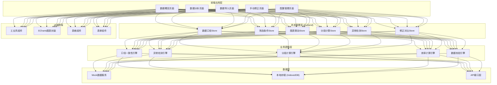
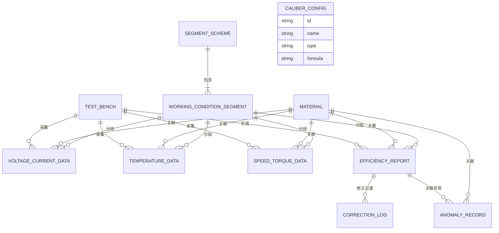

## 1. 架构设计



## 2. 技术选型说明

| 分类 | 技术栈 | 版本 | 选型理由 |
|------|--------|------|----------|
| 前端框架 | React | 18.x | 组件化开发，生态成熟，适合复杂交互 |
| 开发语言 | TypeScript | 5.x | 类型安全，减少数据口径不一致导致的bug |
| 构建工具 | Vite | 5.x | 开发体验好，热更新快 |
| 样式方案 | TailwindCSS | 3.x | 原子化CSS，快速构建工业风UI |
| 状态管理 | Zustand | 4.x | 轻量高性能，支持跨组件状态共享，适合多图表联动场景 |
| 图表库 | ECharts | 5.x | 工业级数据可视化，支持大数据量渲染、联动、自定义标记 |
| 表格组件 | TanStack Table | 8.x | 高性能虚拟滚动，支持大量数据行 |
| 日期处理 | date-fns | 3.x | 轻量日期库，支持国际化 |
| 文件处理 | xlsx | 0.18.x | 解析Excel/CSV文件，支持多种格式导入 |
| 本地存储 | Dexie.js | 3.x | IndexedDB封装，存储大量测试数据 |
| 动画 | Framer Motion | 11.x | 流畅的页面过渡和微交互 |
| 图标 | Font Awesome | 6.x | 工业类图标丰富 |

## 3. 路由定义

| 路由 | 页面 | 说明 |
|------|------|------|
| `/` | 数据概览页 | 仪表盘、异常统计、快捷入口 |
| `/analysis` | 数据分析页 | 多口径筛选、联动图表、工况分段、异常标注 |
| `/import` | 数据导入页 | 三类数据上传、口径映射、数据校验 |
| `/correction` | 手动修正页 | 转速扭矩修正、新旧结果并排对比、修正日志 |
| `/config` | 配置管理页 | 口径规则、异常阈值、分段策略配置 |

## 4. 核心数据模型

### 4.1 TypeScript 类型定义

```typescript
// 材料类型
interface Material {
  id: string;
  code: string;          // 材料牌号
  name: string;
  type: 'copper' | 'aluminum' | 'steel' | 'other';
  temperatureLimit: number;  // 温升上限
  powerRange: [number, number];  // 功率正常范围
}

// 测试台
interface TestBench {
  id: string;
  name: string;
  code: string;
  status: 'online' | 'offline' | 'maintenance';
  lastUpdate: Date;
}

// 工况分段
interface WorkingConditionSegment {
  id: string;
  name: string;
  order: number;
  speedRange: [number, number];  // 转速范围
  torqueRange: [number, number]; // 扭矩范围
  color: string;
}

// 电压电流数据
interface VoltageCurrentData {
  id: string;
  testBenchId: string;
  materialId: string;
  timestamp: Date;
  voltage: number;      // 电压 V
  current: number;      // 电流 A
  power: number;        // 功率 kW
  segmentId: string;
}

// 温度序列数据
interface TemperatureData {
  id: string;
  testBenchId: string;
  materialId: string;
  timestamp: Date;
  objectType: 'winding' | 'bearing' | 'housing';  // 测温对象
  temperature: number;   // 温度 °C
  segmentId: string;
}

// 转速扭矩数据
interface SpeedTorqueData {
  id: string;
  testBenchId: string;
  materialId: string;
  timestamp: Date;
  speed: number;         // 转速 rpm
  torque: number;        // 扭矩 N·m
  isMissing: boolean;    // 是否缺采
  segmentId: string;
}

// 效率报告数据
interface EfficiencyReport {
  id: string;
  testBenchId: string;
  materialId: string;
  segmentId: string;
  startTime: Date;
  endTime: Date;
  inputPower: number;    // 输入功率 kW
  outputPower: number;   // 输出功率 kW
  efficiency: number;    // 效率 %
  isCorrected: boolean;  // 是否经过修正
  originalData?: {
    speed: number;
    torque: number;
    efficiency: number;
  };
  correctedData?: {
    speed: number;
    torque: number;
    efficiency: number;
    operator: string;
    reason: string;
    correctedAt: Date;
  };
}

// 异常记录
interface AnomalyRecord {
  id: string;
  type: 'speed_missing' | 'temp_overlimit' | 'power_reverse';
  severity: 'warning' | 'error' | 'critical';
  testBenchId: string;
  materialId: string;
  objectType?: string;   // 具体对象：绕组/轴承/测试点
  segmentId: string;
  timestamp: Date;
  actualValue: number;
  threshold: number;
  duration?: number;     // 持续时间 秒
  message: string;       // 已格式化的提示信息
  resolved: boolean;
  resolution?: string;
}

// 筛选条件
interface FilterCriteria {
  testBenchIds: string[];
  materialIds: string[];
  segmentIds: string[];
  timeRange: [Date, Date] | null;
  anomalyTypes: AnomalyType[];
  dataCaliber: 'voltage_current' | 'temperature' | 'efficiency' | 'all';
}

// 计算口径配置
interface CaliberConfig {
  id: string;
  name: string;
  type: 'voltage' | 'current' | 'power' | 'temperature' | 'efficiency';
  formula: string;           // 计算公式
  unit: string;
  precision: number;         // 小数位数
  isSystemDefault: boolean;  // 是否系统默认（禁止自动修改）
  description: string;
}

// 修正记录
interface CorrectionLog {
  id: string;
  reportId: string;
  operatorId: string;
  operatorName: string;
  originalSpeed: number;
  originalTorque: number;
  originalEfficiency: number;
  correctedSpeed: number;
  correctedTorque: number;
  correctedEfficiency: number;
  reason: string;
  status: 'pending' | 'approved' | 'rejected';
  createdAt: Date;
  approvedAt?: Date;
  approver?: string;
}

// 分段方案
interface SegmentScheme {
  id: string;
  name: string;
  segments: WorkingConditionSegment[];
  isActive: boolean;
  createdAt: Date;
  createdBy: string;
}
```

### 4.2 数据关系ER图



## 5. 核心业务引擎设计

### 5.1 口径一致性引擎

```typescript
// 核心职责：确保所有计算使用同一口径，禁止系统自动修正业务口径
class CaliberConsistencyEngine {
  private activeCalibers: Map<string, CaliberConfig>;

  constructor() {
    this.activeCalibers = new Map();
  }

  // 加载当前生效的口径配置
  loadActiveCalibers(): void;

  // 计算数值（严格按配置口径）
  calculate(type: string, inputs: Record<string, number>): number;

  // 检测口径冲突（不同来源数据口径不一致）
  detectConflict(dataSources: DataSource[]): ConflictInfo[];

  // 标记口径冲突（不自动修正，只提示用户）
  markConflict(data: any, conflict: ConflictInfo): void;

  // 获取口径说明（用于导出报告）
  getCaliberDescription(type: string): string;
}
```

### 5.2 异常检测引擎

```typescript
// 核心职责：精确检测三类异常，提示到具体材料/对象
class AnomalyDetectionEngine {
  private thresholdConfigs: Map<string, ThresholdConfig>;

  // 检测转速缺采
  detectSpeedMissing(
    data: SpeedTorqueData[],
    material: Material,
    testBench: TestBench
  ): AnomalyRecord[];

  // 检测温升超限
  detectTemperatureOverlimit(
    data: TemperatureData[],
    material: Material,
    testBench: TestBench,
    segment: WorkingConditionSegment
  ): AnomalyRecord[];

  // 检测功率反号
  detectPowerReverse(
    data: VoltageCurrentData[],
    material: Material,
    testBench: TestBench
  ): AnomalyRecord[];

  // 格式化异常提示信息
  formatMessage(anomaly: AnomalyRecord): string;

  // 重新计算所有异常（分段变化后调用）
  recalculateAll(
    segments: WorkingConditionSegment[],
    allData: AllDataType
  ): AnomalyRecord[];
}
```

### 5.3 分段计算引擎

```typescript
// 核心职责：工况分段变化后，所有依赖数据同步更新
class SegmentCalculationEngine {
  private activeScheme: SegmentScheme | null;

  // 设置分段方案
  setActiveScheme(scheme: SegmentScheme): void;

  // 调整分段边界
  adjustSegmentBoundary(
    segmentId: string,
    newSpeedRange?: [number, number],
    newTorqueRange?: [number, number]
  ): WorkingConditionSegment[];

  // 数据分段归属计算
  assignDataToSegments<T extends HasTimestamp>(
    data: T[],
    getValue: (item: T) => { speed: number; torque: number }
  ): Map<string, T[]>;

  // 分段变化后触发的联动更新
  onSegmentChange(): {
    efficiencyReports: EfficiencyReport[];
    anomalies: AnomalyRecord[];
    chartData: ChartData[];
  };
}
```

### 5.4 效率计算引擎

```typescript
// 核心职责：按分段计算效率，不是全局一次性判断
class EfficiencyCalculationEngine {
  private caliberEngine: CaliberConsistencyEngine;

  // 计算单段效率
  calculateSegmentEfficiency(
    segmentId: string,
    voltageData: VoltageCurrentData[],
    speedData: SpeedTorqueData[]
  ): EfficiencyReport;

  // 计算所有分段效率
  calculateAllSegments(
    segments: WorkingConditionSegment[],
    data: AllDataType
  ): EfficiencyReport[];

  // 手动修正后重算效率
  recalculateAfterCorrection(
    report: EfficiencyReport,
    newSpeed: number,
    newTorque: number
  ): {
    newEfficiency: number;
    anomalyChanges: AnomalyRecord[];
  };

  // 生成并排对比数据
  generateComparisonData(
    original: EfficiencyReport,
    corrected: EfficiencyReport
  ): ComparisonData;
}
```

## 6. Store 设计 (Zustand)

### 6.1 筛选条件与数据联动Store

```typescript
interface AnalysisStore {
  // 筛选条件
  filters: FilterCriteria;
  setFilters: (filters: Partial<FilterCriteria>) => void;

  // 当前数据
  voltageData: VoltageCurrentData[];
  temperatureData: TemperatureData[];
  speedData: SpeedTorqueData[];
  efficiencyReports: EfficiencyReport[];

  // 筛选后的数据（派生）
  filteredVoltageData: VoltageCurrentData[];
  filteredTemperatureData: TemperatureData[];
  filteredSpeedData: SpeedTorqueData[];
  filteredReports: EfficiencyReport[];

  // 异常数据
  anomalies: AnomalyRecord[];
  filteredAnomalies: AnomalyRecord[];

  // 图表联动状态
  hoveredTimestamp: Date | null;
  selectedDataPoint: string | null;
  setHoveredTimestamp: (ts: Date | null) => void;
  setSelectedDataPoint: (id: string | null) => void;

  // 筛选变化时自动触发数据更新
  loadData: () => Promise<void>;
}
```

### 6.2 手动修正Store

```typescript
interface CorrectionStore {
  // 待修正数据
  pendingCorrections: EfficiencyReport[];
  selectedReport: EfficiencyReport | null;

  // 修正中的值
  draftSpeed: number | null;
  draftTorque: number | null;
  draftReason: string;

  // 预览结果
  previewResult: {
    newEfficiency: number;
    anomalyChanges: AnomalyRecord[];
  } | null;

  // 并排对比数据
  comparisonData: {
    original: EfficiencyReport;
    corrected: EfficiencyReport;
    diff: Record<string, number>;
  } | null;

  // 修正日志
  correctionLogs: CorrectionLog[];

  // 操作方法
  selectReport: (report: EfficiencyReport) => void;
  setDraftValues: (speed?: number, torque?: number, reason?: string) => void;
  calculatePreview: () => void;
  submitCorrection: () => Promise<boolean>;
  loadLogs: () => Promise<void>;
}
```

## 7. Mock数据设计

### 7.1 数据规模

| 数据类型 | 数量 | 说明 |
|----------|------|------|
| 测试台 | 6个 | 3个在线，2个离线，1个维护 |
| 材料 | 8种 | 铜、铝、钢各2-3种牌号 |
| 分段方案 | 3套 | 不同的工况分段策略 |
| 电压电流数据 | 10000+条 | 覆盖30天的测试数据 |
| 温度数据 | 8000+条 | 包含绕组、轴承、外壳三类对象 |
| 转速扭矩数据 | 12000+条 | 包含5%左右的缺采数据 |
| 效率报告 | 500+份 | 按分段生成 |
| 异常记录 | 200+条 | 三类异常各占约1/3 |
| 修正记录 | 30+条 | 用于对比展示 |

### 7.2 数据生成策略

- 时间序列数据按1秒间隔生成，覆盖连续30天
- 正常数据符合工业规律，带随机波动
- 异常数据按预设比例注入，包含真实的边界情况
- 分段边界处数据设计典型的工况切换特征
- 材料参数符合真实的物理特性

## 8. 性能优化策略

1. **图表虚拟渲染**：ECharts开启大数据量优化，超过1000条数据启用采样
2. **表格虚拟滚动**：TanStack Table启用虚拟滚动，支持10万行流畅滚动
3. **计算缓存**：分段计算、效率计算结果使用memo缓存，依赖变化才重算
4. **增量更新**：筛选条件变化时只重新计算受影响的数据
5. **Web Worker**：大数据量计算放在Web Worker中，不阻塞UI
6. **懒加载**：各页面组件按需加载，首屏只加载概览页
7. **本地存储**：常用数据缓存到IndexedDB，减少重复计算
