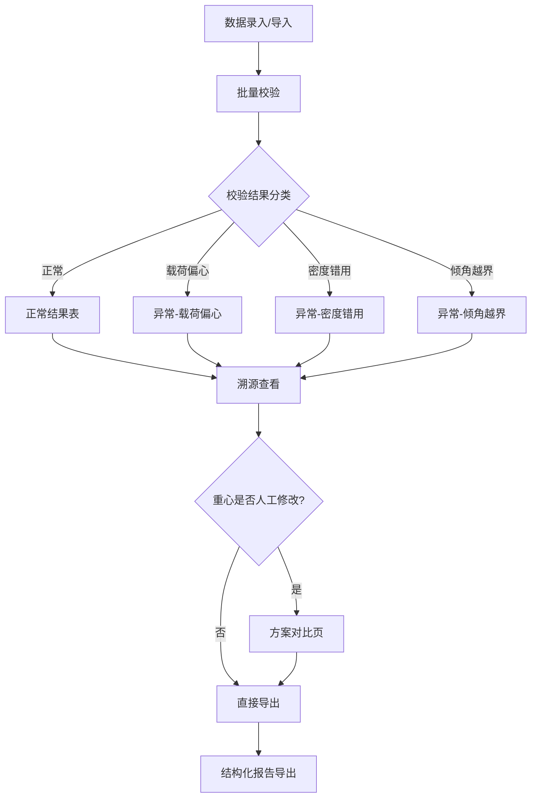

## 1. 产品概述

无人船浮态校验工具——面向船模社实验人员与教师，批量校验无人船浮态数据，自动识别载荷偏心、密度错用、倾角越界等异常，并生成可追溯的结构化报告。  
核心目标：让复核人一眼看清每条记录的船体参数来源、倾角记录来源和校验结论来源，杜绝"一行总记录"式信息压缩。

## 2. 核心功能

### 2.1 用户角色

| 角色 | 使用方式 | 核心权限 |
|------|----------|----------|
| 实验人员 | 直接使用 | 录入数据、批量校验、导出报告 |
| 教师复核 | 直接使用 | 查看结构化报告、方案对比、审计重心修改 |

### 2.2 功能模块

1. **数据录入页**：批量粘贴/导入船体参数与载荷数据，支持逐条编辑
2. **校验结果页**：分项展示校验结论，异常类型独立标注，支持筛选与导出
3. **方案对比页**：对比重心人工修改前后的浮态差异，量化改动影响
4. **报告导出**：结构化导出船体参数、倾角记录、校验报告为各自独立段，附带数据溯源标记

### 2.3 页面详情

| 页面名称 | 模块名称 | 功能描述 |
|----------|----------|----------|
| 数据录入页 | 数据表格 | 支持逐行录入船体参数（船长、船宽、型深、吃水、排水量、重心位置）、载荷信息（载荷重量、载荷位置x/y/z）、航行备注、介质密度 |
| 数据录入页 | 批量导入 | 支持 JSON/CSV 文件导入，自动解析字段映射 |
| 数据录入页 | 样例数据 | 一键加载预置样例（1条正常 + 1条倾角越界），方便教师确认分支生效 |
| 校验结果页 | 正常结果表 | 展示浮态参数（初稳性高GM、横倾角、纵倾角等），每列标注数据来源 |
| 校验结果页 | 异常结果表 | 按异常类型分行展示：载荷偏心、密度错用、倾角越界，各自附原因说明，不合并为笼统风险 |
| 校验结果页 | 批量导出 | 正常结果与不可计算原因分别导出为 CSV/JSON |
| 方案对比页 | 修改前后对比 | 若重心被人工修改，展示原始值/修改值/差值/对GM的影响 |
| 方案对比页 | 报告导出 | 对比结果随报告一并导出，标注"重心已修改"及影响量 |
| 报告导出 | 结构化报告 | 船体参数段、倾角记录段、校验结论段各自独立，每段附数据来源字段 |

## 3. 核心流程

用户在数据录入页批量输入或导入船体参数与载荷数据 → 点击"批量校验" → 系统逐条执行浮态计算 → 正常记录进入"正常结果表"，异常记录按类型（载荷偏心/密度错用/倾角越界）进入"异常结果表" → 用户可筛选、查看每条记录的详细溯源 → 若重心被人工修改，可在"方案对比页"查看修改影响 → 导出结构化报告（正常+异常+对比分别导出）

## 4. 用户界面设计

### 4.1 设计风格

- **主色调**：深海蓝 (#0A2540) + 航海绿 (#00BFA5) 作为强调色
- **次色调**：暖橙 (#FF6D00) 用于异常警示，淡灰 (#E8EDF2) 用于背景
- **按钮风格**：圆角微凸（3D 效果），主按钮深海蓝底白字，警示按钮暖橙底白字
- **字体**：标题用 DM Serif Display（衬线，庄重感），正文用 IBM Plex Sans（等宽数据友好）
- **布局风格**：左侧导航栏 + 右侧内容区，数据表格占满宽度，卡片式展示详情
- **图标风格**：Lucide 图标库，线条风格，统一 18px

### 4.2 页面设计概览

| 页面名称 | 模块名称 | UI 元素 |
|----------|----------|---------|
| 数据录入页 | 数据表格 | 深色表头，斑马纹行，悬浮行高亮，可编辑单元格，来源标记小标签 |
| 数据录入页 | 批量导入 | 拖拽上传区域，虚线边框，上传图标，格式提示 |
| 数据录入页 | 样例数据 | 海绿色按钮"加载样例"，点击后自动填充表格 |
| 校验结果页 | 正常结果表 | 绿色状态徽章，每列底部小字标注来源，可展开行查看完整参数 |
| 校验结果页 | 异常结果表 | 橙/红色状态徽章，异常类型标签分色（偏心-橙、密度-黄、越界-红），独立原因说明区 |
| 方案对比页 | 修改前后对比 | 双栏对照，差异高亮，箭头指示变化方向，GM 变化量独立数值卡 |
| 报告导出 | 导出面板 | 三个独立导出按钮（正常结果/异常原因/完整报告），格式选择（CSV/JSON），预览缩略 |

### 4.3 响应式

- 桌面优先设计，最小宽度 1024px
- 平板端表格可横向滚动，导航栏收缩为图标
- 移动端不作为主要适配目标，但确保不溢出

### 4.4 3D 场景

不适用
