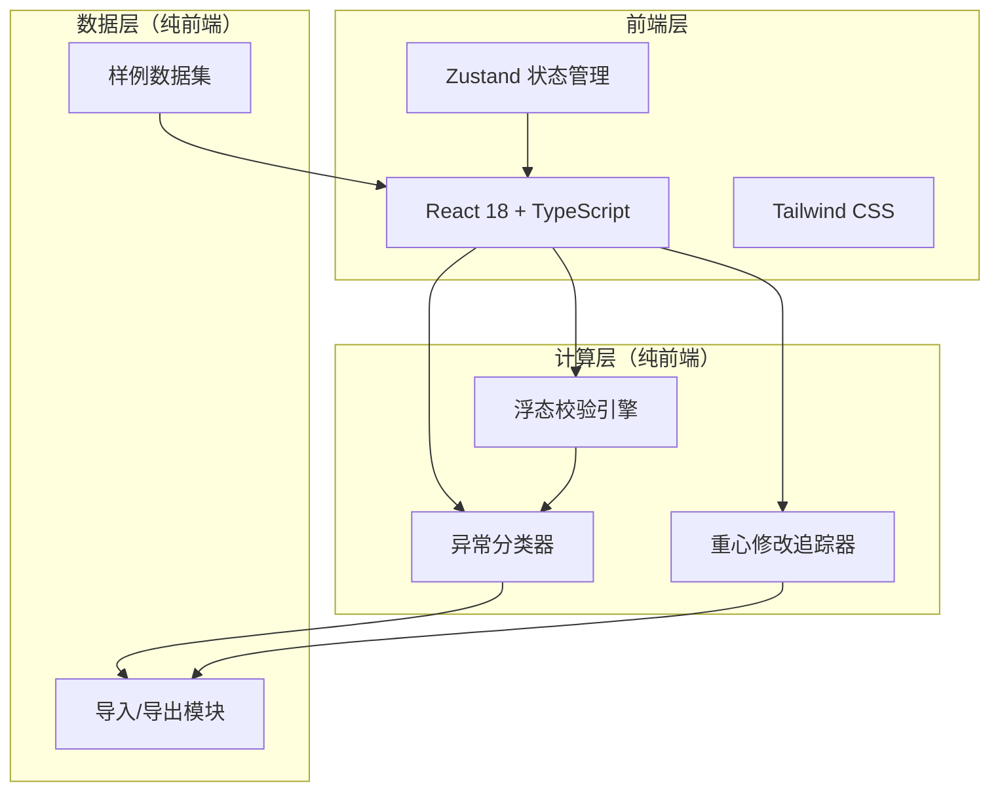
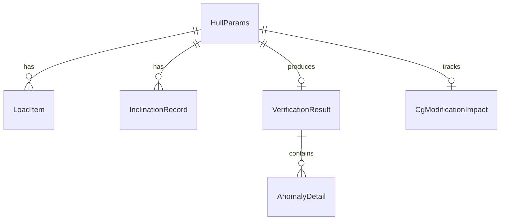

## 1. 架构设计



纯前端架构，所有计算在浏览器端完成，无需后端服务。

## 2. 技术说明

- **前端**：React@18 + TypeScript + Tailwind CSS@3 + Vite
- **初始化工具**：vite-init（react-ts 模板）
- **后端**：无（纯前端计算）
- **数据库**：无（浏览器内存 + 文件导入导出）
- **状态管理**：Zustand
- **图标库**：lucide-react
- **字体**：DM Serif Display（标题） + IBM Plex Sans（正文/数据）

## 3. 路由定义

| 路由 | 用途 |
|------|------|
| `/` | 数据录入页：批量录入/导入船体参数与载荷数据 |
| `/results` | 校验结果页：正常结果表 + 异常结果表（分类型） |
| `/compare` | 方案对比页：重心修改前后对比 |

## 4. API 定义

无后端 API，所有数据通过前端 Zustand store 管理。

### 4.1 核心数据类型

```typescript
interface HullParams {
  id: string;
  source: "input" | "import" | "sample";
  length: number;
  beam: number;
  depth: number;
  draft: number;
  displacement: number;
  cgX: number;
  cgY: number;
  cgZ: number;
  cgModified: boolean;
  cgOriginal?: { x: number; y: number; z: number };
  density: number;
  densityUnit: "fresh" | "salt";
  remark: string;
}

interface LoadItem {
  id: string;
  hullId: string;
  weight: number;
  positionX: number;
  positionY: number;
  positionZ: number;
  name: string;
}

interface InclinationRecord {
  id: string;
  hullId: string;
  rollAngle: number;
  pitchAngle: number;
  measuredAt: string;
  source: "sensor" | "manual" | "calculated";
}

type AnomalyType = "load_eccentricity" | "density_misuse" | "inclination_exceedance";

interface AnomalyDetail {
  type: AnomalyType;
  label: string;
  description: string;
  severity: "warning" | "critical";
  relatedParam: string;
  threshold: number;
  actual: number;
}

interface VerificationResult {
  id: string;
  hullId: string;
  status: "pass" | "anomaly" | "uncalculable";
  gm: number | null;
  rollAngle: number | null;
  pitchAngle: number | null;
  anomalies: AnomalyDetail[];
  hullSource: string;
  inclinationSource: string;
  calculatedAt: string;
}

interface CgModificationImpact {
  hullId: string;
  originalCg: { x: number; y: number; z: number };
  modifiedCg: { x: number; y: number; z: number };
  deltaCg: { x: number; y: number; z: number };
  originalGm: number | null;
  modifiedGm: number | null;
  deltaGm: number | null;
  impactDescription: string;
}
```

## 5. 服务器架构图

不适用（纯前端项目）

## 6. 数据模型

### 6.1 数据模型定义



### 6.2 数据定义语言

无需数据库 DDL，数据以 Zustand store 形式存储于浏览器内存，通过 JSON/CSV 文件导入导出。
