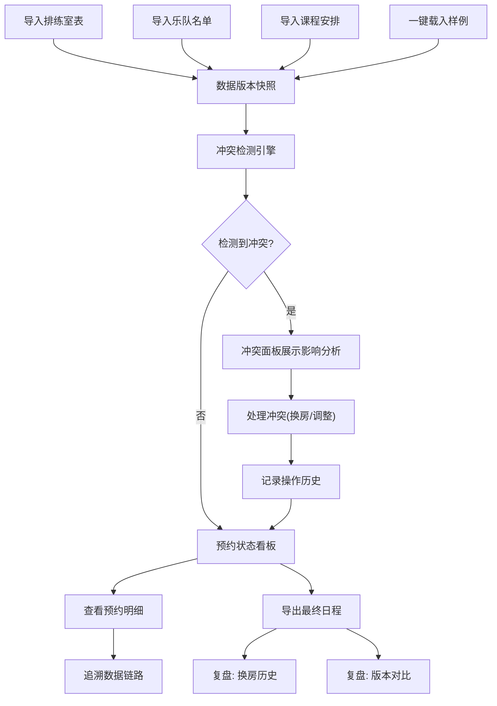

## 1. 产品概述

排练室预约冲突台是面向音乐教务团队的内部管理工具，解决乐队名单、设备需求与课程安排之间频繁冲突的问题，通过可视化预约看板、智能冲突检测和完整数据链路，让预约状态稳定可追溯。

- **核心问题**：乐队与设备需求经常冲突，预约状态混乱，事后无法追溯来源和版本
- **目标用户**：音乐教务人员、排练室管理员
- **产品价值**：建立从排练室表到导出日程的完整可追溯链路，冲突透明化，数据可审计

## 2. 核心 Features

### 2.1 用户角色

| 角色 | 注册方式 | 核心权限 |
|------|----------|----------|
| 教务管理员 | 内部账号登录 | 导入数据、处理冲突、导出日程、查看历史 |
| 普通用户 | 内部账号登录 | 查看预约状态、导入样例数据 |

### 2.2 功能模块

1. **数据导入中心**：排练室表导入、乐队名单导入、课程安排导入、样例数据一键导入
2. **预约状态看板**：时间轴可视化、房间占用热力图、冲突标记高亮
3. **冲突检测引擎**：设备不匹配检测、老师请假检测、跨天预约检测、冲突影响分析
4. **明细与操作**：预约详情查看、换房调整、冲突处理记录
5. **复盘与导出**：换房历史追溯、日程导出、数据版本对比
6. **数据来源管理**：导入来源记录、版本快照、链路追踪

### 2.3 页面详情

| 页面名称 | 模块名称 | 功能描述 |
|----------|----------|----------|
| 数据导入中心 | 排练室表导入 | Excel/CSV导入，支持字段映射，记录来源和版本 |
| 数据导入中心 | 乐队名单导入 | 导入乐队成员、乐器设备需求，关联课程 |
| 数据导入中心 | 课程安排导入 | 导入上课时间、老师、教室需求 |
| 数据导入中心 | 样例数据 | 一键载入演示数据，快速体验完整流程 |
| 预约状态看板 | 时间轴视图 | 按周/日展示所有排练室预约情况，颜色区分状态 |
| 预约状态看板 | 房间热力图 | 展示各时段房间使用率，快速识别空闲/冲突 |
| 预约状态看板 | 冲突标记 | 红色高亮冲突预约，鼠标悬停显示冲突原因 |
| 冲突检测面板 | 冲突列表 | 列出所有检测到的冲突，分类展示 |
| 冲突检测面板 | 影响分析 | 展示每个冲突关联的预约条目，说明影响范围 |
| 预约详情页 | 基础信息 | 展示预约的乐队、时间、房间、设备需求 |
| 预约详情页 | 操作记录 | 记录所有修改操作，支持换房调整 |
| 预约详情页 | 数据链路 | 展示从原始导入到当前状态的完整链路 |
| 复盘中心 | 换房历史 | 按时间线展示所有房间调整记录 |
| 复盘中心 | 日程导出 | 导出Excel/PDF格式的最终日程表 |
| 复盘中心 | 版本对比 | 对比不同版本的导入数据差异 |

## 3. 核心流程

用户从导入数据开始，经过冲突检测，在看板上可视化查看状态，处理冲突后导出最终日程，全程保留数据来源和版本信息。

## 4. 用户界面设计

### 4.1 设计风格

- **主色调**：深靛蓝 (#1E3A5F) - 专业稳重，适合管理系统
- **辅助色**：珊瑚红 (#E74C3C) 标记冲突，森林绿 (#27AE60) 标记正常，琥珀黄 (#F39C12) 标记待处理
- **按钮风格**：微立体边框，圆角4px，hover时有轻微浮起效果
- **字体**：标题用"Noto Serif SC" 衬线体体现专业感，正文用"Noto Sans SC" 无衬线体保证可读性
- **布局风格**：左侧导航 + 主内容区的经典管理后台布局，卡片式模块划分
- **图标风格**：线性简约图标，统一2px描边，冲突场景使用警示性图标

### 4.2 页面设计概览

| 页面名称 | 模块名称 | UI Elements |
|----------|----------|-------------|
| 数据导入中心 | 导入卡片 | 拖拽上传区、字段映射表、来源版本输入框、导入进度条 |
| 预约状态看板 | 时间轴 | 时间刻度标尺、可拖拽预约块、冲突红边高亮、悬停tooltip |
| 预约状态看板 | 房间列表 | 房间信息卡、设备标签、容量标识、状态指示灯 |
| 冲突检测面板 | 冲突卡片 | 冲突类型徽章、影响条目列表、"处理"按钮、影响范围说明 |
| 预约详情页 | 链路追踪 | 时间线式数据流向图、来源版本标签、操作人时间戳 |
| 复盘中心 | 历史时间线 | 垂直时间轴、换房前后对比、操作备注、导出按钮 |

### 4.3 响应式

- **桌面优先**：1280px以上宽度最佳体验，左侧导航固定240px
- **平板适配**：1024px时导航可折叠，主内容区自适应
- **移动端**：768px以下转为顶部导航，看板简化为列表视图

### 4.4 数据可视化特别说明

- 预约时间轴使用甘特图式横向布局，每个预约块可点击查看详情
- 冲突预约块使用红色边框 + 斜纹底纹双重标记，确保一眼识别
- 数据链路图使用节点连线方式，清晰展示"原始数据 → 冲突检测 → 调整记录 → 最终导出"的完整路径
- 热力图使用从浅蓝到深红的渐变，直观展示房间使用密度
