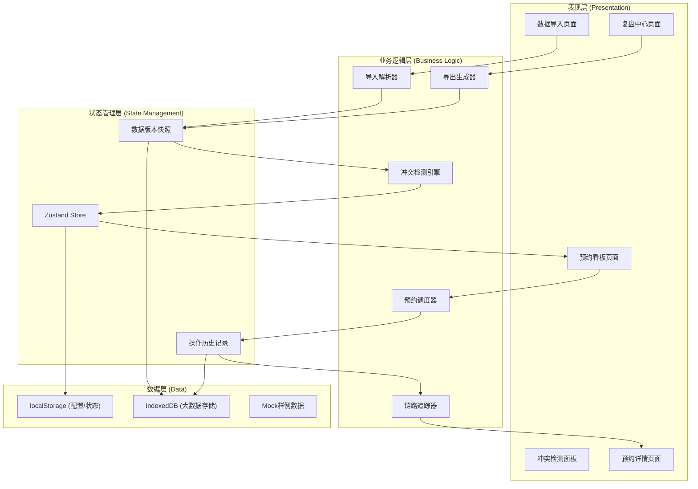
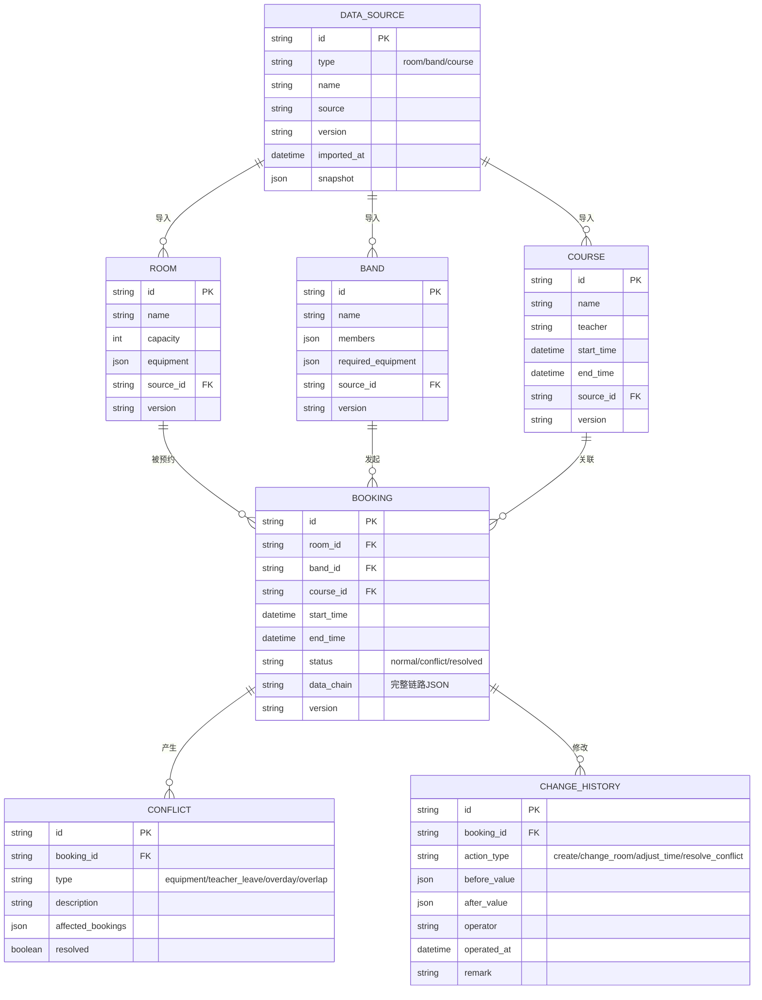
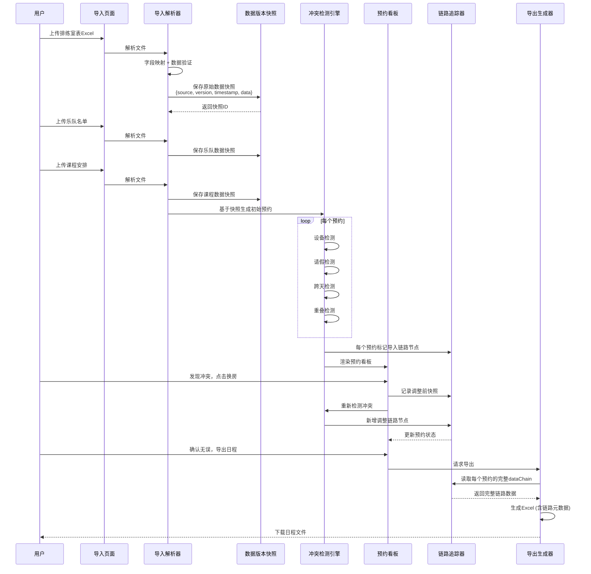

## 1. 架构设计

本系统为纯前端单页应用，数据存储在浏览器本地（localStorage + IndexedDB），确保从原始数据导入到最终日程导出的完整链路可追溯，不依赖后端服务即可独立运行。



## 2. 技术描述

- **前端框架**: React@18.2.0 + TypeScript@5
- **构建工具**: Vite@5
- **样式方案**: TailwindCSS@3.4 + CSS变量主题系统
- **状态管理**: Zustand@4 (轻量、可追溯、支持时间旅行)
- **数据存储**: localStorage + IndexedDB (idb库封装)
- **图表可视化**: Recharts@2 (热力图、统计图表)
- **文件处理**: xlsx@0.18 (Excel导入导出), papaparse@5 (CSV解析)
- **路由**: React Router@6
- **图标**: Lucide React
- **日期处理**: dayjs@1.11

## 3. 路由定义

| Route | 页面 | 核心功能 |
|-------|------|----------|
| `/` | 数据导入中心 | 排练室表、乐队名单、课程安排导入，样例数据载入 |
| `/board` | 预约状态看板 | 时间轴视图、房间热力图、冲突标记、快速操作 |
| `/booking/:id` | 预约详情 | 基础信息、操作记录、数据链路追溯、换房调整 |
| `/review` | 复盘中心 | 换房历史时间线、版本对比、日程导出 |

## 4. 核心数据模型

### 4.1 ER Diagram



### 4.2 数据链路追踪设计

**核心原则**: 每个预约实体(`booking`)必须携带完整的 `data_chain` 字段，记录从原始导入到当前状态的每一步变化，不依赖内存变量传递。

```typescript
interface DataChainNode {
  step: 'import' | 'conflict_detect' | 'adjust' | 'export';
  timestamp: string;
  source: string;
  version: string;
  dataSnapshot: any;
  operator?: string;
  remark?: string;
}

interface Booking {
  id: string;
  roomId: string;
  bandId: string;
  courseId: string;
  startTime: string;
  endTime: string;
  status: 'normal' | 'conflict' | 'resolved';
  // 完整链路，不依赖后台变量
  dataChain: DataChainNode[];
  version: string;
}
```

### 4.3 冲突检测算法

```typescript
// 设备不匹配检测
function detectEquipmentConflict(booking: Booking, room: Room): Conflict | null {
  const missing = booking.band.requiredEquipment.filter(
    eq => !room.equipment.includes(eq)
  );
  if (missing.length > 0) {
    return {
      type: 'equipment',
      description: `缺少设备: ${missing.join(', ')}`,
      affectedBookings: [booking.id]
    };
  }
  return null;
}

// 老师请假检测
function detectTeacherLeaveConflict(booking: Booking, leaves: TeacherLeave[]): Conflict | null {
  const teacher = booking.course.teacher;
  const overlappingLeave = leaves.find(leave => 
    leave.teacher === teacher &&
    dateRangesOverlap(booking.startTime, booking.endTime, leave.startDate, leave.endDate)
  );
  if (overlappingLeave) {
    return {
      type: 'teacher_leave',
      description: `${teacher} 在该时段请假 (${overlappingLeave.reason})`,
      affectedBookings: findBookingsByTeacherAndTimeRange(teacher, booking.startTime, booking.endTime)
    };
  }
  return null;
}

// 跨天预约检测
function detectOverdayConflict(booking: Booking): Conflict | null {
  const startDay = dayjs(booking.startTime).startOf('day');
  const endDay = dayjs(booking.endTime).startOf('day');
  if (!startDay.isSame(endDay)) {
    return {
      type: 'overday',
      description: `预约跨 ${endDay.diff(startDay, 'day') + 1} 天`,
      affectedBookings: [booking.id]
    };
  }
  return null;
}

// 时间重叠检测
function detectOverlapConflict(booking: Booking, allBookings: Booking[]): Conflict | null {
  const overlapping = allBookings.filter(b => 
    b.id !== booking.id &&
    b.roomId === booking.roomId &&
    dateRangesOverlap(b.startTime, b.endTime, booking.startTime, booking.endTime)
  );
  if (overlapping.length > 0) {
    return {
      type: 'overlap',
      description: `与 ${overlapping.map(b => b.band.name).join(', ')} 的预约时间重叠`,
      affectedBookings: [booking.id, ...overlapping.map(b => b.id)]
    };
  }
  return null;
}
```

## 5. 模块组件设计

```
src/
├── components/
│   ├── import/
│   │   ├── ImportCard.tsx          # 导入卡片组件
│   │   ├── FileUploader.tsx        # 文件上传组件
│   │   └── FieldMapper.tsx         # 字段映射表
│   ├── board/
│   │   ├── TimelineView.tsx        # 时间轴视图
│   │   ├── RoomHeatmap.tsx         # 房间热力图
│   │   ├── BookingBlock.tsx        # 预约块组件
│   │   └── RoomCard.tsx            # 房间信息卡
│   ├── conflict/
│   │   ├── ConflictPanel.tsx       # 冲突面板
│   │   ├── ConflictCard.tsx        # 冲突卡片
│   │   └── ImpactAnalysis.tsx      # 影响分析
│   ├── booking/
│   │   ├── BookingDetail.tsx       # 预约详情
│   │   ├── DataChainView.tsx       # 数据链路可视化
│   │   └── RoomChangeForm.tsx      # 换房表单
│   └── review/
│       ├── ChangeHistory.tsx       # 换房历史时间线
│       ├── VersionCompare.tsx      # 版本对比
│       └── ExportDialog.tsx        # 导出对话框
├── store/
│   ├── useDataStore.ts             # 数据源管理
│   ├── useBookingStore.ts          # 预约状态管理
│   ├── useConflictStore.ts         # 冲突状态管理
│   └── useHistoryStore.ts          # 历史记录管理
├── engine/
│   ├── importParser.ts             # 导入解析引擎
│   ├── conflictDetector.ts         # 冲突检测引擎
│   ├── bookingScheduler.ts         # 预约调度器
│   ├── chainTracker.ts             # 链路追踪器
│   └── exportGenerator.ts          # 导出生成器
├── types/
│   └── index.ts                    # TypeScript类型定义
├── data/
│   └── sampleData.ts               # 样例数据
└── utils/
    ├── storage.ts                  # 存储工具
    └── dateUtils.ts                # 日期工具
```

## 6. 核心数据流 - 从排练室表到导出日程



## 7. 状态管理设计 - Zustand Store

```typescript
// useDataStore.ts - 数据源管理
interface DataState {
  sources: DataSource[];
  rooms: Room[];
  bands: Band[];
  courses: Course[];
  importData: (type: DataSourceType, file: File, source: string, version: string) => Promise<void>;
  loadSampleData: () => void;
  getVersionHistory: (type: DataSourceType) => DataSource[];
  compareVersions: (v1Id: string, v2Id: string) => DiffResult;
}

// useBookingStore.ts - 预约管理
interface BookingState {
  bookings: Booking[];
  generateBookings: () => void;
  changeRoom: (bookingId: string, newRoomId: string, remark: string) => void;
  adjustTime: (bookingId: string, newStart: string, newEnd: string, remark: string) => void;
  getBookingChain: (bookingId: string) => DataChainNode[];
}

// useConflictStore.ts - 冲突管理
interface ConflictState {
  conflicts: Conflict[];
  detectConflicts: () => void;
  resolveConflict: (conflictId: string, solution: string) => void;
  getConflictsByBooking: (bookingId: string) => Conflict[];
  getAffectedBookings: (conflictId: string) => Booking[];
}
```
