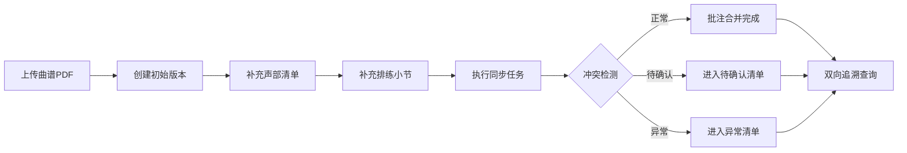

## 1. 产品概述

曲谱批注同步器是为乐团助理设计的专业工具，解决日常曲谱管理中的版本错用、批注覆盖、小节错位等问题。通过版本追踪、冲突检测和双向追溯机制，确保曲谱资料的一致性和可追溯性。

## 2. 核心功能

### 2.1 用户角色

| 角色 | 注册方式 | 核心权限 |
|------|----------|----------|
| 乐团助理 | 系统登录 | 曲谱上传、批注管理、版本追踪、异常复核 |

### 2.2 功能模块

1. **曲谱管理首页**: 曲谱列表概览、筛选面板、统计图表
2. **曲谱详情页**: 版本对比、批注合并、声部清单、异常清单
3. **同步任务中心**: 任务列表、执行日志、冲突复核
4. **追溯查询页**: 双向追溯链路、关联关系可视化

### 2.3 页面详情

| 页面名称 | 模块名称 | 功能描述 |
|----------|----------|----------|
| 曲谱管理首页 | 筛选面板 | 多维度筛选（状态、声部、时间），筛选结果同步图表和明细 |
| 曲谱管理首页 | 统计概览 | 正常/待确认/异常数量统计，版本分布图表 |
| 曲谱管理首页 | 曲谱列表 | 曲谱卡片展示，支持快速查看和操作 |
| 曲谱详情页 | 版本追踪 | PDF版本历史，增量更新不覆盖原有判断 |
| 曲谱详情页 | 批注合并 | 多源批注智能合并，冲突高亮标注 |
| 曲谱详情页 | 声部清单 | 声部与小节对应关系，支持后续补充 |
| 曲谱详情页 | 异常清单 | 版本错用、批注覆盖、小节错位独立列表 |
| 同步任务中心 | 任务执行 | 同步任务触发、进度展示、执行日志 |
| 追溯查询页 | 双向追溯 | PDF→结果→声部清单完整链路追溯 |

## 3. 核心流程

用户上传曲谱PDF后，系统自动解析并创建初始版本。后续补充声部清单和排练小节时采用增量更新，保留原有判断。同步任务执行批注合并和版本比对，发现冲突自动进入待确认或异常清单。支持从PDF出发追溯到最终结果，或从结果反查回声部清单，形成完整闭环。

## 4. 用户界面设计

### 4.1 设计风格

- **主色调**: 深海军蓝 (#1e3a5f) - 专业、稳重
- **辅助色**: 暖金色 (#d4a855) - 音乐艺术感
- **状态色**: 成功绿 (#059669)、警告橙 (#f59e0b)、危险红 (#dc2626)
- **背景**: 深色主题，营造专业工作环境
- **字体**: Playfair Display (标题) + Noto Sans SC (正文)
- **布局**: 卡片式设计，清晰的信息层级
- **图标**: Lucide 图标库，简洁线条风格

### 4.2 页面设计概述

| 页面名称 | 模块名称 | UI元素 |
|----------|----------|--------|
| 曲谱管理首页 | 顶部导航 | Logo、搜索框、用户菜单 |
| 曲谱管理首页 | 筛选面板 | 多条件筛选器，实时联动 |
| 曲谱管理首页 | 统计卡片 | 四个状态统计，带图标和数值 |
| 曲谱管理首页 | 曲谱列表 | 卡片网格，悬停动画 |
| 曲谱详情页 | 侧边栏 | 版本树、快速跳转 |
| 曲谱详情页 | 主内容区 | 三栏布局（PDF预览、批注、声部） |
| 曲谱详情页 | 底部面板 | 异常清单，可展开收起 |
| 追溯查询页 | 链路视图 | 时间线式追溯展示 |

### 4.3 响应式

桌面端优先设计，支持平板自适应。核心工作区在大屏上最大化利用空间，保证信息密度和操作效率。

### 4.4 交互细节

- 筛选条件变更时，图表和列表平滑过渡刷新
- 版本对比时，差异内容高亮闪烁提示
- 异常项点击展开详情，带微妙的缩放动画
- 卡片悬停时轻微上浮和阴影加深
