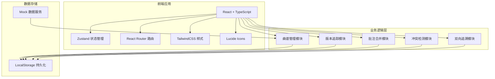
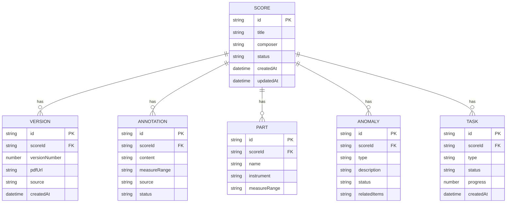

## 1. 架构设计



## 2. 技术描述

- **前端**: React@18 + TypeScript + Vite
- **状态管理**: Zustand
- **路由**: React Router DOM
- **样式**: TailwindCSS@3
- **图标**: Lucide React
- **后端**: 纯前端应用，使用 LocalStorage + Mock 数据
- **数据持久化**: LocalStorage

## 3. 路由定义

| 路由 | 页面名称 | 功能 |
|------|----------|------|
| / | 曲谱管理首页 | 曲谱列表、筛选、统计概览 |
| /score/:id | 曲谱详情页 | 版本对比、批注合并、声部清单、异常清单 |
| /tasks | 同步任务中心 | 任务列表、执行日志、冲突复核 |
| /trace | 追溯查询页 | 双向追溯链路查询 |

## 4. 数据模型

### 4.1 数据模型定义



### 4.2 TypeScript 类型定义

```typescript
// 曲谱状态
type ScoreStatus = 'normal' | 'pending' | 'anomaly'

// 异常类型
type AnomalyType = 'version_mismatch' | 'annotation_override' | 'measure_misalignment'

// 曲谱
interface Score {
  id: string
  title: string
  composer: string
  status: ScoreStatus
  pdfUrl: string
  partListUrl?: string
  exportedUrl?: string
  createdAt: string
  updatedAt: string
}

// 版本
interface Version {
  id: string
  scoreId: string
  versionNumber: number
  pdfUrl: string
  source: string
  createdAt: string
  note?: string
}

// 批注
interface Annotation {
  id: string
  scoreId: string
  content: string
  measureRange: string
  source: string
  status: 'merged' | 'conflict' | 'pending'
  createdBy: string
  createdAt: string
}

// 声部
interface Part {
  id: string
  scoreId: string
  name: string
  instrument: string
  measureRange: string
  confirmed: boolean
}

// 异常
interface Anomaly {
  id: string
  scoreId: string
  type: AnomalyType
  description: string
  status: 'open' | 'confirmed' | 'resolved'
  relatedItems: string[]
  createdAt: string
}

// 同步任务
interface SyncTask {
  id: string
  scoreId: string
  type: 'annotation_merge' | 'version_check' | 'part_alignment'
  status: 'pending' | 'running' | 'completed' | 'failed'
  progress: number
  log: string[]
  createdAt: string
}

// 追溯链路
interface TraceLink {
  id: string
  type: 'pdf' | 'part_list' | 'exported' | 'annotation' | 'anomaly'
  name: string
  url?: string
  timestamp: string
}
```
