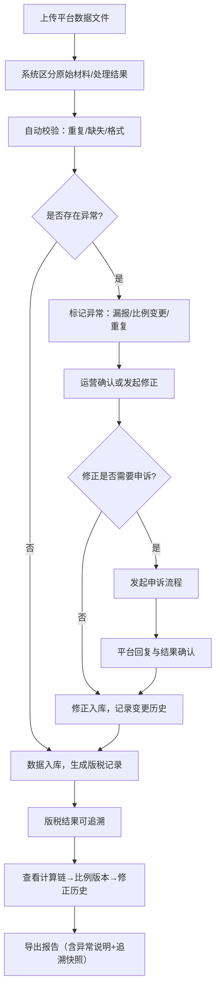

## 1. 产品概述

音乐版权版税追踪工作台——面向版权运营团队的本地 Web 工具，聚合短视频平台、KTV、直播三大渠道的使用记录与版税数据，提供从导入、校验、修正、申诉到报告导出的全链路管理。核心解决：多平台数据分散、漏报难以追溯、比例变更无版本记录、导出报告缺乏上下文说明。

- 目标用户：版权运营专员、词曲作者对接人、合规审计人员
- 核心价值：一条版税结果可反向追溯至平台归集、计算规则、比例版本，出问题时能快速定位并用人话解释

## 2. 核心功能

### 2.1 用户角色

| 角色 | 使用方式 | 核心权限 |
|------|----------|----------|
| 版权运营专员 | 本地登录 | 导入数据、修正记录、发起申诉、导出报告 |
| 词曲作者（只读） | 通过导出报告查看 | 查看最终版税、申诉结果说明 |

### 2.2 功能模块

1. **版税总览页**：多平台版税汇总、异常标记、快速筛选
2. **作品列表页**：全部作品档案、多维度筛选与搜索、批量操作
3. **作品详情页**：使用记录、版税计算链、比例版本、修正与申诉历史
4. **数据导入页**：文件上传、原始材料与处理结果分离、导入校验
5. **修正与申诉页**：漏报修正、比例变更记录、申诉流程与结果
6. **报告导出页**：生成可分享报告、附带异常说明、追溯链快照

### 2.3 页面详情

| 页面名称 | 模块名称 | 功能描述 |
|----------|----------|----------|
| 版税总览页 | 汇总看板 | 按平台（短视频/KTV/直播）展示版税总额、环比变化、异常数量 |
| 版税总览页 | 异常标记列表 | 标记漏报、比例变更、重复使用等异常，点击直达详情 |
| 版税总览页 | 快速筛选 | 按平台、时间范围、异常类型筛选 |
| 作品列表页 | 作品表格 | 作品名、词曲作者、平台分布、版税总额、最近修正时间 |
| 作品列表页 | 搜索与筛选 | 按作品名、作者、平台、状态搜索 |
| 作品列表页 | 批量操作 | 批量标记异常、批量导出 |
| 作品详情页 | 基本信息卡 | 作品档案：标题、ISRC、词曲作者、首次登记时间 |
| 作品详情页 | 使用记录表 | 按平台分组展示各渠道使用次数与金额 |
| 作品详情页 | 版税计算链 | 从原始使用量→平台规则→比例分配→最终版税的完整链路 |
| 作品详情页 | 比例版本时间线 | 每次比例变更的版本记录，含变更原因与审批人 |
| 作品详情页 | 修正与申诉记录 | 所有修正操作和申诉流程的历史记录 |
| 数据导入页 | 文件上传区 | 支持 CSV/Excel 上传，拖拽上传 |
| 数据导入页 | 导入预览 | 区分"原始材料"与"处理结果"，显示校验结果 |
| 数据导入页 | 校验报告 | 检测重复、缺失、格式异常，标记问题行 |
| 修正与申诉页 | 修正记录表 | 漏报修正、比例变更、重复使用处理记录 |
| 修正与申诉页 | 申诉流程 | 发起申诉→平台回复→结果确认的完整流程 |
| 修正与申诉页 | 原因说明 | 每条修正/申诉附人话说明，非技术同事可理解 |
| 报告导出页 | 报告模板 | 版税结算报告、异常说明报告、追溯链报告 |
| 报告导出页 | 异常附带 | 报告自动附带漏报说明、比例变更说明、重复使用说明 |
| 报告导出页 | 追溯快照 | 报告内嵌版税计算链快照，收件人可逐级追溯 |

## 3. 核心流程

**版税数据导入与校验流程**：运营人员上传平台数据文件→系统区分原始材料与处理结果→自动校验重复/缺失/格式→标记异常→运营确认或修正→数据入库。

**版税追溯流程**：从一条版税结果出发→查看平台归集来源→查看计算规则与比例版本→查看修正/申诉历史→定位问题环节→导出含完整上下文的报告。

## 4. 用户界面设计

### 4.1 设计风格

- 主色调：深墨蓝 (#1a1f36) 搭配琥珀金 (#d4a853) 点缀，传达版权行业的专业与严谨
- 辅助色：冷灰 (#6b7280) 用于次要信息，翡翠绿 (#10b981) 用于正常状态，珊瑚红 (#ef4444) 用于异常告警
- 按钮风格：圆角 6px，主按钮深墨蓝底+琥珀金文字，次按钮边框式
- 字体：标题使用 Noto Serif SC（衬线体，版权行业质感），正文使用 Noto Sans SC（清晰易读）
- 布局风格：左侧固定导航栏 + 右侧内容区，表格为主的数据展示，卡片式信息聚合
- 图标风格：线性图标，与整体专业感统一

### 4.2 页面设计概览

| 页面名称 | 模块名称 | UI元素 |
|----------|----------|--------|
| 版税总览页 | 汇总看板 | 深色卡片、琥珀金数字大字、环形图展示平台占比、趋势折线图 |
| 版税总览页 | 异常标记列表 | 红色标签标记异常类型、可点击行跳转、右侧浮动筛选面板 |
| 作品列表页 | 作品表格 | 斑马纹表格、左侧固定列（作品名）、平台标签色块、行hover高亮 |
| 作品列表页 | 搜索栏 | 顶部粘性搜索栏、多条件下拉筛选 |
| 作品详情页 | 版税计算链 | 垂直步骤条、每步可展开详情、连接线可视化数据流转 |
| 作品详情页 | 比例版本时间线 | 左侧时间轴、右侧版本卡片、变更用琥珀金高亮 |
| 数据导入页 | 上传区 | 虚线边框拖拽区、文件类型图标、进度条动画 |
| 数据导入页 | 校验报告 | 分栏布局：左原始/右结果、问题行红色背景高亮 |
| 修正与申诉页 | 修正记录 | 表格+内联编辑、人话说明区域用浅黄背景区分 |
| 报告导出页 | 报告模板 | 卡片式模板选择、预览区、下载按钮带文件格式选项 |

### 4.3 响应式设计

- 桌面优先设计，核心操作区域在 1280px+ 宽度下最优
- 平板端（768-1280px）：侧边导航收缩为图标模式，表格列适当隐藏
- 移动端（<768px）：底部Tab导航，表格转卡片视图，核心操作保留

### 4.4 3D场景

不适用
