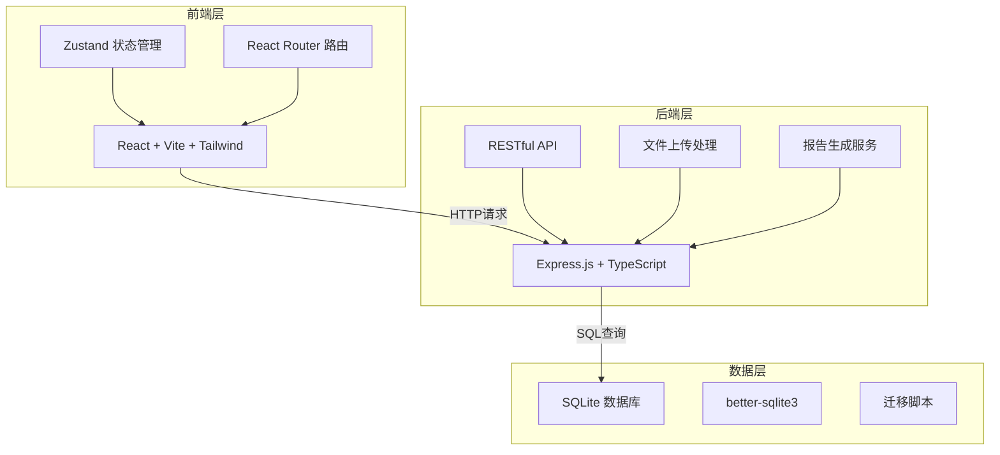
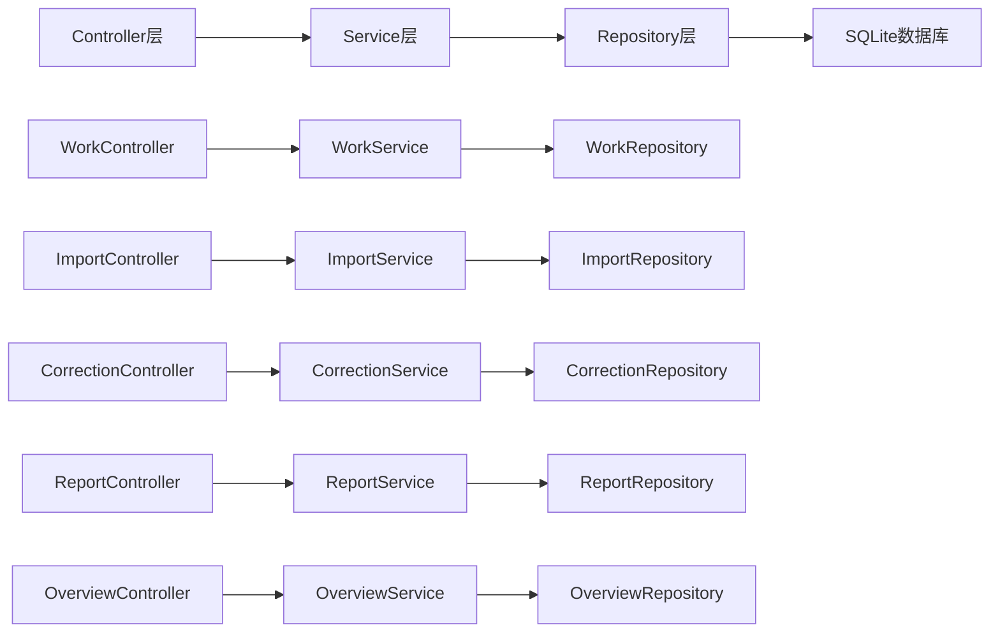
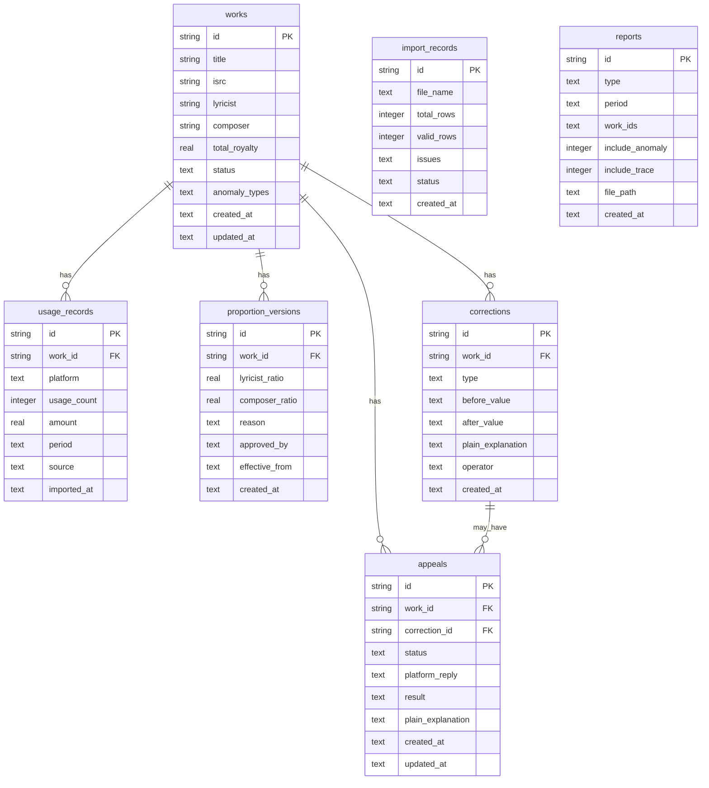

## 1. 架构设计



## 2. 技术说明

- 前端：React@18 + TailwindCSS@3 + Vite
- 初始化工具：vite-init
- 后端：Express@4 + TypeScript（ESM格式）
- 数据库：SQLite（better-sqlite3），本地文件存储，无需外部服务
- 状态管理：Zustand
- 路由：React Router DOM v6

## 3. 路由定义

| 路由 | 用途 |
|------|------|
| `/` | 版税总览页：多平台汇总看板、异常标记 |
| `/works` | 作品列表页：全部作品档案、搜索筛选 |
| `/works/:id` | 作品详情页：使用记录、版税计算链、比例版本、修正申诉 |
| `/import` | 数据导入页：文件上传、校验、原始/处理分离 |
| `/corrections` | 修正与申诉页：修正记录、申诉流程 |
| `/reports` | 报告导出页：模板选择、预览、下载 |

## 4. API 定义

### 4.1 作品相关

```typescript
interface Work {
  id: string;
  title: string;
  isrc: string;
  lyricist: string;
  composer: string;
  firstRegisteredAt: string;
  totalRoyalty: number;
  status: "normal" | "anomaly";
  anomalyTypes: AnomalyType[];
  createdAt: string;
  updatedAt: string;
}

type AnomalyType = "under_report" | "proportion_change" | "duplicate_use";

// GET /api/works - 获取作品列表（支持分页、筛选）
interface GetWorksQuery {
  page?: number;
  pageSize?: number;
  platform?: "short_video" | "ktv" | "live";
  status?: "normal" | "anomaly";
  anomalyType?: AnomalyType;
  keyword?: string;
}

interface GetWorksResponse {
  data: Work[];
  total: number;
  page: number;
  pageSize: number;
}

// GET /api/works/:id - 获取作品详情
interface WorkDetail extends Work {
  usageRecords: UsageRecord[];
  royaltyChain: RoyaltyChainItem[];
  proportionVersions: ProportionVersion[];
  corrections: Correction[];
  appeals: Appeal[];
}
```

### 4.2 使用记录

```typescript
interface UsageRecord {
  id: string;
  workId: string;
  platform: "short_video" | "ktv" | "live";
  usageCount: number;
  amount: number;
  period: string;
  source: "original" | "processed";
  importedAt: string;
}
```

### 4.3 版税计算链

```typescript
interface RoyaltyChainItem {
  step: number;
  label: string;
  value: number;
  description: string;
  rule?: string;
}

// 示例：原始使用量(10000次) → 平台规则(0.01元/次) → 平台归集金额(100元) → 比例分配(词60%/曲40%) → 最终版税(词60元/曲40元)
```

### 4.4 比例版本

```typescript
interface ProportionVersion {
  id: string;
  workId: string;
  lyricistRatio: number;
  composerRatio: number;
  reason: string;
  approvedBy: string;
  effectiveFrom: string;
  createdAt: string;
}
```

### 4.5 修正记录

```typescript
interface Correction {
  id: string;
  workId: string;
  type: AnomalyType;
  beforeValue: string;
  afterValue: string;
  plainExplanation: string;
  operator: string;
  createdAt: string;
}

// POST /api/corrections - 创建修正
interface CreateCorrectionBody {
  workId: string;
  type: AnomalyType;
  beforeValue: string;
  afterValue: string;
  plainExplanation: string;
}
```

### 4.6 申诉

```typescript
interface Appeal {
  id: string;
  workId: string;
  correctionId: string;
  status: "pending" | "platform_replied" | "confirmed";
  platformReply?: string;
  result?: string;
  plainExplanation: string;
  createdAt: string;
  updatedAt: string;
}

// POST /api/appeals - 发起申诉
interface CreateAppealBody {
  workId: string;
  correctionId: string;
  plainExplanation: string;
}

// PUT /api/appeals/:id - 更新申诉状态
interface UpdateAppealBody {
  status: "platform_replied" | "confirmed";
  platformReply?: string;
  result?: string;
  plainExplanation?: string;
}
```

### 4.7 数据导入

```typescript
// POST /api/import/upload - 上传文件
// Content-Type: multipart/form-data
interface UploadResponse {
  importId: string;
  fileName: string;
  totalRows: number;
  validRows: number;
  issues: ImportIssue[];
  originalData: UsageRecord[];
  processedData: UsageRecord[];
}

interface ImportIssue {
  row: number;
  type: "duplicate" | "missing_field" | "format_error";
  description: string;
}

// POST /api/import/:importId/confirm - 确认导入
interface ConfirmImportBody {
  importId: string;
}
```

### 4.8 报告导出

```typescript
// POST /api/reports/generate - 生成报告
interface GenerateReportBody {
  type: "settlement" | "anomaly" | "trace";
  workIds?: string[];
  period?: string;
  includeAnomalyExplanation: boolean;
  includeTraceSnapshot: boolean;
}

interface GenerateReportResponse {
  reportId: string;
  downloadUrl: string;
  generatedAt: string;
}

// GET /api/reports/:reportId/download - 下载报告
```

### 4.9 总览统计

```typescript
// GET /api/overview - 获取总览数据
interface OverviewData {
  totalRoyalty: number;
  platformBreakdown: {
    short_video: number;
    ktv: number;
    live: number;
  };
  periodComparison: {
    current: number;
    previous: number;
    change: number;
  };
  anomalySummary: {
    under_report: number;
    proportion_change: number;
    duplicate_use: number;
  };
  recentAnomalies: Work[];
}
```

## 5. 服务架构图



## 6. 数据模型

### 6.1 数据模型定义



### 6.2 数据定义语言

```sql
CREATE TABLE IF NOT EXISTS works (
  id TEXT PRIMARY KEY,
  title TEXT NOT NULL,
  isrc TEXT,
  lyricist TEXT NOT NULL,
  composer TEXT NOT NULL,
  total_royalty REAL DEFAULT 0,
  status TEXT DEFAULT 'normal',
  anomaly_types TEXT DEFAULT '[]',
  created_at TEXT DEFAULT (datetime('now')),
  updated_at TEXT DEFAULT (datetime('now'))
);

CREATE TABLE IF NOT EXISTS usage_records (
  id TEXT PRIMARY KEY,
  work_id TEXT NOT NULL,
  platform TEXT NOT NULL CHECK(platform IN ('short_video', 'ktv', 'live')),
  usage_count INTEGER DEFAULT 0,
  amount REAL DEFAULT 0,
  period TEXT NOT NULL,
  source TEXT NOT NULL CHECK(source IN ('original', 'processed')),
  imported_at TEXT DEFAULT (datetime('now')),
  FOREIGN KEY (work_id) REFERENCES works(id)
);

CREATE TABLE IF NOT EXISTS proportion_versions (
  id TEXT PRIMARY KEY,
  work_id TEXT NOT NULL,
  lyricist_ratio REAL NOT NULL,
  composer_ratio REAL NOT NULL,
  reason TEXT NOT NULL,
  approved_by TEXT NOT NULL,
  effective_from TEXT NOT NULL,
  created_at TEXT DEFAULT (datetime('now')),
  FOREIGN KEY (work_id) REFERENCES works(id)
);

CREATE TABLE IF NOT EXISTS corrections (
  id TEXT PRIMARY KEY,
  work_id TEXT NOT NULL,
  type TEXT NOT NULL CHECK(type IN ('under_report', 'proportion_change', 'duplicate_use')),
  before_value TEXT NOT NULL,
  after_value TEXT NOT NULL,
  plain_explanation TEXT NOT NULL,
  operator TEXT NOT NULL,
  created_at TEXT DEFAULT (datetime('now')),
  FOREIGN KEY (work_id) REFERENCES works(id)
);

CREATE TABLE IF NOT EXISTS appeals (
  id TEXT PRIMARY KEY,
  work_id TEXT NOT NULL,
  correction_id TEXT NOT NULL,
  status TEXT DEFAULT 'pending' CHECK(status IN ('pending', 'platform_replied', 'confirmed')),
  platform_reply TEXT,
  result TEXT,
  plain_explanation TEXT NOT NULL,
  created_at TEXT DEFAULT (datetime('now')),
  updated_at TEXT DEFAULT (datetime('now')),
  FOREIGN KEY (work_id) REFERENCES works(id),
  FOREIGN KEY (correction_id) REFERENCES corrections(id)
);

CREATE TABLE IF NOT EXISTS import_records (
  id TEXT PRIMARY KEY,
  file_name TEXT NOT NULL,
  total_rows INTEGER DEFAULT 0,
  valid_rows INTEGER DEFAULT 0,
  issues TEXT DEFAULT '[]',
  status TEXT DEFAULT 'pending' CHECK(status IN ('pending', 'confirmed', 'rejected')),
  created_at TEXT DEFAULT (datetime('now'))
);

CREATE TABLE IF NOT EXISTS reports (
  id TEXT PRIMARY KEY,
  type TEXT NOT NULL CHECK(type IN ('settlement', 'anomaly', 'trace')),
  period TEXT,
  work_ids TEXT DEFAULT '[]',
  include_anomaly INTEGER DEFAULT 0,
  include_trace INTEGER DEFAULT 0,
  file_path TEXT,
  created_at TEXT DEFAULT (datetime('now'))
);

CREATE INDEX IF NOT EXISTS idx_usage_records_work ON usage_records(work_id);
CREATE INDEX IF NOT EXISTS idx_usage_records_platform ON usage_records(platform);
CREATE INDEX IF NOT EXISTS idx_corrections_work ON corrections(work_id);
CREATE INDEX IF NOT EXISTS idx_appeals_work ON appeals(work_id);
CREATE INDEX IF NOT EXISTS idx_appeals_correction ON appeals(correction_id);
CREATE INDEX IF NOT EXISTS idx_proportion_versions_work ON proportion_versions(work_id);
CREATE INDEX IF NOT EXISTS idx_works_status ON works(status);
```
