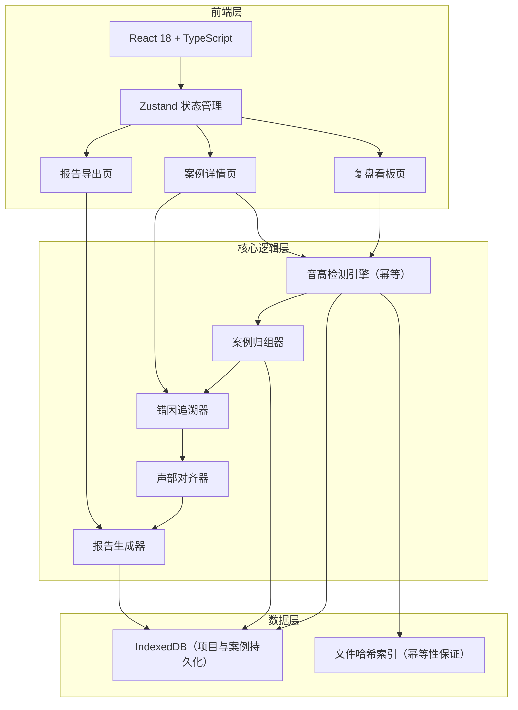
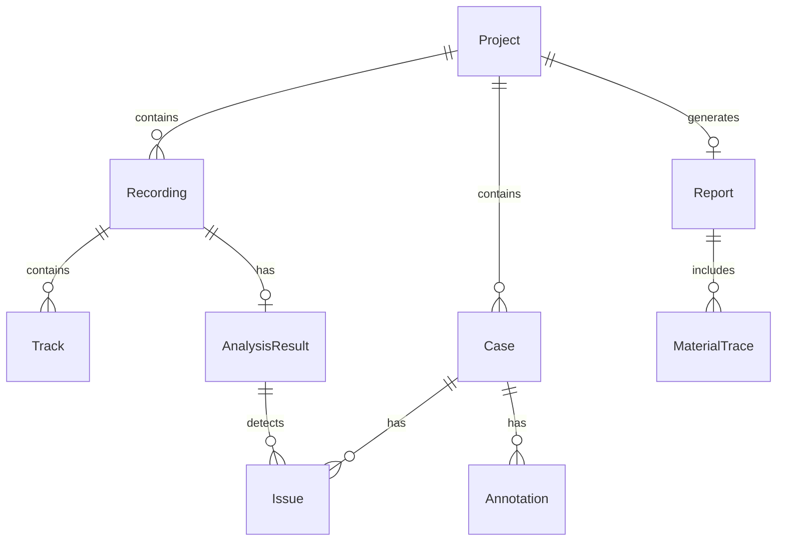

## 1. 架构设计



## 2. 技术说明

- 前端：React@18 + TypeScript + Tailwind CSS@3 + Vite
- 初始化工具：vite-init
- 后端：无（纯前端，使用 IndexedDB 做本地持久化）
- 数据库：IndexedDB（通过 idb 库封装），Mock 数据用于演示

## 3. 路由定义

| 路由 | 用途 |
|------|------|
| / | 复盘看板页，展示项目列表与案例卡片 |
| /project/:projectId | 项目下的案例列表与问题统计 |
| /case/:caseId | 案例详情页，音高检测、声部对齐、错因追溯、材料溯源 |
| /report/:projectId | 报告导出页，报告预览与导出 |

## 4. API 定义

无后端 API。所有数据通过 IndexedDB 在本地读写。

### 核心数据类型

```typescript
interface Project {
  id: string;
  name: string;
  createdAt: number;
  updatedAt: number;
  recordings: Recording[];
}

interface Recording {
  id: string;
  projectId: string;
  fileName: string;
  fileHash: string;
  uploadedAt: number;
  tracks: Track[];
}

interface Track {
  id: string;
  recordingId: string;
  partName: string;
  fileName: string;
  fileHash: string;
}

interface AnalysisResult {
  id: string;
  recordingId: string;
  fileHash: string;
  pitchData: PitchPoint[];
  detectedIssues: Issue[];
  computedAt: number;
}

interface PitchPoint {
  time: number;
  frequency: number;
  midiNote: number;
  deviation: number;
}

interface Issue {
  id: string;
  type: "part_misalignment" | "unmarked_modulation" | "audio_gap";
  startTime: number;
  endTime: number;
  severity: "warning" | "error";
  triggerMaterial: string;
  stuckAt: string;
  nextStep: string;
  partName?: string;
}

interface Case {
  id: string;
  projectId: string;
  title: string;
  linkedRecordings: string[];
  linkedMeasures: string[];
  linkedAnnotations: Annotation[];
  issues: Issue[];
  status: "open" | "resolved";
  createdAt: number;
  updatedAt: number;
}

interface Annotation {
  id: string;
  caseId: string;
  content: string;
  author: string;
  createdAt: number;
  linkedClue: string;
}

interface MaterialTrace {
  recordingId: string;
  recordingFileName: string;
  trackId: string;
  trackFileName: string;
  reportId: string;
  reportGeneratedAt: number;
}

interface Report {
  id: string;
  projectId: string;
  cases: Case[];
  materialTraces: MaterialTrace[];
  generatedAt: number;
  htmlContent: string;
}
```

## 5. 服务端架构图

不适用（纯前端项目）

## 6. 数据模型

### 6.1 数据模型定义



### 6.2 数据定义语言

使用 IndexedDB 对象仓库：

- **projects**: 以 `id` 为主键，索引 `updatedAt`
- **recordings**: 以 `id` 为主键，索引 `projectId`、`fileHash`
- **tracks**: 以 `id` 为主键，索引 `recordingId`
- **analysisResults**: 以 `id` 为主键，索引 `recordingId`、`fileHash`（唯一，保证幂等）
- **cases**: 以 `id` 为主键，索引 `projectId`、`status`
- **annotations**: 以 `id` 为主键，索引 `caseId`
- **reports**: 以 `id` 为主键，索引 `projectId`

幂等性保证：`analysisResults` 以 `fileHash` 为唯一索引，同一文件哈希不会重复写入分析结果，确保同一批排练录音跑第二遍结果一致。
