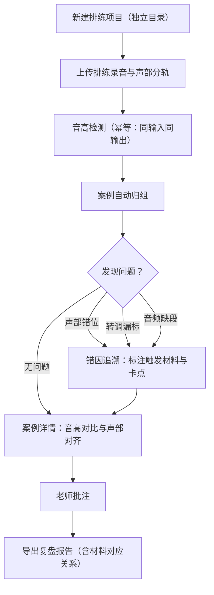

## 1. 产品概述

合唱音准复盘板是一款面向合唱排练场景的音准分析工具，帮助合唱指导老师从排练录音中自动检测音高偏差、声部错位和转调漏标等问题，并以案例为单位归组展示，最终导出复盘报告。
- 解决排练录音改动后需手动重算、同一批录音重复跑结果不一致的痛点
- 目标用户为合唱指导老师与排练助理，核心价值是让音准复盘流程可追溯、可复现、可导出

## 2. 核心功能

### 2.1 用户角色

| 角色 | 使用方式 | 核心权限 |
|------|----------|----------|
| 合唱指导老师 | 直接使用 | 上传录音、查看分析、批注、导出报告 |
| 排练助理 | 直接使用 | 上传录音、查看分析、协助整理批注 |

### 2.2 功能模块

1. **复盘看板页**：项目列表、案例卡片、全局问题统计
2. **案例详情页**：音高检测波形、声部对齐、错因追溯链、材料溯源、批注区
3. **报告导出页**：生成复盘报告、材料对应关系表、导出为可打印文档

### 2.3 页面详情

| 页面名称 | 模块名称 | 功能描述 |
|----------|----------|----------|
| 复盘看板页 | 项目列表 | 展示所有排练项目，支持新建项目（新目录），显示最近分析时间与案例数量 |
| 复盘看板页 | 案例卡片 | 按案例归组展示，每个案例显示关联的排练录音、乐谱小节、老师批注线索 |
| 复盘看板页 | 全局问题统计 | 统计声部错位、转调漏标、音频缺段等问题的数量与分布 |
| 案例详情页 | 音高检测面板 | 展示排练录音的音高曲线与标准音高对比，标注偏差区域 |
| 案例详情页 | 声部对齐视图 | 展示各声部分轨时间线，标注错位位置与原因 |
| 案例详情页 | 错因追溯链 | 遇到声部错位/转调漏标/音频缺段时，显示触发材料、卡点位置、下一步补料建议 |
| 案例详情页 | 材料溯源 | 记录排练录音、声部分轨、报告导出的对应关系，方便复核 |
| 案例详情页 | 批注区 | 老师可添加批注，批注自动归入当前案例 |
| 报告导出页 | 报告生成 | 基于案例数据生成结构化复盘报告 |
| 报告导出页 | 材料对应关系表 | 展示录音→分轨→报告的完整对应链路 |
| 报告导出页 | 导出操作 | 支持导出为 HTML 可打印文档 |

## 3. 核心流程

用户新建一个排练项目（独立目录）后，上传排练录音与声部分轨文件。系统对同一批录音执行音高检测，结果具有幂等性（同一输入始终产出相同结果）。检测出的音高偏差按排练录音、乐谱小节、老师批注等线索自动归组为案例。用户在案例详情中查看音高对比、声部对齐、错因追溯链，并可添加批注。遇到声部错位、转调漏标或音频缺段时，系统标注触发材料、卡点位置与补料建议。最终导出复盘报告，报告中包含材料对应关系表。

## 4. 用户界面设计

### 4.1 设计风格

- 主色调：深靛蓝（#1B2A4A）搭配琥珀色（#D4A843）强调色，营造专业音乐分析氛围
- 辅助色：浅灰（#F5F5F0）背景、红色（#C44E52）标注问题区域
- 按钮风格：圆角微凸，带细微阴影
- 字体：标题使用 Noto Serif SC，正文使用 Noto Sans SC，数据展示使用 JetBrains Mono
- 布局风格：左侧导航 + 右侧内容区，卡片式布局
- 图标风格：线性图标，使用 lucide-react

### 4.2 页面设计概览

| 页面名称 | 模块名称 | UI 元素 |
|----------|----------|----------|
| 复盘看板页 | 项目列表 | 左侧竖向导航栏，项目以卡片形式排列，每卡片含项目名、时间戳、案例计数徽标 |
| 复盘看板页 | 案例卡片 | 卡片含案例编号、关联线索标签（录音/小节/批注）、问题类型标记、展开按钮 |
| 复盘看板页 | 全局问题统计 | 顶部横向统计条，用图标+数字展示三类问题的计数 |
| 案例详情页 | 音高检测面板 | 上方大面积波形区域，横轴时间纵轴音高，标准音高曲线与实际曲线叠加，偏差区域高亮 |
| 案例详情页 | 声部对齐视图 | 波形下方水平时间线，每行一个声部，错位位置用红色竖线标注 |
| 案例详情页 | 错因追溯链 | 右侧面板，纵向步骤条：触发材料→卡点位置→补料建议，每步含图标与描述 |
| 案例详情页 | 材料溯源 | 底部折叠面板，展示录音→分轨→检测→报告的链路图 |
| 案例详情页 | 批注区 | 右侧面板下方，批注列表+输入框，每条批注含时间戳与关联线索 |
| 报告导出页 | 报告预览 | 中央大面积预览区，带打印样式 |
| 报告导出页 | 材料对应关系表 | 预览区内嵌表格，三列：排练录音→声部分轨→报告 |
| 报告导出页 | 导出操作 | 顶部工具栏，导出按钮带图标 |

### 4.3 响应式设计

- 桌面优先设计，最小支持 1280px 宽度
- 平板端（768-1280px）左侧导航收缩为图标模式
- 不适配手机端（音乐分析工具以桌面使用为主）

### 4.4 3D 场景指引

不适用
