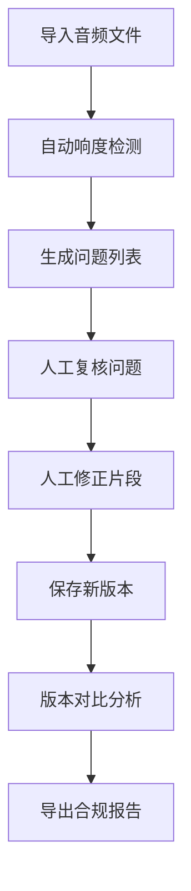

## 1. 产品概述

播客响度合规检查工具，专注于音频编辑工作中的问题定位与版本追踪。解决广告过响、静音段误判、采样率错误等问题的回溯与证据留存。

- 核心目标：让音频问题定位有据可依，避免在音频文件、片段标记、剪辑备注之间建立可追溯的关联。

## 2. 核心功能

### 2.1 用户角色

| 角色 | 注册方式 | 核心权限 |
|------|----------|----------|
| 音频编辑师 | 本地使用 | 导入音频、标记片段、查看问题、导出报告 |

### 2.2 功能模块

1. **工作台**：音频导入、波形展示、问题列表
2. **片段分析**：响度检测、问题定位、人工修正
3. **版本对比**：历史版本、差异对比、修改追踪
4. **报告导出**：合规报告、问题明细、来源追溯

### 2.3 页面详情

| 页面名称 | 模块名称 | 功能描述 |
|---------|----------|----------|
| 工作台 | 音频导入区 | 支持拖拽上传音频文件，显示文件基本信息 |
| 工作台 | 波形可视化 | 展示音频波形，支持缩放、定位、播放 |
| 工作台 | 问题列表 | 展示检测到的所有问题，支持筛选和跳转 |
| 片段分析 | 响度检测 | 自动检测广告过响、静音段、采样率问题 |
| 片段分析 | 问题详情 | 展示问题片段的波形、响度曲线、参数 |
| 片段分析 | 人工修正 | 支持人工修改片段分层，记录修改历史 |
| 版本对比 | 历史版本 | 保存每次检测的版本历史 |
| 版本对比 | 差异对比 | 对比两个版本的问题差异 |
| 报告导出 | 报告预览 | 预览合规报告，包含问题明细和来源 |
| 报告导出 | 报告导出 | 导出PDF/HTML格式报告 |

## 3. 核心流程

## 4. 用户界面设计

### 4.1 设计风格

- 采用专业音频工具风格，深色主题
- 主色调：深蓝灰（#1a1f36）
- 强调色：青蓝色（#00d4ff）
- 警告色：橙红色（#ff6b35）
- 成功色：青绿色（#00ffa3）
- 字体：JetBrains Mono 作为等宽字体用于数据展示，Inter 用于界面文本
- 按钮风格：扁平化设计，圆角4px，悬停有轻微上浮效果
- 布局风格：三栏布局，左侧文件列表，中间波形区，右侧详情面板

### 4.2 页面设计概览

| 页面名称 | 模块名称 | UI元素 |
|---------|----------|--------|
| 工作台 | 波形可视化 | 深色背景，波形用青蓝色，问题标记用红色高亮 |
| 工作台 | 问题列表 | 卡片式设计，每张卡片展示问题类型、时间位置、响度值 |
| 片段分析 | 响度曲线 | 折线图展示响度变化，阈值线用虚线 |
| 版本对比 | 差异展示 | 左右分栏对比，差异部分高亮显示 |

### 4.3 响应式设计

采用桌面端优先设计，支持1200px以上最佳体验
- 大屏：三栏布局
- 中屏：左右两栏，问题列表可折叠
- 小屏：单栏滚动

### 4.4 动效设计

- 波形滚动时有平滑过渡
- 问题标记出现时有淡入效果
- 版本切换时有滑动过渡
- 悬停按钮有轻微放大和阴影变化

