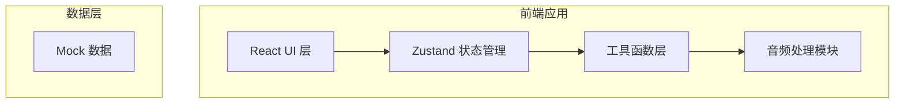
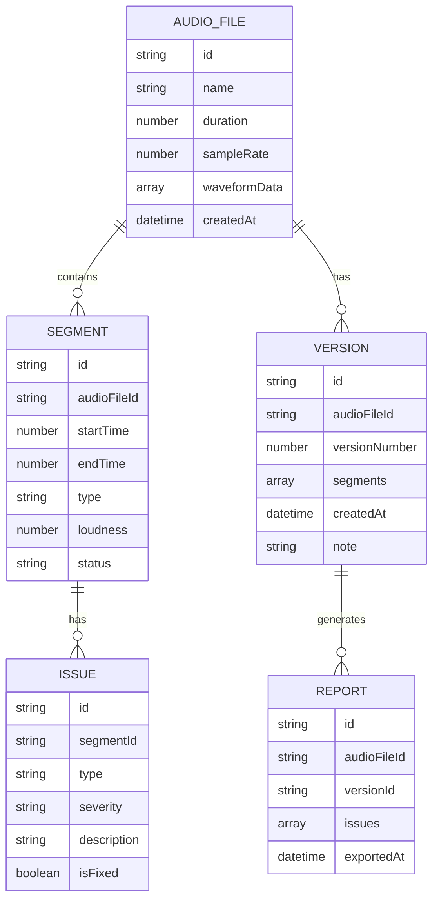

## 1. 架构设计



## 2. 技术栈说明

- 前端：React@18 + TypeScript + Vite
- 状态管理：Zustand
- 样式：TailwindCSS 3
- 图表：Recharts
- 图标：Lucide React
- 音频处理：Web Audio API
- 后端：无（纯前端应用，使用Mock数据）
- 数据存储：LocalStorage 存储项目数据

## 3. 路由定义

| 路由 | 页面用途 |
|-------|----------|
| / | 工作台 - 音频导入和问题列表 |
| /analysis | 片段分析 - 响度检测和问题详情 |
| /compare | 版本对比 - 历史版本和差异对比 |
| /report | 报告导出 - 报告预览和导出 |

## 4. 数据模型

### 4.1 数据模型定义



### 4.2 TypeScript 类型定义

```typescript
// 音频文件
interface AudioFile {
  id: string;
  name: string;
  duration: number;
  sampleRate: number;
  waveformData: number[];
  createdAt: Date;
}

// 音频片段
interface Segment {
  id: string;
  audioFileId: string;
  startTime: number;
  endTime: number;
  type: 'speech' | 'music' | 'ad' | 'silence';
  loudness: number;
  status: 'detected' | 'modified' | 'confirmed';
  modifiedBy?: 'auto' | 'manual';
}

// 问题项
interface Issue {
  id: string;
  segmentId: string;
  type: 'loudness' | 'silence' | 'sampleRate' | 'clipping';
  severity: 'low' | 'medium' | 'high';
  description: string;
  isFixed: boolean;
  fixedAt?: Date;
  affectedByManualChange?: boolean;
}

// 版本记录
interface Version {
  id: string;
  audioFileId: string;
  versionNumber: number;
  segments: Segment[];
  createdAt: Date;
  note: string;
}

// 报告
interface Report {
  id: string;
  audioFileId: string;
  versionId: string;
  issues: Issue[];
  exportedAt: Date;
  exportFormat: 'pdf' | 'html';
}
```

## 5. 核心组件结构

```
src/
├── components/
│   ├── AudioPlayer/          # 音频播放器组件
│   ├── Waveform/          # 波形可视化组件
│   ├── IssueList/         # 问题列表组件
│   ├── SegmentEditor/     # 片段编辑器
│   ├── VersionCompare/    # 版本对比
│   └── ReportViewer/      # 报告预览
├── pages/
│   ├── Dashboard.tsx       # 工作台
│   ├── Analysis.tsx        # 片段分析
│   ├── Compare.tsx         # 版本对比
│   └── Report.tsx          # 报告导出
├── store/
│   └── useAudioStore.ts   # 音频状态管理
│   └── useIssueStore.ts # 问题状态管理
├── utils/
│   ├── audioAnalysis.ts   # 音频分析算法
│   └── reportGenerator.ts # 报告生成
└── types/
    └── index.ts            # 类型定义
```

