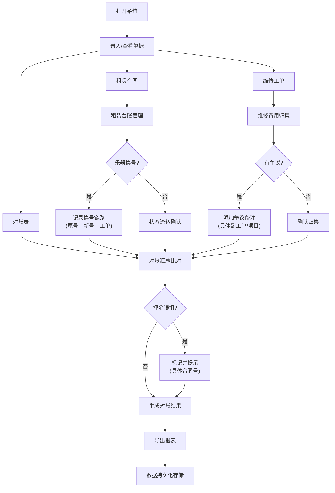

## 1. 产品概述

乐器租赁维修账系统，专为乐器租赁业务团队设计的账务核对工具。核心解决租赁状态流转后的乐器换号追踪、押金误扣识别、维修争议记录三大痛点，确保多源材料（租赁合同、维修工单、对账表）对账时不篡改业务口径，所有操作留痕可追溯。

- 目标用户：乐器租赁业务对账人员、财务人员
- 核心价值：把最容易漏的环节显性化，让历史记录可沉淀、不重复

## 2. 核心功能

### 2.1 用户角色

| 角色 | 注册方式 | 核心权限 |
|------|----------|----------|
| 业务对账员 | 本地系统使用，无需注册 | 录入单据、确认状态、筛选查询、导出记录 |
| 财务复核员 | 本地系统使用，无需注册 | 查看记录、添加争议备注、导出对账单 |

### 2.2 功能模块

1. **单据录入页**：租赁合同录入、维修工单录入、对账表导入
2. **租赁台账页**：租赁状态管理、乐器换号追踪、押金核对
3. **维修归集页**：维修费用归集、争议记录、状态确认
4. **对账汇总页**：多源材料比对、差异提示、导出报表

### 2.3 页面详情

| 页面名称 | 模块名称 | 功能描述 |
|-----------|-------------|---------------------|
| 单据录入页 | 租赁合同录入 | 合同编号、乐器编号、租赁起止日期、押金金额、月租金录入，保存到本地存储 |
| 单据录入页 | 维修工单录入 | 工单编号、关联合同、维修项目、费用、维修后乐器编号，支持标记争议 |
| 单据录入页 | 对账表导入 | 支持粘贴对账数据，系统自动比对并高亮差异 |
| 租赁台账页 | 租赁状态流转 | 待起租、租赁中、已退租状态切换，每次状态变更记录操作人时间 |
| 租赁台账页 | 乐器换号追踪 | 记录原乐器号→新乐器号的变更，关联维修工单，追踪完整链路 |
| 租赁台账页 | 押金核对 | 自动比对合同押金与实际到账，标记"押金误扣"并提示具体合同号 |
| 维修归集页 | 维修费用归集 | 按合同、按月份归集维修费用，支持筛选导出 |
| 维修归集页 | 争议备注 | 对有争议的维修记录添加备注，提示具体到"工单XX维修项目XX" |
| 对账汇总页 | 多源比对 | 自动比对合同、工单、对账表三类数据，差异项具体提示 |
| 对账汇总页 | 导出报表 | 导出Excel格式的对账结果，包含所有状态和备注 |

## 3. 核心流程

用户打开系统后，先录入三类基础单据（租赁合同、维修工单、对账表），系统自动校验数据一致性。在租赁台账中管理租赁状态，遇到乐器换号时明确记录变更链路。维修归集时标记争议并添加具体备注。最后在对账汇总页查看差异提示，确认无误后导出报表。所有数据持久化到本地存储，重启后不丢失。

## 4. 用户界面设计

### 4.1 设计风格
- 主色调：深海军蓝 `#1e3a5f`，代表专业可信
- 辅助色：琥珀橙 `#f59e0b`（标记警告/争议），翠绿 `#10b981`（标记正常/确认），玫红 `#ef4444`（标记错误/误扣）
- 按钮风格：直角微圆角（4px），边框清晰，hover时有细微阴影提升
- 字体：标题用 "Noto Serif SC"（专业衬线），正文用 "Noto Sans SC"（清晰易读）
- 布局风格：左侧导航 + 右侧内容区，卡片式分组，表格为主的数据展示
- 图标风格：lucide-react 线性图标，保持简洁专业

### 4.2 页面设计概述

| 页面名称 | 模块名称 | UI元素 |
|-----------|-------------|-------------|
| 单据录入页 | 表单区域 | 选项卡切换（合同/工单/对账表），表单分组，保存按钮带确认提示 |
| 租赁台账页 | 数据表格 | 可筛选的乐器列表，状态标签，换号记录用箭头连接展示 |
| 维修归集页 | 费用卡片 | 按月分组的费用卡片，争议记录用橙色边框高亮 |
| 对账汇总页 | 比对面板 | 三栏对比布局（合同/工单/对账表），差异项背景高亮 |

### 4.3 响应性
- 桌面端优先（1280px以上），优化宽屏展示
- 平板端（768px-1279px）：左侧导航收起为图标，表格支持横向滚动
- 移动端（768px以下）：顶部导航，表格转卡片展示

### 4.4 动效设计
- 页面加载：内容区域从下往上淡入，延迟50ms逐级展示
- 状态变更：状态标签切换时有颜色过渡动画（300ms）
- 提示消息：从顶部滑入，自动消失时淡出
- 表格行hover：背景色轻微加深（200ms过渡）
