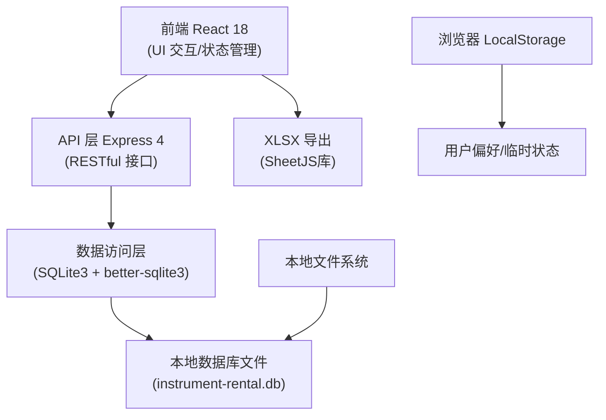
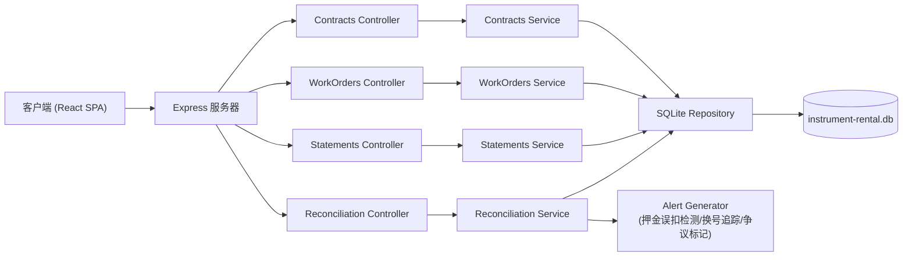
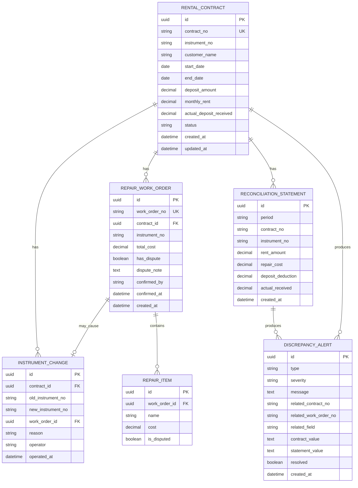

## 1. 架构设计



## 2. 技术描述

- **前端**：React@18 + TypeScript + tailwindcss@3 + vite@5 + zustand@4 + react-router-dom@6 + lucide-react@0.294 + xlsx@0.18
- **初始化工具**：vite-init (react-express-ts 模板)
- **后端**：Express@4 + TypeScript + sql.js@1
- **数据库**：SQLite3（本地文件存储，无需额外服务，重启数据不丢失，纯JS实现无需编译）
- **数据持久化**：SQLite 数据库文件存储于项目根目录，所有业务数据持久化
- **导出功能**：SheetJS (xlsx) 客户端导出 Excel

## 3. 路由定义

| 路由 | 页面 | 用途 |
|------|------|------|
| / | 租赁台账页 | 默认首页，展示乐器租赁状态和换号记录 |
| /entry | 单据录入页 | 录入租赁合同、维修工单、对账表 |
| /repair | 维修归集页 | 维修费用归集和争议备注管理 |
| /summary | 对账汇总页 | 多源数据比对和报表导出 |

## 4. API 定义

### 4.1 类型定义

```typescript
// 租赁合同
interface RentalContract {
  id: string;
  contractNo: string;
  instrumentNo: string;
  customerName: string;
  startDate: string;
  endDate: string | null;
  depositAmount: number;
  monthlyRent: number;
  actualDepositReceived: number | null;
  status: 'PENDING' | 'ACTIVE' | 'ENDED';
  instrumentChangeHistory: InstrumentChangeRecord[];
  createdAt: string;
  updatedAt: string;
}

// 乐器换号记录
interface InstrumentChangeRecord {
  id: string;
  contractId: string;
  oldInstrumentNo: string;
  newInstrumentNo: string;
  relatedWorkOrderId: string | null;
  reason: string;
  operator: string;
  operatedAt: string;
}

// 维修工单
interface RepairWorkOrder {
  id: string;
  workOrderNo: string;
  contractId: string;
  instrumentNo: string;
  repairItems: RepairItem[];
  totalCost: number;
  hasDispute: boolean;
  disputeNote: string | null;
  confirmedBy: string | null;
  confirmedAt: string | null;
  createdAt: string;
}

// 维修项目
interface RepairItem {
  id: string;
  name: string;
  cost: number;
  isDisputed: boolean;
}

// 对账表
interface ReconciliationStatement {
  id: string;
  period: string;
  contractNo: string;
  instrumentNo: string;
  rentAmount: number;
  repairCost: number;
  depositDeduction: number;
  actualReceived: number;
  createdAt: string;
}

// 差异提示
interface DiscrepancyAlert {
  id: string;
  type: 'DEPOSIT_MISMATCH' | 'INSTRUMENT_CHANGE' | 'REPAIR_DISPUTE' | 'DATA_MISMATCH';
  severity: 'ERROR' | 'WARNING';
  message: string;
  relatedContractNo: string;
  relatedWorkOrderNo?: string;
  relatedField?: string;
  contractValue?: any;
  statementValue?: any;
  resolved: boolean;
}
```

### 4.2 接口列表

| 方法 | 路径 | 描述 |
|------|------|------|
| GET | /api/contracts | 获取租赁合同列表，支持筛选 |
| POST | /api/contracts | 创建租赁合同 |
| PUT | /api/contracts/:id | 更新租赁合同 |
| PATCH | /api/contracts/:id/status | 变更租赁状态 |
| POST | /api/contracts/:id/change-instrument | 记录乐器换号 |
| GET | /api/work-orders | 获取维修工单列表 |
| POST | /api/work-orders | 创建维修工单 |
| PATCH | /api/work-orders/:id/dispute | 标记/更新争议备注 |
| PATCH | /api/work-orders/:id/confirm | 确认维修工单 |
| GET | /api/statements | 获取对账表列表 |
| POST | /api/statements | 导入对账表 |
| GET | /api/reconciliation | 执行对账比对，返回差异列表 |
| GET | /api/export | 导出对账报表 (Excel) |
| GET | /api/repair-summary | 获取维修费用归集数据 |

### 4.3 请求响应示例

创建租赁合同请求：
```json
{
  "contractNo": "HT202406001",
  "instrumentNo": "YAMAHA-CP-001",
  "customerName": "张三",
  "startDate": "2024-06-01",
  "depositAmount": 5000,
  "monthlyRent": 800,
  "actualDepositReceived": 5000
}
```

创建维修工单请求：
```json
{
  "workOrderNo": "WX202406001",
  "contractId": "uuid-xxx",
  "instrumentNo": "YAMAHA-CP-001",
  "repairItems": [
    { "name": "更换琴弦", "cost": 150, "isDisputed": false },
    { "name": "琴身抛光", "cost": 300, "isDisputed": true }
  ],
  "hasDispute": true,
  "disputeNote": "抛光费用未提前告知客户"
}
```

乐器换号请求：
```json
{
  "oldInstrumentNo": "YAMAHA-CP-001",
  "newInstrumentNo": "YAMAHA-CP-023",
  "relatedWorkOrderId": "uuid-xxx",
  "reason": "原琴维修期间更换备用琴",
  "operator": "李四"
}
```

对账差异响应：
```json
{
  "alerts": [
    {
      "id": "alert-001",
      "type": "DEPOSIT_MISMATCH",
      "severity": "ERROR",
      "message": "押金误扣：合同HT202406001约定押金5000元，对账表显示扣押金6000元，多扣1000元",
      "relatedContractNo": "HT202406001",
      "relatedField": "depositAmount",
      "contractValue": 5000,
      "statementValue": 6000
    }
  ]
}
```

## 5. 服务器架构图



## 6. 数据模型

### 6.1 ER 图



### 6.2 DDL 语句

```sql
-- 租赁合同表
CREATE TABLE IF NOT EXISTS rental_contracts (
  id TEXT PRIMARY KEY,
  contract_no TEXT UNIQUE NOT NULL,
  instrument_no TEXT NOT NULL,
  customer_name TEXT NOT NULL,
  start_date TEXT NOT NULL,
  end_date TEXT,
  deposit_amount REAL NOT NULL DEFAULT 0,
  monthly_rent REAL NOT NULL DEFAULT 0,
  actual_deposit_received REAL,
  status TEXT NOT NULL DEFAULT 'PENDING',
  created_at TEXT NOT NULL DEFAULT CURRENT_TIMESTAMP,
  updated_at TEXT NOT NULL DEFAULT CURRENT_TIMESTAMP
);

-- 乐器换号记录表
CREATE TABLE IF NOT EXISTS instrument_changes (
  id TEXT PRIMARY KEY,
  contract_id TEXT NOT NULL,
  old_instrument_no TEXT NOT NULL,
  new_instrument_no TEXT NOT NULL,
  work_order_id TEXT,
  reason TEXT,
  operator TEXT NOT NULL,
  operated_at TEXT NOT NULL DEFAULT CURRENT_TIMESTAMP,
  FOREIGN KEY (contract_id) REFERENCES rental_contracts(id),
  FOREIGN KEY (work_order_id) REFERENCES repair_work_orders(id)
);

-- 维修工单表
CREATE TABLE IF NOT EXISTS repair_work_orders (
  id TEXT PRIMARY KEY,
  work_order_no TEXT UNIQUE NOT NULL,
  contract_id TEXT NOT NULL,
  instrument_no TEXT NOT NULL,
  total_cost REAL NOT NULL DEFAULT 0,
  has_dispute INTEGER NOT NULL DEFAULT 0,
  dispute_note TEXT,
  confirmed_by TEXT,
  confirmed_at TEXT,
  created_at TEXT NOT NULL DEFAULT CURRENT_TIMESTAMP,
  FOREIGN KEY (contract_id) REFERENCES rental_contracts(id)
);

-- 维修项目表
CREATE TABLE IF NOT EXISTS repair_items (
  id TEXT PRIMARY KEY,
  work_order_id TEXT NOT NULL,
  name TEXT NOT NULL,
  cost REAL NOT NULL DEFAULT 0,
  is_disputed INTEGER NOT NULL DEFAULT 0,
  FOREIGN KEY (work_order_id) REFERENCES repair_work_orders(id)
);

-- 对账表
CREATE TABLE IF NOT EXISTS reconciliation_statements (
  id TEXT PRIMARY KEY,
  period TEXT NOT NULL,
  contract_no TEXT NOT NULL,
  instrument_no TEXT NOT NULL,
  rent_amount REAL NOT NULL DEFAULT 0,
  repair_cost REAL NOT NULL DEFAULT 0,
  deposit_deduction REAL NOT NULL DEFAULT 0,
  actual_received REAL NOT NULL DEFAULT 0,
  created_at TEXT NOT NULL DEFAULT CURRENT_TIMESTAMP
);

-- 差异提示表
CREATE TABLE IF NOT EXISTS discrepancy_alerts (
  id TEXT PRIMARY KEY,
  type TEXT NOT NULL,
  severity TEXT NOT NULL,
  message TEXT NOT NULL,
  related_contract_no TEXT NOT NULL,
  related_work_order_no TEXT,
  related_field TEXT,
  contract_value TEXT,
  statement_value TEXT,
  resolved INTEGER NOT NULL DEFAULT 0,
  created_at TEXT NOT NULL DEFAULT CURRENT_TIMESTAMP
);

-- 索引
CREATE INDEX IF NOT EXISTS idx_contracts_no ON rental_contracts(contract_no);
CREATE INDEX IF NOT EXISTS idx_contracts_status ON rental_contracts(status);
CREATE INDEX IF NOT EXISTS idx_changes_contract ON instrument_changes(contract_id);
CREATE INDEX IF NOT EXISTS idx_orders_contract ON repair_work_orders(contract_id);
CREATE INDEX IF NOT EXISTS idx_orders_dispute ON repair_work_orders(has_dispute);
CREATE INDEX IF NOT EXISTS idx_alerts_contract ON discrepancy_alerts(related_contract_no);
CREATE INDEX IF NOT EXISTS idx_alerts_resolved ON discrepancy_alerts(resolved);
```

### 6.3 初始数据

```sql
-- 示例租赁合同
INSERT INTO rental_contracts (id, contract_no, instrument_no, customer_name, start_date, deposit_amount, monthly_rent, actual_deposit_received, status) VALUES
('c-001', 'HT202405001', 'YAMAHA-U1-015', '李明', '2024-05-10', 8000, 1200, 8000, 'ACTIVE'),
('c-002', 'HT202405002', 'STEINWAY-D-008', '王芳', '2024-05-15', 20000, 3500, 19000, 'ACTIVE'),
('c-003', 'HT202406001', 'YAMAHA-C7-023', '张伟', '2024-06-01', 5000, 800, 5000, 'PENDING');

-- 示例乐器换号
INSERT INTO instrument_changes (id, contract_id, old_instrument_no, new_instrument_no, reason, operator) VALUES
('ch-001', 'c-001', 'YAMAHA-U1-015', 'YAMAHA-U1-022', '原琴调音故障临时更换', '赵管理员');

-- 示例维修工单
INSERT INTO repair_work_orders (id, work_order_no, contract_id, instrument_no, total_cost, has_dispute, dispute_note) VALUES
('w-001', 'WX202405001', 'c-001', 'YAMAHA-U1-015', 450, 1, '客户认为琴键修复费用应包含在租金内'),
('w-002', 'WX202406001', 'c-002', 'STEINWAY-D-008', 1200, 0, NULL);

-- 示例维修项目
INSERT INTO repair_items (id, work_order_id, name, cost, is_disputed) VALUES
('i-001', 'w-001', '更换琴槌', 200, 0),
('i-002', 'w-001', '琴键修复', 250, 1),
('i-003', 'w-002', '钢琴调律', 800, 0),
('i-004', 'w-002', '内部清洁', 400, 0);

-- 示例对账表
INSERT INTO reconciliation_statements (id, period, contract_no, instrument_no, rent_amount, repair_cost, deposit_deduction, actual_received) VALUES
('s-001', '2024-05', 'HT202405001', 'YAMAHA-U1-015', 1200, 450, 0, 1650),
('s-002', '2024-05', 'HT202405002', 'STEINWAY-D-008', 3500, 0, 1000, 2500);
```
