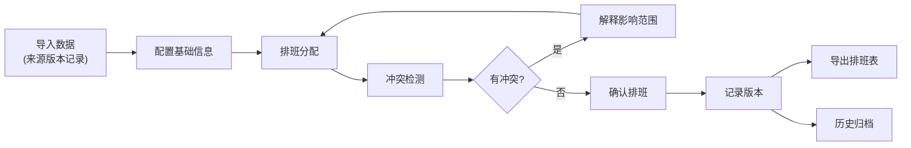

## 1. 产品概述

音乐节志愿者排班工作台是一个本地 Web 应用，旨在解决音乐节多舞台场景下志愿者排班的复杂问题。核心解决志愿者技能匹配、餐休冲突、证件管理等痛点，提供完整的排班分配、冲突检测、历史追溯和数据导出功能。

- **目标用户**：活动统筹人员、音乐节志愿者管理团队
- **核心价值**：通过系统化的排班和冲突检测，减少人工排班错误，提高管理效率，保留完整的数据来源版本和操作历史

## 2. 核心功能

### 2.1 用户角色

| 角色 | 注册方式 | 核心权限 |
|------|----------|----------|
| 活动统筹 | 本地登录 | 完整的排班管理、数据导入、冲突检测、导出权限 |

### 2.2 功能模块

1. **排班总览页**：数据来源管理、排班状态概览、异常告警面板
2. **志愿者管理页**：志愿者列表、技能标签、证件状态、餐休时段设置
3. **岗位舞台管理页**：舞台时段配置、岗位需求、技能要求
4. **排班分配页**：拖拽式排班、自动匹配、冲突实时检测
5. **历史记录页**：排班版本、换班历史、操作日志
6. **异常复盘页**：冲突统计、影响分析、优化建议

### 2.3 页面详情

| 页面名称 | 模块名称 | 功能描述 |
|----------|----------|----------|
| 排班总览页 | 数据来源面板 | 志愿者名单、岗位需求、舞台时段的导入/版本管理 |
| 排班总览页 | 状态概览卡片 | 已排班人数、待分配人数、冲突数量统计 |
| 排班总览页 | 异常告警列表 | 实时显示冲突类型及影响范围 |
| 志愿者管理页 | 志愿者列表 | 搜索筛选、技能标签、证件状态显示 |
| 志愿者管理页 | 详情编辑 | 个人信息、技能、餐休偏好、证件状态维护 |
| 岗位舞台管理页 | 舞台时间轴 | 多舞台时段可视化配置 |
| 岗位舞台管理页 | 岗位需求配置 | 人数要求、技能要求、时段设置 |
| 排班分配页 | 排班表格 | 按舞台×时段的矩阵视图 |
| 排班分配页 | 拖拽分配 | 志愿者拖拽到岗位单元格 |
| 排班分配页 | 冲突检测 | 实时检测餐休冲突、证件缺失、岗位缺人 |
| 历史记录页 | 版本对比 | 排班版本列表、差异对比 |
| 历史记录页 | 换班记录 | 换班申请、审批、执行日志 |
| 异常复盘页 | 冲突统计图表 | 按类型、按舞台的冲突分布 |
| 异常复盘页 | 影响分析 | 冲突影响的岗位和志愿者清单 |
| 异常复盘页 | 导出报告 | 冲突检测口径说明、排班表导出 |

## 3. 核心流程

### 3.1 排班主流程

1. 导入志愿者名单、岗位需求、舞台时段数据（保留来源和版本）
2. 配置志愿者技能、餐休时段、证件状态
3. 配置舞台时段、岗位需求、技能要求
4. 进行排班分配（自动匹配或手动拖拽）
5. 系统实时检测冲突并提示影响范围
6. 确认排班并生成最终排班表
7. 导出排班表和冲突检测报告

### 3.2 流程图

## 4. 用户界面设计

### 4.1 设计风格

- **主色调**：深紫 (#6366F1) + 橙红 (#F97316) 渐变色，体现音乐节的活力和专业性
- **辅助色**：冲突红 (#EF4444)、成功绿 (#10B981)、警告黄 (#F59E0B)
- **字体**：标题使用 Space Grotesk，正文使用 Inter
- **布局风格**：卡片式模块化布局，左侧导航 + 主内容区
- **按钮风格**：圆角胶囊形，悬停有微缩放和阴影效果
- **图标风格**：线性图标，统一 24px 尺寸

### 4.2 页面设计概览

| 页面名称 | 模块名称 | UI 元素 |
|----------|----------|---------|
| 排班总览页 | 数据来源面板 | 版本标签、时间戳、导入来源、操作按钮 |
| 排班总览页 | 状态卡片 | 渐变色背景、数字动画、趋势箭头 |
| 排班总览页 | 异常告警 | 彩色徽章、影响人数、一键定位 |
| 排班分配页 | 时间轴表头 | 固定表头、时间刻度、舞台标签 |
| 排班分配页 | 单元格 | 志愿者头像、技能标签、冲突标记 |
| 排班分配页 | 侧边栏 | 待分配志愿者列表、筛选器 |
| 异常复盘页 | 统计图表 | 环形图、柱状图、交互式高亮 |
| 异常复盘页 | 冲突列表 | 可展开详情、影响链路展示 |

### 4.3 响应式设计

- **桌面优先**：1440px 及以上最佳体验
- **平板适配**：1024px 下侧边栏可折叠
- **触控优化**：拖拽区域最小 48px，点击区域有反馈

### 4.4 交互动效

- 页面加载：顶部进度条 + 卡片渐入动画
- 拖拽排班：半透明拖拽预览 + 放置区高亮
- 冲突提示：红色脉冲动画 +  Tooltip 详情
- 数据变更：轻微闪烁 + 数字滚动动画
