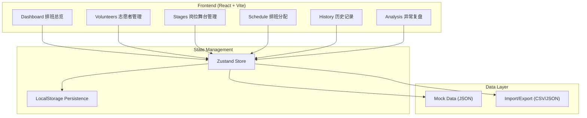
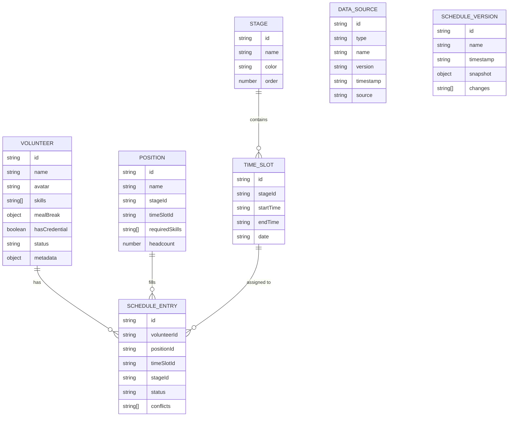

## 1. 架构设计



## 2. 技术描述

- **前端框架**：React@18 + TypeScript
- **构建工具**：Vite@5
- **样式方案**：TailwindCSS@3 + CSS Variables
- **状态管理**：Zustand@4
- **路由方案**：React Router@6
- **图表库**：Recharts@2
- **拖拽库**：@dnd-kit/core + @dnd-kit/sortable
- **图标库**：Lucide React
- **数据存储**：LocalStorage + 本地 JSON 文件
- **无后端设计**：纯前端应用，数据本地持久化

## 3. 路由定义

| 路由 | 页面名称 | 功能 |
|------|----------|------|
| / | 排班总览页 | 数据来源管理、状态概览、异常告警 |
| /volunteers | 志愿者管理 | 志愿者列表、详情编辑、技能配置 |
| /stages | 岗位舞台管理 | 舞台配置、岗位需求设置 |
| /schedule | 排班分配 | 拖拽排班、冲突检测、实时校验 |
| /history | 历史记录 | 版本管理、换班日志、操作记录 |
| /analysis | 异常复盘 | 冲突统计、影响分析、报告导出 |

## 4. 数据模型

### 4.1 ER 图



### 4.2 TypeScript 类型定义

```typescript
// 志愿者
interface Volunteer {
  id: string;
  name: string;
  avatar: string;
  phone: string;
  skills: string[];
  mealBreak: {
    enabled: boolean;
    startTime: string;
    endTime: string;
  };
  hasCredential: boolean;
  credentialType?: string;
  status: 'active' | 'inactive' | 'onLeave';
  notes?: string;
  createdAt: string;
  updatedAt: string;
}

// 舞台
interface Stage {
  id: string;
  name: string;
  color: string;
  order: number;
  description?: string;
}

// 时段
interface TimeSlot {
  id: string;
  stageId: string;
  date: string;
  startTime: string;
  endTime: string;
  label: string;
}

// 岗位
interface Position {
  id: string;
  name: string;
  stageId: string;
  timeSlotId: string;
  requiredSkills: string[];
  headcount: number;
  description?: string;
}

// 排班记录
interface ScheduleEntry {
  id: string;
  volunteerId: string;
  positionId: string;
  timeSlotId: string;
  stageId: string;
  status: 'scheduled' | 'swapped' | 'cancelled';
  conflicts: Conflict[];
  createdAt: string;
  updatedAt: string;
}

// 冲突
interface Conflict {
  id: string;
  type: 'mealBreak' | 'credential' | 'headcount' | 'skill' | 'overlap';
  severity: 'error' | 'warning';
  message: string;
  affectedEntries: string[];
  details: Record<string, unknown>;
}

// 数据来源
interface DataSource {
  id: string;
  type: 'volunteers' | 'positions' | 'stages';
  name: string;
  version: string;
  timestamp: string;
  source: string;
  recordCount: number;
}

// 排班版本
interface ScheduleVersion {
  id: string;
  name: string;
  timestamp: string;
  snapshot: {
    volunteers: Volunteer[];
    entries: ScheduleEntry[];
  };
  changes: VersionChange[];
  createdBy: string;
}

// 版本变更
interface VersionChange {
  type: 'add' | 'remove' | 'update' | 'swap';
  entityType: string;
  entityId: string;
  oldValue?: unknown;
  newValue?: unknown;
  timestamp: string;
}

// 应用状态
interface AppState {
  volunteers: Volunteer[];
  stages: Stage[];
  timeSlots: TimeSlot[];
  positions: Position[];
  scheduleEntries: ScheduleEntry[];
  dataSources: DataSource[];
  versions: ScheduleVersion[];
  activeDate: string;
}
```

## 5. 核心模块设计

### 5.1 冲突检测模块

```typescript
interface ConflictDetector {
  detectMealBreakConflicts(entry: ScheduleEntry): Conflict[];
  detectCredentialConflicts(entry: ScheduleEntry): Conflict[];
  detectHeadcountConflicts(position: Position): Conflict[];
  detectSkillConflicts(volunteer: Volunteer, position: Position): Conflict[];
  detectOverlapConflicts(volunteer: Volunteer, entry: ScheduleEntry): Conflict[];
  detectAllConflicts(entries: ScheduleEntry[]): Conflict[];
}
```

### 5.2 排班算法模块

```typescript
interface Scheduler {
  autoAssign(volunteers: Volunteer[], positions: Position[]): ScheduleEntry[];
  suggestVolunteers(position: Position): Volunteer[];
  validateAssignment(volunteer: Volunteer, position: Position): ValidationResult;
}

interface ValidationResult {
  valid: boolean;
  conflicts: Conflict[];
  warnings: string[];
}
```

### 5.3 导出模块

```typescript
interface Exporter {
  exportToCSV(entries: ScheduleEntry[]): Blob;
  exportToJSON(data: AppState): Blob;
  exportReport(conflicts: Conflict[], stats: Statistics): Blob;
  generateConflictExplanation(conflict: Conflict): string;
}
```

## 6. 目录结构

```
src/
├── components/
│   ├── layout/          # 布局组件
│   ├── dashboard/       # 总览页组件
│   ├── volunteers/      # 志愿者管理组件
│   ├── stages/          # 舞台管理组件
│   ├── schedule/        # 排班分配组件
│   ├── history/         # 历史记录组件
│   ├── analysis/        # 异常复盘组件
│   └── ui/              # 通用 UI 组件
├── store/               # Zustand 状态管理
├── types/               # TypeScript 类型定义
├── utils/               # 工具函数
│   ├── conflictDetector.ts
│   ├── scheduler.ts
│   ├── exporter.ts
│   └── mockData.ts
├── hooks/               # 自定义 Hooks
├── pages/               # 页面组件
├── routes/              # 路由配置
└── styles/              # 全局样式
```
