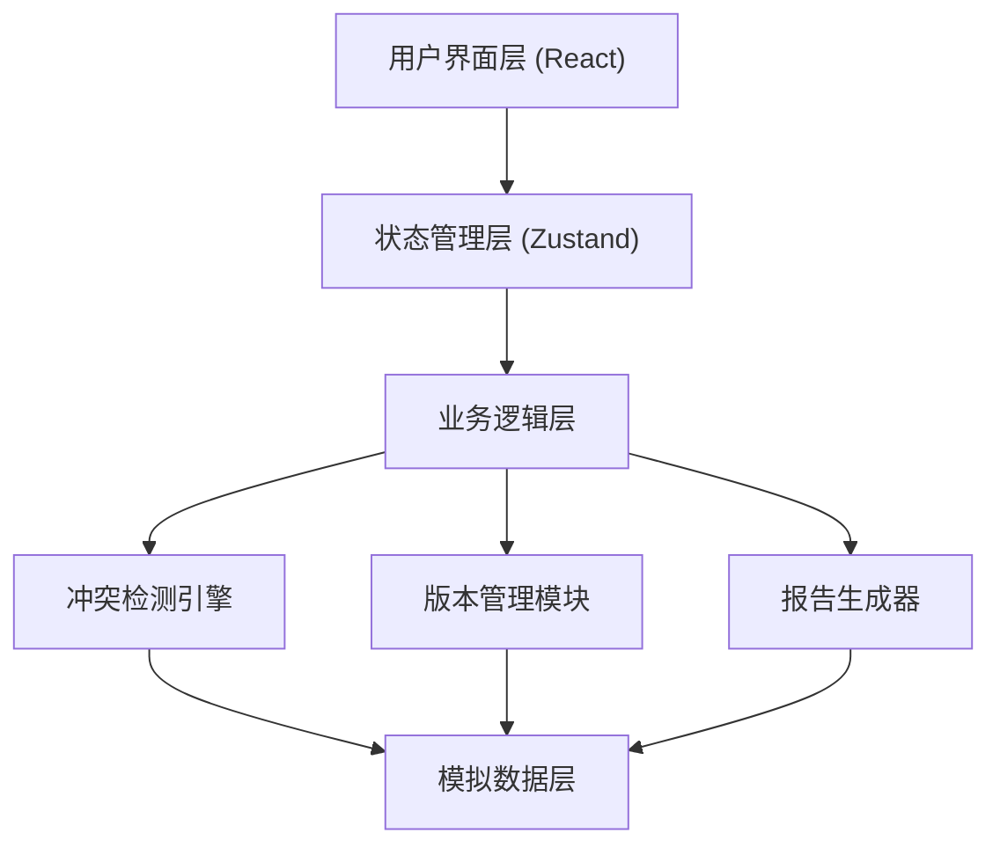
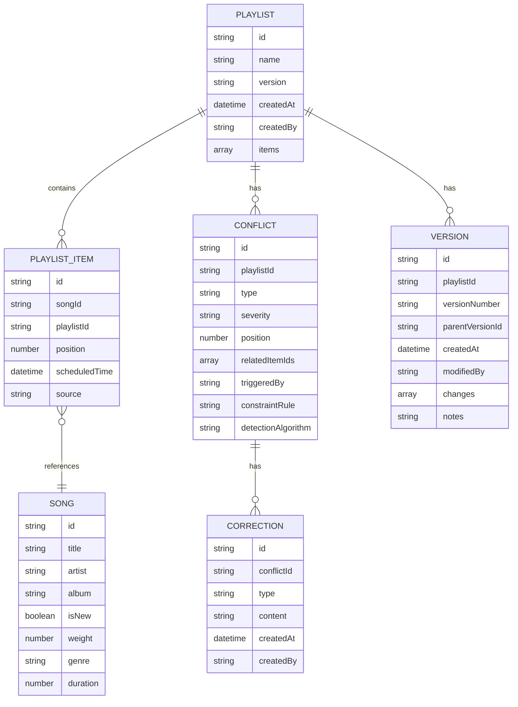

## 1. 架构设计



## 2. 技术描述

- **前端框架**：React@18 + TypeScript
- **构建工具**：Vite@5
- **样式方案**：TailwindCSS@3 + CSS Variables
- **路由管理**：React Router@6
- **状态管理**：Zustand（轻量级，适合中小规模应用）
- **图表可视化**：Recharts（React生态，与项目风格统一）
- **后端**：无后端，使用前端模拟数据
- **数据持久化**：LocalStorage（存储版本历史和用户修正）

## 3. 路由定义

| Route | 页面用途 |
|-------|----------|
| / | 歌单总览页 - 时间轴、热力图、指标概览 |
| /conflict/:id | 冲突详情页 - 溯源链、人工修正 |
| /versions | 版本对比页 - 历史版本、差异对比 |
| /report | 编排报告页 - 完整分析报告 |

## 4. 数据模型

### 4.1 数据模型定义



### 4.2 核心数据结构

```typescript
// 歌曲
interface Song {
  id: string;
  title: string;
  artist: string;
  album: string;
  isNew: boolean;
  weight: number;
  genre: string;
  duration: number;
}

// 歌单项
interface PlaylistItem {
  id: string;
  songId: string;
  position: number;
  scheduledTime: string;
  source: 'library' | 'promotion' | 'advertisement';
  song?: Song;
}

// 歌单
interface Playlist {
  id: string;
  name: string;
  version: string;
  createdAt: string;
  items: PlaylistItem[];
}

// 冲突类型
type ConflictType = 'artist_repeat' | 'ad_clash' | 'new_song_dense';

// 冲突
interface Conflict {
  id: string;
  playlistId: string;
  type: ConflictType;
  severity: 'low' | 'medium' | 'high';
  position: number;
  relatedItemIds: string[];
  triggeredBy: {
    source: string;
    material: string;
    timestamp: string;
  };
  constraintRule: {
    id: string;
    name: string;
    description: string;
    threshold: number;
  };
  detectionAlgorithm: {
    name: string;
    version: string;
    parameters: Record<string, any>;
  };
  resolved: boolean;
}

// 溯源链节点
interface TraceNode {
  id: string;
  type: 'material' | 'constraint' | 'algorithm' | 'result';
  title: string;
  description: string;
  details: any;
  relatedLink?: string;
}
```

## 5. 核心算法模块

### 5.1 同艺人连播检测

```typescript
function detectArtistRepeat(items: PlaylistItem[], threshold: number = 2): Conflict[] {
  // 检测连续N首歌是否来自同一艺人
  // 考虑因素：艺人别名、合作歌曲、同乐队不同成员
}
```

### 5.2 广告撞歌检测

```typescript
function detectAdClash(items: PlaylistItem[], adSlots: string[]): Conflict[] {
  // 检测广告前后是否有冲突歌曲
  // 考虑因素：广告内容与歌曲主题匹配度、品牌歌曲重复
}
```

### 5.3 新歌密度检测

```typescript
function detectNewSongDense(items: PlaylistItem[], windowSize: number = 5, maxNew: number = 2): Conflict[] {
  // 滑动窗口检测新歌密度
  // 考虑因素：新歌权重、歌曲优先级、时段要求
}
```

## 6. 状态管理设计

```typescript
interface AppState {
  currentPlaylist: Playlist | null;
  conflicts: Conflict[];
  versions: Version[];
  selectedConflict: Conflict | null;
  corrections: Correction[];
  
  // Actions
  loadPlaylist: (id: string) => void;
  detectConflicts: () => void;
  resolveConflict: (id: string, correction: Correction) => void;
  saveVersion: (notes: string) => void;
  generateReport: () => ReportData;
}
```
