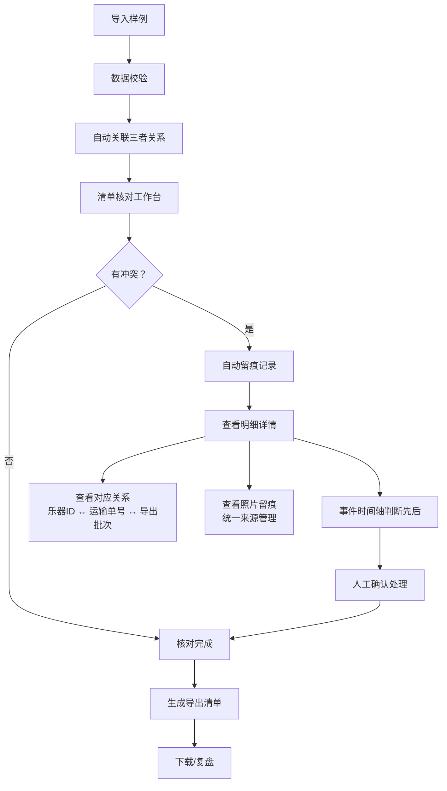

## 1. 产品概述

乐团巡演物流清单系统，解决乐团巡演过程中乐器清单、运输单、城市日程三者核对效率低下的问题。面向乐团经理和物流同事，提供自助式导入、核对、留痕、导出全流程能力。

通过统一数据源和可视化核对链路，减少重复解释成本，让物流核对过程可追溯、可复盘。

## 2. 核心功能

### 2.1 用户角色

| 角色 | 注册方式 | 核心权限 |
|------|----------|----------|
| 乐团经理 | 内部账号 | 导入样例、发起核对、查看全链路、导出清单 |
| 物流同事 | 内部账号 | 查看明细、上传照片、标记状态、确认核对 |

### 2.2 功能模块

1. **首页仪表盘**：待核对清单概览、异常告警、快速操作入口
2. **清单核对工作台**：乐器清单主视图、运输单联动、城市日程时间线
3. **明细详情页**：三者对应关系、冲突留痕、事件时间轴、照片证据
4. **样例导入页**：模板下载、批量导入、数据预览、导入校验
5. **导出清单页**：导出预览、筛选条件、历史导出记录

### 2.3 页面详情

| 页面名称 | 模块名称 | 功能描述 |
|----------|----------|----------|
| 首页仪表盘 | 异常告警区 | 漏箱+保险过期+城市错配+晚到 四重异常高亮展示，按时间先后排序 |
| 首页仪表盘 | 核对进度条 | 显示当前批次核对完成度，区分已核对/有冲突/待处理 |
| 清单核对工作台 | 乐器清单主表 | 展示乐器主信息，支持按状态筛选，每行可展开查看关联运输单和日程 |
| 清单核对工作台 | 三栏联动区 | 左：乐器清单 | 中：运输单 | 右：城市日程，点击任一元素联动高亮 |
| 清单核对工作台 | 冲突标记区 | 三者数据不一致时，红色高亮并生成留痕记录 |
| 明细详情页 | 对应关系区 | 清晰展示乐器清单ID ↔ 运输单号 ↔ 导出批次号的映射关系 |
| 明细详情页 | 事件时间轴 | 按时间顺序展示：保险过期→城市错配→晚到→漏箱发现 等事件节点 |
| 明细详情页 | 照片留痕区 | 上传/查看装箱照片、运输凭证、现场照片，统一来源管理 |
| 样例导入页 | 导入向导 | 选择样例类型→上传文件→预览数据→确认导入→自动关联已有数据 |
| 样例导入页 | 导入校验 | 检查必填项、格式错误、重复数据，给出可下载的错误报告 |
| 导出清单页 | 导出配置 | 选择导出范围、格式（Excel/PDF）、是否包含冲突详情和照片链接 |
| 导出清单页 | 历史记录 | 展示历次导出记录，支持重新下载和对比差异 |

## 3. 核心流程

用户从样例导入开始，在工作台核对乐器清单、运输单、城市日程三者的一致性。发现冲突时系统自动留痕，用户可查看明细详情中的事件时间轴判断先后顺序。确认无误后导出清单用于复盘。三者的对应关系在详情页永久留存，方便后续复核。

## 4. 用户界面设计

### 4.1 设计风格

- **主色调**：深午夜蓝 (#0F172A) 作为主背景，搭配琥珀金 (#D97706) 作为强调色，体现专业、严谨的乐团调性
- **辅助色**：异常状态用警示红 (#DC2626)，正常状态用森林绿 (#059669)，待处理用琥珀金
- **按钮风格**：微立体设计，轻微圆角（6px），hover时有微妙的光影变化
- **字体**：标题用 "Playfair Display" 衬线字体体现艺术感，正文用 "Inter" 无衬线保证可读性
- **布局风格**：三栏联动工作台为主，卡片式容器，清晰的分割线和层次
- **图标风格**：线性图标，统一2px描边，搭配乐器相关的具象图标（小提琴、鼓、号等）

### 4.2 页面设计概述

| 页面名称 | 模块名称 | UI Elements |
|----------|----------|-------------|
| 首页仪表盘 | 异常告警区 | 卡片堆叠布局，时间轴式排列，四重异常卡片有层级阴影 |
| 首页仪表盘 | 核对进度条 | 分段式进度条，不同颜色代表不同状态，带动画填充效果 |
| 清单核对工作台 | 三栏联动区 | 可拖拽调整宽度的三栏布局，选中项有金色高亮边框 |
| 清单核对工作台 | 冲突标记区 | 冲突行有闪烁红光动画，点击展开留痕面板 |
| 明细详情页 | 事件时间轴 | 垂直时间轴，节点用不同图标，连接线有渐变效果 |
| 明细详情页 | 对应关系区 | 三列卡片用箭头连接，清晰展示映射链路 |
| 明细详情页 | 照片留痕区 | 瀑布流布局，hover放大，点击全屏查看 |
| 样例导入页 | 导入向导 | 步骤指示器，每步完成有对勾动画 |
| 导出清单页 | 历史记录 | 时间线式列表，支持点击对比两次导出差异 |

### 4.3 响应性

- 桌面端优先设计（1440px+），三栏布局充分利用宽屏
- 平板端（768-1440px）：三栏改为可滑动切换的标签页
- 移动端（<768px）：简化为单列表视图，核心操作保留
- 所有表格支持横向滚动，关键列固定

### 4.4 动效设计

- 页面加载：元素 staggered 入场，从左到右依次显现
- 冲突告警：脉冲式红光闪烁，吸引注意力但不刺眼
- 时间轴滚动：节点渐入，连接线随滚动绘制
- 三栏联动：选中项平滑高亮过渡，关联行有淡入效果
- 照片查看：平滑缩放过渡，背景模糊遮罩
