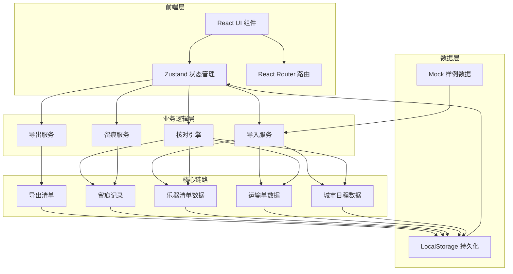
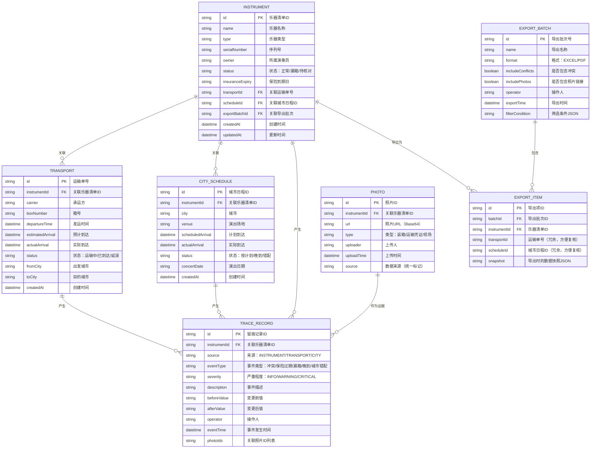

## 1. 架构设计

本系统采用纯前端架构，所有数据和业务逻辑在前端完成，数据通过 LocalStorage 持久化存储，确保链路清晰可追溯，不依赖后台变量传递状态。核心数据流围绕"乐器清单 → 运输单 → 城市日程 → 核对留痕 → 导出清单"这条主线设计。



## 2. 技术描述

- **前端框架**：React@18.2.0 + TypeScript@5.3.0
- **构建工具**：Vite@5.0.0
- **样式方案**：TailwindCSS@3.4.0 + CSS Variables
- **状态管理**：Zustand@4.4.0（轻量、可追溯、支持时间旅行调试）
- **路由管理**：React Router@6.20.0
- **图标库**：Lucide React（线性图标，配合自定义乐器图标）
- **数据持久化**：LocalStorage + Zustand Persist 中间件
- **文件处理**：xlsx（Excel导入导出）、jspdf（PDF导出）
- **动画库**：Framer Motion（复杂动画）+ CSS Transitions（基础动效）

**关键技术决策说明**：
1. 选择 Zustand 而非 Redux：更轻量，代码更少，状态变更可追溯，符合"不要只靠后台变量撑着"的要求，每个状态变更都有明确的 action 记录
2. 纯前端架构：所有数据流转在前端可见，核对过程留痕完整存储在 LocalStorage，可随时导出审计
3. 统一数据源：城市状态、照片留痕共用同一套数据模型，确保来源一致

## 3. 路线定义

| Route | 页面 | 用途 |
|-------|------|------|
| `/` | 首页仪表盘 | 异常告警、核对进度、快速入口 |
| `/check` | 清单核对工作台 | 三栏联动核对主界面 |
| `/detail/:id` | 明细详情页 | 对应关系、时间轴、照片留痕 |
| `/import` | 样例导入页 | 模板下载、导入向导、数据校验 |
| `/export` | 导出清单页 | 导出配置、预览、历史记录 |

## 4. 数据模型

### 4.1 数据模型定义



### 4.2 核心业务规则

1. **三者对应关系规则**：
   - 乐器清单 (id) ↔ 运输单 (instrumentId) ↔ 城市日程 (instrumentId)
   - 导出时，三者ID同时冗余存储在 EXPORT_ITEM 中，详情页永久展示对应关系
   - 对应关系变更必须生成 TRACE_RECORD 留痕

2. **冲突检测规则**：
   - 运输单 toCity ≠ 城市日程 city → 城市错配，留痕
   - 运输单 actualArrival > 城市日程 scheduledArrival → 晚到，留痕
   - 乐器清单 status = 漏箱 AND insuranceExpiry < today → 双重异常，按时间排序展示
   - 所有冲突按 eventTime 排序，事件时间轴清晰展示先后

3. **留痕不可篡改规则**：
   - TRACE_RECORD 一旦创建不可修改、不可删除
   - 每个留痕记录包含 beforeValue 和 afterValue，完整记录变更过程
   - 留痕来源(source)必须明确标记来自哪个数据模块

4. **统一数据源规则**：
   - 城市状态仅从 CITY_SCHEDULE 读取，不通过变量传递
   - 照片留痕仅从 PHOTO 表读取，source 字段统一标记
   - 所有模块读取数据时必须通过 Zustand store，确保数据一致性

## 5. 状态管理设计

### 5.1 Store 结构

```typescript
interface AppState {
  // 数据实体
  instruments: Instrument[];
  transports: Transport[];
  citySchedules: CitySchedule[];
  traceRecords: TraceRecord[];
  photos: Photo[];
  exportBatches: ExportBatch[];
  
  // UI 状态（非后台变量，有明确的状态变更记录）
  selectedInstrumentId: string | null;
  activeTab: 'instrument' | 'transport' | 'schedule';
  filterStatus: string[];
  conflictHighlight: boolean;
  
  // Actions（每个 action 都生成留痕记录）
  importData: (type: string, data: any[]) => void;
  updateInstrument: (id: string, updates: Partial<Instrument>) => void;
  updateTransport: (id: string, updates: Partial<Transport>) => void;
  updateSchedule: (id: string, updates: Partial<CitySchedule>) => void;
  addPhoto: (photo: Omit<Photo, 'id' | 'uploadTime'>) => void;
  resolveConflict: (traceId: string, resolution: string) => void;
  exportBatch: (config: ExportConfig) => ExportBatch;
  selectInstrument: (id: string | null) => void;
}
```

### 5.2 关键中间件

1. **TraceMiddleware**：拦截所有数据变更 action，自动生成 TRACE_RECORD
2. **ConflictDetectionMiddleware**：数据变更后自动检测三者冲突，生成冲突留痕
3. **PersistMiddleware**：状态变更后自动持久化到 LocalStorage

## 6. 核心组件结构

```
src/
├── components/
│   ├── dashboard/
│   │   ├── AlertCards.tsx      # 异常告警卡片组
│   │   ├── ProgressBar.tsx     # 核对进度条
│   │   └── QuickActions.tsx    # 快速操作入口
│   ├── check/
│   │   ├── ThreeColumnLayout.tsx  # 三栏联动布局
│   │   ├── InstrumentList.tsx     # 乐器清单列表
│   │   ├── TransportList.tsx      # 运输单列表
│   │   ├── ScheduleTimeline.tsx   # 城市日程时间线
│   │   └── ConflictMarker.tsx     # 冲突标记组件
│   ├── detail/
│   │   ├── RelationMap.tsx        # 三者对应关系图
│   │   ├── EventTimeline.tsx      # 事件时间轴
│   │   └── PhotoGallery.tsx       # 照片留痕画廊
│   ├── import/
│   │   ├── ImportWizard.tsx       # 导入向导
│   │   └── DataPreview.tsx        # 数据预览
│   └── export/
│       ├── ExportConfig.tsx       # 导出配置
│       ├── ExportPreview.tsx      # 导出预览
│       └── ExportHistory.tsx      # 历史记录
├── store/
│   ├── useAppStore.ts         # 主 Store
│   ├── middleware/
│   │   ├── trace.ts           # 留痕中间件
│   │   └── conflict.ts        # 冲突检测中间件
│   └── types.ts               # 类型定义
├── utils/
│   ├── conflictDetector.ts    # 冲突检测引擎
│   ├── dataMapper.ts          # 数据关联映射
│   ├── exporter.ts            # 导出服务
│   └── importer.ts            # 导入服务
├── mock/
│   └── sampleData.ts          # 样例数据
└── pages/
    ├── Dashboard.tsx
    ├── CheckWorkbench.tsx
    ├── DetailPage.tsx
    ├── ImportPage.tsx
    └── ExportPage.tsx
```

## 7. 数据流转示例（重点链路）

```typescript
// 乐器清单 -> 导出清单 完整链路
// 1. 导入乐器清单
const importInstrument = (data) => {
  const instrument = createInstrument(data);
  addTraceRecord({
    source: 'INSTRUMENT',
    eventType: 'IMPORT',
    beforeValue: null,
    afterValue: JSON.stringify(instrument)
  });
  return instrument;
};

// 2. 关联运输单（留痕）
const linkTransport = (instrumentId, transportId) => {
  const before = getInstrument(instrumentId).transportId;
  updateInstrument(instrumentId, { transportId });
  addTraceRecord({
    source: 'INSTRUMENT',
    eventType: 'LINK_TRANSPORT',
    beforeValue: before,
    afterValue: transportId,
    instrumentId
  });
};

// 3. 关联城市日程（留痕）
const linkSchedule = (instrumentId, scheduleId) => {
  const before = getInstrument(instrumentId).scheduleId;
  updateInstrument(instrumentId, { scheduleId });
  addTraceRecord({
    source: 'INSTRUMENT',
    eventType: 'LINK_SCHEDULE',
    beforeValue: before,
    afterValue: scheduleId,
    instrumentId
  });
};

// 4. 核对（检测冲突，留痕）
const runCheck = (instrumentId) => {
  const conflicts = detectConflicts(instrumentId);
  conflicts.forEach(conflict => {
    addTraceRecord({
      source: conflict.source,
      eventType: conflict.type,
      severity: conflict.severity,
      description: conflict.description,
      eventTime: conflict.eventTime,
      instrumentId
    });
  });
};

// 5. 导出清单（冗余存储三者ID，永久留痕）
const createExportItem = (instrumentId, batchId) => {
  const instrument = getInstrument(instrumentId);
  return {
    instrumentId,
    transportId: instrument.transportId,  // 冗余
    scheduleId: instrument.scheduleId,    // 冗余
    batchId,
    snapshot: JSON.stringify({
      instrument,
      transport: getTransport(instrument.transportId),
      schedule: getSchedule(instrument.scheduleId),
      traces: getTracesByInstrument(instrumentId)
    })
  };
};
```
