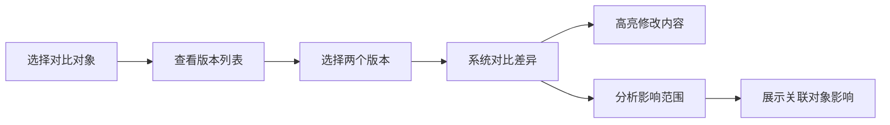

## 1. 产品概述

音频采样授权台账是面向音乐制作人的专业授权管理系统，解决授权过期、素材重名、曲目漏记等核心痛点，通过样本回看与版本对比能力，确保业务决策不脱离原始材料。

- 核心目标：解决音乐制作行业中音频采样授权管理的三大高频风险，提供完整的双向追溯链路（采样素材→最终结果→授权合同），确保授权合规可审计。

## 2. 核心功能

### 2.1 用户角色

| 角色 | 注册方式 | 核心权限 |
|------|----------|---------|
| 音乐制作人 | 系统登录 | 素材录入、授权管理、版本对比、追溯查询、导出报告 |
| 审核人员 | 系统登录 | 查看台账、审核授权状态、追溯历史、导出清单 |

### 2.2 功能模块

1. **总览仪表盘：授权状态总览、风险预警、快速入口
2. **采样素材库：素材录入、素材列表、重名检测、素材详情
3. **曲目项目库：项目录入、项目列表、漏记检测、项目详情
4. **授权报告库：授权录入、授权列表、过期预警、授权详情
5. **双向追溯：正向追溯、反向追溯、追溯链路可视化
6. **版本对比：历史版本、修改痕迹、改动影响分析
7. **导出中心：导出清单、审计报告

### 2.3 页面详情

| 页面名称 | 模块名称 | 功能描述 |
|---------|---------|----------|
| 总览仪表盘 | 授权状态概览 | 授权总数、即将过期数量、重名素材数量、漏记项目数量、风险等级分布 |
| 总览仪表盘 | 风险预警卡片 | 显示具体的风险条目，点击跳转详情 |
| 总览仪表盘 | 快速操作区 | 快速录入入口、追溯入口 |
| 采样素材库 | 素材列表 | 搜索、筛选、分页、重名标记 |
| 采样素材库 | 素材详情 | 素材信息、关联曲目、关联授权、版本历史 |
| 采样素材库 | 素材录入 | 表单录入、文件上传 |
| 曲目项目库 | 项目列表 | 搜索、筛选、漏记标记 |
| 曲目项目库 | 项目详情 | 项目信息、使用素材、授权状态、版本历史 |
| 曲目项目库 | 项目录入 | 项目信息、关联素材 |
| 授权报告库 | 授权列表 | 搜索、筛选、过期预警标记 |
| 授权报告库 | 授权详情 | 授权信息、关联曲目、合同文件、版本历史 |
| 授权报告库 | 授权录入 | 授权信息、合同上传 |
| 双向追溯 | 追溯查询 | 输入素材/曲目/授权，查看完整追溯链路 |
| 双向追溯 | 链路可视化 | 图形化展示追溯关系 |
| 版本对比 | 版本选择 | 选择两个版本进行对比 |
| 版本对比 | 差异展示 | 高亮显示修改内容、修改人、修改时间 |
| 版本对比 | 影响分析 | 展示改动对关联对象的影响范围 |
| 导出中心 | 导出清单 | 选择导出类型、筛选条件、导出格式 |
| 导出中心 | 导出历史 | 历史导出记录 |

## 3. 核心流程

### 3.1 授权录入与追溯流程

用户录入采样素材 → 录入曲目项目并关联素材 → 录入授权报告并关联曲目 → 系统自动检测风险（过期、重名、漏记） → 生成风险预警 → 用户可从素材追溯到授权 → 用户可从授权反查素材 → 导出授权清单

```mermaid
flowchart LR
    A["录入采样素材" --> B["录入曲目项目"]
    B --> C["关联采样素材"]
    C --> D["录入授权报告"]
    D --> E["关联曲目项目"]
    E --> F["系统风险检测"]
    F --> G["生成风险预警"]
    G --> H["授权过期提醒"]
    G --> I["素材重名提醒"]
    G --> J["曲目漏记提醒"]
    K["正向追溯"] --> L["素材→曲目→授权"]
    M["反向追溯"] --> N["授权→曲目→素材"]
```

### 3.2 版本对比流程

选择对象（素材/曲目/授权 → 查看历史版本列表 → 选择两个版本 → 系统对比差异 → 高亮显示修改内容 → 分析改动影响范围 → 展示关联对象受影响情况



## 4. 用户界面设计

### 4.1 设计风格

- 主色调：深灰色 (#1a1a2e → 专业、严谨
- 辅助色：深蓝色 (#16213e) + 警告色：琥珀色 (#f59e0b) 用于风险提示
- 强调色：青色 (#06b6d4) 用于追溯链路高亮
- 错误色：红色 (#ef4444) 用于严重风险
- 成功色：绿色 (#10b981) 用于正常状态
- 按钮风格：扁平化设计，圆角 4px，悬停有轻微阴影
- 字体：现代无衬线字体，标题使用粗体
- 布局风格：卡片式布局，左侧导航 + 主内容区
- 图标风格：线性图标，简洁专业

### 4.2 页面设计概览

| 页面名称 | 模块名称 | UI 元素 |
|---------|---------|----------|
| 总览仪表盘 | 状态概览 | 统计卡片、数据可视化、风险预警列表 |
| 总览仪表盘 | 风险预警 | 彩色卡片、预警级别标签、快速跳转按钮 |
| 采样素材库 | 素材列表 | 表格布局、重名标记、筛选器、搜索框 |
| 采样素材库 | 素材详情 | 标签页布局、版本时间线、关联关系展示 |
| 双向追溯 | 追溯链路 | 节点连线、节点状态颜色区分、点击高亮 |
| 版本对比 | 差异展示 | 左右分栏对比、差异高亮、修改痕迹标注 |

### 4.3 响应式

桌面端优先设计，适配大屏展示更多信息密度高，移动端适配基础浏览和列表视图

### 4.4 动效设计

- 页面加载：渐进式加载动画
- 追溯链路：节点连线动画
- 风险预警：脉冲动画
- 版本对比：差异高亮闪烁
- 悬停效果：轻微上浮+阴影变化
