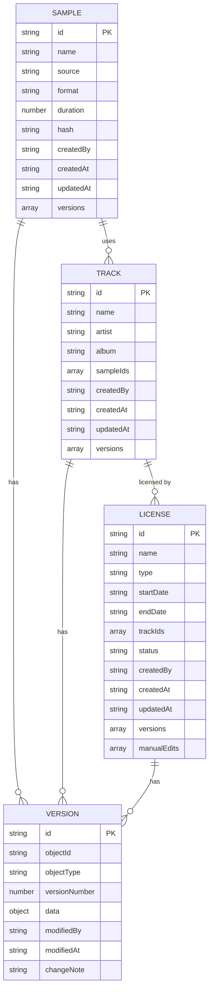

## 1. 技术架构

```mermaid
graph TD
    A["前端 React 应用层" --> B["状态管理层 (Zustand)"]
    A --> C["UI 组件层"]
    A --> D["路由管理 (React Router)"]
    B --> E["数据服务层"]
    E --> F["本地存储 (localStorage)"]
    C --> G["数据层 (Mock Data)"]
    H["工具函数层"] --> I["日期处理"]
    H --> J["版本对比"]
    H --> K["追溯计算"]
    H --> L["导出功能"]
```

## 2. 技术描述

- 前端：React@18 + TypeScript + Vite
- 状态管理：Zustand
- 样式：TailwindCSS@3
- 路由：React Router v6
- 图表：Recharts
- 数据存储：localStorage (前端本地存储
- 图标：Lucide React
- 初始化工具：Vite

## 3. 路由定义

| 路由 | 用途 |
|------|------|
| /dashboard | 总览仪表盘 |
| /samples | 采样素材库列表 |
| /samples/:id | 采样素材详情 |
| /samples/new | 新建采样素材 |
| /tracks | 曲目项目库列表 |
| /tracks/:id | 曲目项目详情 |
| /tracks/new | 新建曲目项目 |
| /licenses | 授权报告库列表 |
| /licenses/:id | 授权报告详情 |
| /licenses/new | 新建授权报告 |
| /trace | 双向追溯 |
| /compare | 版本对比 |
| /export | 导出中心 |

## 4. 数据模型

### 4.1 数据模型定义



### 4.2 TypeScript 类型定义

```typescript
// 采样素材
interface Sample {
  id: string;
  name: string;
  source: string;
  format: string;
  duration: number;
  hash: string;
  createdBy: string;
  createdAt: string;
  updatedAt: string;
  versions: Version[];
  isDuplicate?: boolean;
  duplicateWith?: string[];
}

// 曲目项目
interface Track {
  id: string;
  name: string;
  artist: string;
  album: string;
  sampleIds: string[];
  createdBy: string;
  createdAt: string;
  updatedAt: string;
  versions: Version[];
  isMissingLicense?: boolean;
}

// 授权报告
interface License {
  id: string;
  name: string;
  type: string;
  startDate: string;
  endDate: string;
  trackIds: string[];
  status: 'active' | 'expired' | 'expiring_soon';
  createdBy: string;
  createdAt: string;
  updatedAt: string;
  versions: Version[];
  manualEdits: ManualEdit[];
}

// 版本记录
interface Version {
  id: string;
  objectId: string;
  objectType: 'sample' | 'track' | 'license';
  versionNumber: number;
  data: object;
  modifiedBy: string;
  modifiedAt: string;
  changeNote: string;
}

// 人工修改记录
interface ManualEdit {
  id: string;
  field: string;
  oldValue: any;
  newValue: any;
  editedBy: string;
  editedAt: string;
  reason: string;
}

// 风险预警
interface RiskAlert {
  id: string;
  type: 'expired' | 'duplicate' | 'missing_license';
  severity: 'high' | 'medium' | 'low';
  message: string;
  relatedObjectId: string;
  relatedObjectType: string;
}

// 追溯节点
interface TraceNode {
  id: string;
  type: 'sample' | 'track' | 'license';
  name: string;
  status: 'normal' | 'warning' | 'danger';
  children?: TraceNode[];
  parent?: TraceNode;
}
```

## 5. 核心功能模块

### 5.1 风险检测模块

- 授权过期检测：基于 endDate 计算剩余天数
- 素材重名检测：基于 name + hash 双重检测
- 曲目漏记检测：检查曲目是否关联授权

### 5.2 版本对比模块

- 深度对象比较算法
- 差异高亮展示
- 修改影响范围分析

### 5.3 追溯模块

- 正向追溯：素材 → 曲目 → 授权
- 反向追溯：授权 → 曲目 → 素材
- 链路可视化

### 5.4 导出模块

- CSV 格式导出
- Excel 格式导出
- 导出记录保存

## 6. 目录结构

```
src/
├── components/
│   ├── common/
│   │   ├── Sidebar.tsx
│   │   ├── Header.tsx
│   │   ├── StatusBadge.tsx
│   │   └── RiskAlertCard.tsx
│   ├── dashboard/
│   │   ├── StatsCard.tsx
│   │   └── RiskList.tsx
│   ├── samples/
│   │   ├── SampleList.tsx
│   │   ├── SampleDetail.tsx
│   │   └── SampleForm.tsx
│   ├── tracks/
│   │   ├── TrackList.tsx
│   │   ├── TrackDetail.tsx
│   │   └── TrackForm.tsx
│   ├── licenses/
│   │   ├── LicenseList.tsx
│   │   ├── LicenseDetail.tsx
│   │   └── LicenseForm.tsx
│   ├── trace/
│   │   ├── TraceGraph.tsx
│   │   └── TraceNode.tsx
│   ├── compare/
│   │   ├── VersionCompare.tsx
│   │   ├── DiffViewer.tsx
│   │   └── ImpactAnalysis.tsx
│   └── export/
│       ├── ExportForm.tsx
│       └── ExportHistory.tsx
├── store/
│   ├── useSampleStore.ts
│   ├── useTrackStore.ts
│   ├── useLicenseStore.ts
│   └── useAlertStore.ts
├── utils/
│   ├── dateUtils.ts
│   ├── versionUtils.ts
│   ├── traceUtils.ts
│   ├── exportUtils.ts
│   └── riskDetector.ts
├── types/
│   └── index.ts
├── mock/
│   └── data.ts
│   └── initialData.ts
├── pages/
│   ├── Dashboard.tsx
│   ├── Samples.tsx
│   ├── Tracks.tsx
│   ├── Licenses.tsx
│   ├── Trace.tsx
│   ├── Compare.tsx
│   └── Export.tsx
├── App.tsx
├── main.tsx
└── index.css
```